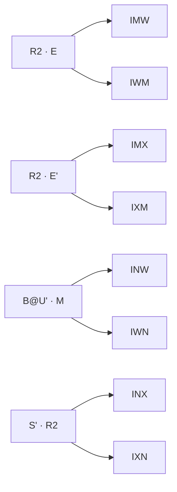

# Edge 3‑Style — Buffer I — Memory Sheet

*Pure‑memorability picks (shortest/cleanest commutator of 100 computer algs per case).*

## The collapse
| metric | value |
|---|---|
| cases | **8** |
| distinct shapes (cores) | **4** |
| shared‑core families (≥2) | **4** covering 8 |
| inverse pairs (learn 1 ⇒ 2) | **4** |
| pure commutators (no setup) | **2** |
| moves min/avg/max | 8 / 9.0 / 10 |

Read: `setup : [interchange , insert]` → setup → interchange → insert → interchange' → insert' → setup'. Inverse case = swap the two pieces.

## Family map



## Families

### F1. R2 · E · ×2

Shape `[E , R2]` — interchange `E`, insert `R2`.

| case | comm | moves | inverse |
|---|---|---|---|
| **IMW** | `r F E:[E,R2]` | 9 | IWM |
| **IWM** | `r F E:[R2,E]` | 9 | IMW |

### F2. R2 · E' · ×2

Shape `[E' , R2]` — interchange `E'`, insert `R2`.

| case | comm | moves | inverse |
|---|---|---|---|
| **IMX** | `D' S' R:[E',R2]` | 9 | IXM |
| **IXM** | `D S' R:[E',R2]` | 9 | IMX |

### F3. B@U' · M · ×2

Shape `[M , U' B U]` — interchange `M`, insert `U' B U`.

| case | comm | moves | inverse |
|---|---|---|---|
| **INW** | `[M,U' B U]` | 8 | IWN |
| **IWN** | `[U' B U,M]` | 8 | INW |

### F4. S' · R2 · ×2

Shape `[R2 , S']` — interchange `R2`, insert `S'`.

| case | comm | moves | inverse |
|---|---|---|---|
| **INX** | `B R' D:[R2,S']` | 10 | IXN |
| **IXN** | `B R' D:[S',R2]` | 10 | INX |

## Inverse‑pair index

| learn | comm | ⇄ | derive | comm |
|---|---|---|---|---|
| **IMW** | `r F E:[E,R2]` | ⇄ | IWM | `r F E:[R2,E]` |
| **IMX** | `D' S' R:[E',R2]` | ⇄ | IXM | `D S' R:[E',R2]` |
| **INW** | `[M,U' B U]` | ⇄ | IWN | `[U' B U,M]` |
| **INX** | `B R' D:[R2,S']` | ⇄ | IXN | `B R' D:[S',R2]` |

## Case cards (with 3‑cycle diagrams)

#### IMW — R2 · E — `r F E:[E,R2]` (9)
```
      · · ·
      · u ·
      · · ·
· · ·  · · ·  · · ·  · · ·
· l ·  · f ·  · r ·  · b 3
· · ·  · · ·  · · ·  · · ·
      · 1 ·
      · d ·
      · 2 ·
  1=I(DF)  2=M(DB)  3=W(BL)
```

#### IMX — R2 · E' — `D' S' R:[E',R2]` (9)
```
      · · ·
      · u ·
      · · ·
· · ·  · · ·  · · ·  · · ·
3 l ·  · f ·  · r ·  · b ·
· · ·  · · ·  · · ·  · · ·
      · 1 ·
      · d ·
      · 2 ·
  1=I(DF)  2=M(DB)  3=X(LB)
```

#### INW — B@U' · M — `[M,U' B U]` (8)
```
      · · ·
      · u ·
      · · ·
· · ·  · · ·  · · ·  · · ·
· l ·  · f ·  · r ·  · b 3
· · ·  · · ·  · · ·  · 2 ·
      · 1 ·
      · d ·
      · · ·
  1=I(DF)  2=N(BD)  3=W(BL)
```

#### INX — S' · R2 — `B R' D:[R2,S']` (10)
```
      · · ·
      · u ·
      · · ·
· · ·  · · ·  · · ·  · · ·
3 l ·  · f ·  · r ·  · b ·
· · ·  · · ·  · · ·  · 2 ·
      · 1 ·
      · d ·
      · · ·
  1=I(DF)  2=N(BD)  3=X(LB)
```

#### IWM — R2 · E — `r F E:[R2,E]` (9)
```
      · · ·
      · u ·
      · · ·
· · ·  · · ·  · · ·  · · ·
· l ·  · f ·  · r ·  · b 2
· · ·  · · ·  · · ·  · · ·
      · 1 ·
      · d ·
      · 3 ·
  1=I(DF)  2=W(BL)  3=M(DB)
```

#### IWN — B@U' · M — `[U' B U,M]` (8)
```
      · · ·
      · u ·
      · · ·
· · ·  · · ·  · · ·  · · ·
· l ·  · f ·  · r ·  · b 2
· · ·  · · ·  · · ·  · 3 ·
      · 1 ·
      · d ·
      · · ·
  1=I(DF)  2=W(BL)  3=N(BD)
```

#### IXM — R2 · E' — `D S' R:[E',R2]` (9)
```
      · · ·
      · u ·
      · · ·
· · ·  · · ·  · · ·  · · ·
2 l ·  · f ·  · r ·  · b ·
· · ·  · · ·  · · ·  · · ·
      · 1 ·
      · d ·
      · 3 ·
  1=I(DF)  2=X(LB)  3=M(DB)
```

#### IXN — S' · R2 — `B R' D:[S',R2]` (10)
```
      · · ·
      · u ·
      · · ·
· · ·  · · ·  · · ·  · · ·
2 l ·  · f ·  · r ·  · b ·
· · ·  · · ·  · · ·  · 3 ·
      · 1 ·
      · d ·
      · · ·
  1=I(DF)  2=X(LB)  3=N(BD)
```
