# Edge 3‑Style — Buffer K — Memory Sheet

*Pure‑memorability picks (shortest/cleanest commutator of 100 computer algs per case).*

## The collapse
| metric | value |
|---|---|
| cases | **120** |
| distinct shapes (cores) | **47** |
| shared‑core families (≥2) | **35** covering 108 |
| inverse pairs (learn 1 ⇒ 2) | **60** |
| pure commutators (no setup) | **48** |
| moves min/avg/max | 5 / 8.4 / 11 |

Read: `setup : [interchange , insert]` → setup → interchange → insert → interchange' → insert' → setup'. Inverse case = swap the two pieces.

## Family map

```mermaid
graph LR
  F1["S' · R2"]
  F1 --> KJN
  F1 --> KJS
  F1 --> KJW
  F1 --> KJX
  F1 --> KJY
  F1 --> KNJ
  F1 --> KNQ
  F1 --> KNS
  F1 --> KNT
  F1 --> KNW
  F1 --> KNX
  F1 --> KNY
  F1 --> KQN
  F1 --> KQW
  F1 --> KQY
  F1 --> KRT
  F1 --> KSJ
  F1 --> KSN
  F1 --> KSW
  F1 --> KSY
  F1 --> KTN
  F1 --> KTR
  F1 --> KWJ
  F1 --> KWN
  F1 --> KWQ
  F1 --> KWS
  F1 --> KXJ
  F1 --> KXN
  F1 --> KXZ
  F1 --> KYJ
  F1 --> KYN
  F1 --> KYQ
  F1 --> KYS
  F1 --> KZX
  F2["S@R · D"]
  F2 --> KMX
  F2 --> KMZ
  F2 --> KXM
  F2 --> KZM
  F3["S@R · D'"]
  F3 --> KIZ
  F3 --> KZI
  F3 --> KZN
  F4["D'@R' · S"]
  F4 --> KJM
  F4 --> KMJ
  F4 --> KNZ
  F5["S@R' · D"]
  F5 --> KMR
  F5 --> KRJ
  F5 --> KRM
  F6["ERS' · R2"]
  F6 --> KTX
  F6 --> KXT
  F6 --> KYW
  F7["U2R2 · S'"]
  F7 --> KIM
  F7 --> KMI
  F8["D@R' · S"]
  F8 --> KIN
  F8 --> KNI
  F9["S2@R · D'"]
  F9 --> KIQ
  F9 --> KQI
  F10["S@R' · D'"]
  F10 --> KIR
  F10 --> KRI
  F11["RER'S · D'"]
  F11 --> KIS
  F11 --> KSI
  F12["S'@R' · F'"]
  F12 --> KIT
  F12 --> KTI
  F13["E@F · D"]
  F13 --> KIW
  F13 --> KWI
  F14["E2@F' · D"]
  F14 --> KIX
  F14 --> KXI
  F15["E'@F' · D"]
  F15 --> KIY
  F15 --> KYI
  F16["S2@R · F'"]
  F16 --> KJQ
  F16 --> KQJ
  F17["R2 · E"]
  F17 --> KJT
  F17 --> KTJ
  F18["U2 · M'"]
  F18 --> KJZ
  F18 --> KZJ
  F19["S2@R · D"]
  F19 --> KMQ
  F19 --> KQM
  F20["E'@B' · D'"]
  F20 --> KMS
  F20 --> KSM
  F21["E2@B · D'"]
  F21 --> KMT
  F21 --> KTM
  F22["R'E'RS · D"]
  F22 --> KMW
  F22 --> KWM
  F23["S2@R' · D"]
  F23 --> KMY
  F23 --> KYM
  F24["U2 · M"]
  F24 --> KNR
  F24 --> KRN
  F25["D@F' · E'"]
  F25 --> KQT
  F25 --> KTQ
  F26["S'RE' · R"]
  F26 --> KQX
  F26 --> KXQ
  F27["D@F · E"]
  F27 --> KRS
  F27 --> KSR
  F28["D@F · E2"]
  F28 --> KRX
  F28 --> KXR
  F29["D@F · E'"]
  F29 --> KRY
  F29 --> KYR
  F30["S · R2"]
  F30 --> KRZ
  F30 --> KZR
  F31["D'@B · E'"]
  F31 --> KSX
  F31 --> KXS
  F32["D@F' · E"]
  F32 --> KTW
  F32 --> KWT
  F33["S'R'E · R'"]
  F33 --> KTY
  F33 --> KYT
  F34["D@F' · E2"]
  F34 --> KTZ
  F34 --> KZT
  F35["D'@B · E"]
  F35 --> KXY
  F35 --> KYX
```



## Families

### F1. S' · R2 · ×34

Shape `[R2 , S']` — interchange `R2`, insert `S'`.

| case | comm | moves | inverse |
|---|---|---|---|
| **KJN** | `F' B R:[S',R2]` | 9 | KNJ |
| **KJS** | `E2 F' R:[S',R2]` | 9 | KSJ |
| **KJW** | `F E2 R':[S',R2]` | 9 | KWJ |
| **KJX** | `E' F' R:[S',R2]` | 9 | KXJ |
| **KJY** | `F' R:[S',R2]` | 7 | KYJ |
| **KNJ** | `F' B R':[S',R2]` | 9 | KJN |
| **KNQ** | `B R':[S',R2]` | 7 | KQN |
| **KNS** | `B' E2 R:[S',R2]` | 9 | KSN |
| **KNT** | `E B R':[S',R2]` | 9 | KTN |
| **KNW** | `E2 B R':[S',R2]` | 9 | KWN |
| **KNX** | `u R2 B R':[S',R2]` | 11 | KXN |
| **KNY** | `R2 B R':[S',R2]` | 9 | KYN |
| **KQN** | `B R:[S',R2]` | 7 | KNQ |
| **KQW** | `B2 R:[S',R2]` | 7 | KWQ |
| **KQY** | `R:[S',R2]` | 5 | KYQ |
| **KRT** | `E R':[S',R2]` | 7 | KTR |
| **KSJ** | `E2 F' R':[S',R2]` | 9 | KJS |
| **KSN** | `B' E2 R':[S',R2]` | 9 | KNS |
| **KSW** | `E2 R':[S',R2]` | 7 | KWS |
| **KSY** | `F2 R:[S',R2]` | 7 | KYS |
| **KTN** | `E B R:[S',R2]` | 9 | KNT |
| **KTR** | `E R:[S',R2]` | 7 | KRT |
| **KWJ** | `F E2 R:[S',R2]` | 9 | KJW |
| **KWN** | `E2 B R:[S',R2]` | 9 | KNW |
| **KWQ** | `B2 R':[S',R2]` | 7 | KQW |
| **KWS** | `E2 R:[S',R2]` | 7 | KSW |
| **KXJ** | `E' F' R':[S',R2]` | 9 | KJX |
| **KXN** | `u R2 B R:[S',R2]` | 11 | KNX |
| **KXZ** | `u R':[S',R2]` | 7 | KZX |
| **KYJ** | `F' R':[S',R2]` | 7 | KJY |
| **KYN** | `R2 B R:[S',R2]` | 9 | KNY |
| **KYQ** | `R':[S',R2]` | 5 | KQY |
| **KYS** | `F2 R':[S',R2]` | 7 | KSY |
| **KZX** | `u R:[S',R2]` | 7 | KXZ |

### F2. S@R · D · ×4

Shape `[D , R S R']` — interchange `D`, insert `R S R'`.

| case | comm | moves | inverse |
|---|---|---|---|
| **KMX** | `B:[D,R S R']` | 10 | KXM |
| **KMZ** | `[R S R',D]` | 8 | KZM |
| **KXM** | `B:[R S R',D]` | 10 | KMX |
| **KZM** | `[D,R S R']` | 8 | KMZ |

### F3. S@R · D' · ×3

Shape `[D' , R S R']` — interchange `D'`, insert `R S R'`.

| case | comm | moves | inverse |
|---|---|---|---|
| **KIZ** | `[R S R',D']` | 8 | KZI |
| **KZI** | `[D',R S R']` | 8 | KIZ |
| **KZN** | `M':[D',R S R']` | 9 | KNZ |

### F4. D'@R' · S · ×3

Shape `[S , R' D' R]` — interchange `S`, insert `R' D' R`.

| case | comm | moves | inverse |
|---|---|---|---|
| **KJM** | `D:[S,R' D' R]` | 10 | KMJ |
| **KMJ** | `D:[R' D' R,S]` | 10 | KJM |
| **KNZ** | `r:[S,R' D' R]` | 9 | KZN |

### F5. S@R' · D · ×3

Shape `[D , R' S R]` — interchange `D`, insert `R' S R`.

| case | comm | moves | inverse |
|---|---|---|---|
| **KMR** | `[R' S R,D]` | 8 | KRM |
| **KRJ** | `M:[D,R' S R]` | 9 | KJR |
| **KRM** | `[D,R' S R]` | 8 | KMR |

### F6. ERS' · R2 · ×3

Shape `[R2 , E R S']` — interchange `R2`, insert `E R S'`.

| case | comm | moves | inverse |
|---|---|---|---|
| **KTX** | `E2:[E R S',R2]` | 9 | KXT |
| **KXT** | `E2:[R2,E R S']` | 9 | KTX |
| **KYW** | `E':[R2,E R S']` | 8 | KWY |

### F7. U2R2 · S' · ×2

Shape `[S' , U2 R2]` — interchange `S'`, insert `U2 R2`.

| case | comm | moves | inverse |
|---|---|---|---|
| **KIM** | `M2 U':[S',U2 R2]` | 9 | KMI |
| **KMI** | `M2 U:[S',U2 R2]` | 9 | KIM |

### F8. D@R' · S · ×2

Shape `[S , R' D R]` — interchange `S`, insert `R' D R`.

| case | comm | moves | inverse |
|---|---|---|---|
| **KIN** | `D':[R' D R,S]` | 10 | KNI |
| **KNI** | `D':[S,R' D R]` | 10 | KIN |

### F9. S2@R · D' · ×2

Shape `[D' , R S2 R']` — interchange `D'`, insert `R S2 R'`.

| case | comm | moves | inverse |
|---|---|---|---|
| **KIQ** | `[R S2 R',D']` | 8 | KQI |
| **KQI** | `[D',R S2 R']` | 8 | KIQ |

### F10. S@R' · D' · ×2

Shape `[D' , R' S R]` — interchange `D'`, insert `R' S R`.

| case | comm | moves | inverse |
|---|---|---|---|
| **KIR** | `[R' S R,D']` | 8 | KRI |
| **KRI** | `[D',R' S R]` | 8 | KIR |

### F11. RER'S · D' · ×2

Shape `[D' , R E R' S]` — interchange `D'`, insert `R E R' S`.

| case | comm | moves | inverse |
|---|---|---|---|
| **KIS** | `[R E R' S,D']` | 10 | KSI |
| **KSI** | `[D',R E R' S]` | 10 | KIS |

### F12. S'@R' · F' · ×2

Shape `[F' , R' S' R]` — interchange `F'`, insert `R' S' R`.

| case | comm | moves | inverse |
|---|---|---|---|
| **KIT** | `F':[R' S' R,F']` | 9 | KTI |
| **KTI** | `F':[F',R' S' R]` | 9 | KIT |

### F13. E@F · D · ×2

Shape `[D , F E F']` — interchange `D`, insert `F E F'`.

| case | comm | moves | inverse |
|---|---|---|---|
| **KIW** | `[D,F E F']` | 8 | KWI |
| **KWI** | `[F E F',D]` | 8 | KIW |

### F14. E2@F' · D · ×2

Shape `[D , F' E2 F]` — interchange `D`, insert `F' E2 F`.

| case | comm | moves | inverse |
|---|---|---|---|
| **KIX** | `[D,F' E2 F]` | 8 | KXI |
| **KXI** | `[F' E2 F,D]` | 8 | KIX |

### F15. E'@F' · D · ×2

Shape `[D , F' E' F]` — interchange `D`, insert `F' E' F`.

| case | comm | moves | inverse |
|---|---|---|---|
| **KIY** | `[D,F' E' F]` | 8 | KYI |
| **KYI** | `[F' E' F,D]` | 8 | KIY |

### F16. S2@R · F' · ×2

Shape `[F' , R S2 R']` — interchange `F'`, insert `R S2 R'`.

| case | comm | moves | inverse |
|---|---|---|---|
| **KJQ** | `[F',R S2 R']` | 8 | KQJ |
| **KQJ** | `[R S2 R',F']` | 8 | KJQ |

### F17. R2 · E · ×2

Shape `[E , R2]` — interchange `E`, insert `R2`.

| case | comm | moves | inverse |
|---|---|---|---|
| **KJT** | `S U2 D R:[E,R2]` | 11 | KTJ |
| **KTJ** | `S U2 D R':[E,R2]` | 11 | KJT |

### F18. U2 · M' · ×2

Shape `[M' , U2]` — interchange `M'`, insert `U2`.

| case | comm | moves | inverse |
|---|---|---|---|
| **KJZ** | `S R' U':[M',U2]` | 9 | KZJ |
| **KZJ** | `S R' U:[M',U2]` | 9 | KJZ |

### F19. S2@R · D · ×2

Shape `[D , R S2 R']` — interchange `D`, insert `R S2 R'`.

| case | comm | moves | inverse |
|---|---|---|---|
| **KMQ** | `[R S2 R',D]` | 8 | KQM |
| **KQM** | `[D,R S2 R']` | 8 | KMQ |

### F20. E'@B' · D' · ×2

Shape `[D' , B' E' B]` — interchange `D'`, insert `B' E' B`.

| case | comm | moves | inverse |
|---|---|---|---|
| **KMS** | `[D',B' E' B]` | 8 | KSM |
| **KSM** | `[B' E' B,D']` | 8 | KMS |

### F21. E2@B · D' · ×2

Shape `[D' , B E2 B']` — interchange `D'`, insert `B E2 B'`.

| case | comm | moves | inverse |
|---|---|---|---|
| **KMT** | `[D',B E2 B']` | 8 | KTM |
| **KTM** | `[B E2 B',D']` | 8 | KMT |

### F22. R'E'RS · D · ×2

Shape `[D , R' E' R S]` — interchange `D`, insert `R' E' R S`.

| case | comm | moves | inverse |
|---|---|---|---|
| **KMW** | `[R' E' R S,D]` | 10 | KWM |
| **KWM** | `[D,R' E' R S]` | 10 | KMW |

### F23. S2@R' · D · ×2

Shape `[D , R' S2 R]` — interchange `D`, insert `R' S2 R`.

| case | comm | moves | inverse |
|---|---|---|---|
| **KMY** | `[R' S2 R,D]` | 8 | KYM |
| **KYM** | `[D,R' S2 R]` | 8 | KMY |

### F24. U2 · M · ×2

Shape `[M , U2]` — interchange `M`, insert `U2`.

| case | comm | moves | inverse |
|---|---|---|---|
| **KNR** | `S R U:[M,U2]` | 9 | KRN |
| **KRN** | `S R U':[M,U2]` | 9 | KNR |

### F25. D@F' · E' · ×2

Shape `[E' , F' D F]` — interchange `E'`, insert `F' D F`.

| case | comm | moves | inverse |
|---|---|---|---|
| **KQT** | `[E',F' D F]` | 8 | KTQ |
| **KTQ** | `[F' D F,E']` | 8 | KQT |

### F26. S'RE' · R · ×2

Shape `[R , S' R E']` — interchange `R`, insert `S' R E'`.

| case | comm | moves | inverse |
|---|---|---|---|
| **KQX** | `S2:[S' R E',R]` | 9 | KXQ |
| **KXQ** | `S2:[R,S' R E']` | 9 | KQX |

### F27. D@F · E · ×2

Shape `[E , F D F']` — interchange `E`, insert `F D F'`.

| case | comm | moves | inverse |
|---|---|---|---|
| **KRS** | `[F D F',E]` | 8 | KSR |
| **KSR** | `[E,F D F']` | 8 | KRS |

### F28. D@F · E2 · ×2

Shape `[E2 , F D F']` — interchange `E2`, insert `F D F'`.

| case | comm | moves | inverse |
|---|---|---|---|
| **KRX** | `[F D F',E2]` | 8 | KXR |
| **KXR** | `[E2,F D F']` | 8 | KRX |

### F29. D@F · E' · ×2

Shape `[E' , F D F']` — interchange `E'`, insert `F D F'`.

| case | comm | moves | inverse |
|---|---|---|---|
| **KRY** | `[F D F',E']` | 8 | KYR |
| **KYR** | `[E',F D F']` | 8 | KRY |

### F30. S · R2 · ×2

Shape `[R2 , S]` — interchange `R2`, insert `S`.

| case | comm | moves | inverse |
|---|---|---|---|
| **KRZ** | `S R':[S,R2]` | 7 | KZR |
| **KZR** | `S R:[S,R2]` | 7 | KRZ |

### F31. D'@B · E' · ×2

Shape `[E' , B D' B']` — interchange `E'`, insert `B D' B'`.

| case | comm | moves | inverse |
|---|---|---|---|
| **KSX** | `[E',B D' B']` | 8 | KXS |
| **KXS** | `[B D' B',E']` | 8 | KSX |

### F32. D@F' · E · ×2

Shape `[E , F' D F]` — interchange `E`, insert `F' D F`.

| case | comm | moves | inverse |
|---|---|---|---|
| **KTW** | `[F' D F,E]` | 8 | KWT |
| **KWT** | `[E,F' D F]` | 8 | KTW |

### F33. S'R'E · R' · ×2

Shape `[R' , S' R' E]` — interchange `R'`, insert `S' R' E`.

| case | comm | moves | inverse |
|---|---|---|---|
| **KTY** | `S2:[R',S' R' E]` | 9 | KYT |
| **KYT** | `S2:[S' R' E,R']` | 9 | KTY |

### F34. D@F' · E2 · ×2

Shape `[E2 , F' D F]` — interchange `E2`, insert `F' D F`.

| case | comm | moves | inverse |
|---|---|---|---|
| **KTZ** | `[F' D F,E2]` | 8 | KZT |
| **KZT** | `[E2,F' D F]` | 8 | KTZ |

### F35. D'@B · E · ×2

Shape `[E , B D' B']` — interchange `E`, insert `B D' B'`.

| case | comm | moves | inverse |
|---|---|---|---|
| **KXY** | `[B D' B',E]` | 8 | KYX |
| **KYX** | `[E,B D' B']` | 8 | KXY |

## Singletons

| case | comm | moves | inverse |
|---|---|---|---|
| **KJR** | `r':[S,R D R']` | 9 | KRJ |
| **KQS** | `E:[R2,E' R' S']` | 8 | KSQ |
| **KQZ** | `D':[R S R',B]` | 10 | KZQ |
| **KRW** | `R' E':[R',E R S']` | 8 | KWR |
| **KSQ** | `E:[E' r' S',R2]` | 8 | KQS |
| **KSZ** | `S':[R,S R E]` | 8 | KZS |
| **KWR** | `S':[R',S R' E']` | 8 | KRW |
| **KWY** | `E':[E r S',R2]` | 8 | KYW |
| **KWZ** | `S':[R,S R' E']` | 8 | KZW |
| **KZQ** | `[B' D' B,E]` | 8 | KQZ |
| **KZS** | `R E:[R,E' R' S']` | 8 | KSZ |
| **KZW** | `[B' D' B,E']` | 8 | KWZ |

## Inverse‑pair index

| learn | comm | ⇄ | derive | comm |
|---|---|---|---|---|
| **KIM** | `M2 U':[S',U2 R2]` | ⇄ | KMI | `M2 U:[S',U2 R2]` |
| **KIN** | `D':[R' D R,S]` | ⇄ | KNI | `D':[S,R' D R]` |
| **KIQ** | `[R S2 R',D']` | ⇄ | KQI | `[D',R S2 R']` |
| **KIR** | `[R' S R,D']` | ⇄ | KRI | `[D',R' S R]` |
| **KIS** | `[R E R' S,D']` | ⇄ | KSI | `[D',R E R' S]` |
| **KIT** | `F':[R' S' R,F']` | ⇄ | KTI | `F':[F',R' S' R]` |
| **KIW** | `[D,F E F']` | ⇄ | KWI | `[F E F',D]` |
| **KIX** | `[D,F' E2 F]` | ⇄ | KXI | `[F' E2 F,D]` |
| **KIY** | `[D,F' E' F]` | ⇄ | KYI | `[F' E' F,D]` |
| **KIZ** | `[R S R',D']` | ⇄ | KZI | `[D',R S R']` |
| **KJM** | `D:[S,R' D' R]` | ⇄ | KMJ | `D:[R' D' R,S]` |
| **KJN** | `F' B R:[S',R2]` | ⇄ | KNJ | `F' B R':[S',R2]` |
| **KJQ** | `[F',R S2 R']` | ⇄ | KQJ | `[R S2 R',F']` |
| **KJR** | `r':[S,R D R']` | ⇄ | KRJ | `M:[D,R' S R]` |
| **KJS** | `E2 F' R:[S',R2]` | ⇄ | KSJ | `E2 F' R':[S',R2]` |
| **KJT** | `S U2 D R:[E,R2]` | ⇄ | KTJ | `S U2 D R':[E,R2]` |
| **KJW** | `F E2 R':[S',R2]` | ⇄ | KWJ | `F E2 R:[S',R2]` |
| **KJX** | `E' F' R:[S',R2]` | ⇄ | KXJ | `E' F' R':[S',R2]` |
| **KJY** | `F' R:[S',R2]` | ⇄ | KYJ | `F' R':[S',R2]` |
| **KJZ** | `S R' U':[M',U2]` | ⇄ | KZJ | `S R' U:[M',U2]` |
| **KMQ** | `[R S2 R',D]` | ⇄ | KQM | `[D,R S2 R']` |
| **KMR** | `[R' S R,D]` | ⇄ | KRM | `[D,R' S R]` |
| **KMS** | `[D',B' E' B]` | ⇄ | KSM | `[B' E' B,D']` |
| **KMT** | `[D',B E2 B']` | ⇄ | KTM | `[B E2 B',D']` |
| **KMW** | `[R' E' R S,D]` | ⇄ | KWM | `[D,R' E' R S]` |
| **KMX** | `B:[D,R S R']` | ⇄ | KXM | `B:[R S R',D]` |
| **KMY** | `[R' S2 R,D]` | ⇄ | KYM | `[D,R' S2 R]` |
| **KMZ** | `[R S R',D]` | ⇄ | KZM | `[D,R S R']` |
| **KNQ** | `B R':[S',R2]` | ⇄ | KQN | `B R:[S',R2]` |
| **KNR** | `S R U:[M,U2]` | ⇄ | KRN | `S R U':[M,U2]` |
| **KNS** | `B' E2 R:[S',R2]` | ⇄ | KSN | `B' E2 R':[S',R2]` |
| **KNT** | `E B R':[S',R2]` | ⇄ | KTN | `E B R:[S',R2]` |
| **KNW** | `E2 B R':[S',R2]` | ⇄ | KWN | `E2 B R:[S',R2]` |
| **KNX** | `u R2 B R':[S',R2]` | ⇄ | KXN | `u R2 B R:[S',R2]` |
| **KNY** | `R2 B R':[S',R2]` | ⇄ | KYN | `R2 B R:[S',R2]` |
| **KNZ** | `r:[S,R' D' R]` | ⇄ | KZN | `M':[D',R S R']` |
| **KQS** | `E:[R2,E' R' S']` | ⇄ | KSQ | `E:[E' r' S',R2]` |
| **KQT** | `[E',F' D F]` | ⇄ | KTQ | `[F' D F,E']` |
| **KQW** | `B2 R:[S',R2]` | ⇄ | KWQ | `B2 R':[S',R2]` |
| **KQX** | `S2:[S' R E',R]` | ⇄ | KXQ | `S2:[R,S' R E']` |
| **KQY** | `R:[S',R2]` | ⇄ | KYQ | `R':[S',R2]` |
| **KQZ** | `D':[R S R',B]` | ⇄ | KZQ | `[B' D' B,E]` |
| **KRS** | `[F D F',E]` | ⇄ | KSR | `[E,F D F']` |
| **KRT** | `E R':[S',R2]` | ⇄ | KTR | `E R:[S',R2]` |
| **KRW** | `R' E':[R',E R S']` | ⇄ | KWR | `S':[R',S R' E']` |
| **KRX** | `[F D F',E2]` | ⇄ | KXR | `[E2,F D F']` |
| **KRY** | `[F D F',E']` | ⇄ | KYR | `[E',F D F']` |
| **KRZ** | `S R':[S,R2]` | ⇄ | KZR | `S R:[S,R2]` |
| **KSW** | `E2 R':[S',R2]` | ⇄ | KWS | `E2 R:[S',R2]` |
| **KSX** | `[E',B D' B']` | ⇄ | KXS | `[B D' B',E']` |
| **KSY** | `F2 R:[S',R2]` | ⇄ | KYS | `F2 R':[S',R2]` |
| **KSZ** | `S':[R,S R E]` | ⇄ | KZS | `R E:[R,E' R' S']` |
| **KTW** | `[F' D F,E]` | ⇄ | KWT | `[E,F' D F]` |
| **KTX** | `E2:[E R S',R2]` | ⇄ | KXT | `E2:[R2,E R S']` |
| **KTY** | `S2:[R',S' R' E]` | ⇄ | KYT | `S2:[S' R' E,R']` |
| **KTZ** | `[F' D F,E2]` | ⇄ | KZT | `[E2,F' D F]` |
| **KWY** | `E':[E r S',R2]` | ⇄ | KYW | `E':[R2,E R S']` |
| **KWZ** | `S':[R,S R' E']` | ⇄ | KZW | `[B' D' B,E']` |
| **KXY** | `[B D' B',E]` | ⇄ | KYX | `[E,B D' B']` |
| **KXZ** | `u R':[S',R2]` | ⇄ | KZX | `u R:[S',R2]` |

## Case cards (with 3‑cycle diagrams)

#### KIM — U2R2 · S' — `M2 U':[S',U2 R2]` (9)
```
      · · ·
      · u ·
      · · ·
· · ·  · · ·  · · ·  · · ·
· l ·  · f ·  · r ·  · b ·
· · ·  · · ·  · · ·  · · ·
      · 2 ·
      1 d ·
      · 3 ·
  1=K(DL)  2=I(DF)  3=M(DB)
```

#### KIN — D@R' · S — `D':[R' D R,S]` (10)
```
      · · ·
      · u ·
      · · ·
· · ·  · · ·  · · ·  · · ·
· l ·  · f ·  · r ·  · b ·
· · ·  · · ·  · · ·  · 3 ·
      · 2 ·
      1 d ·
      · · ·
  1=K(DL)  2=I(DF)  3=N(BD)
```

#### KIQ — S2@R · D' — `[R S2 R',D']` (8)
```
      · · ·
      · u ·
      · · ·
· · ·  · · ·  · · ·  · · ·
· l ·  · f 3  · r ·  · b ·
· · ·  · · ·  · · ·  · · ·
      · 2 ·
      1 d ·
      · · ·
  1=K(DL)  2=I(DF)  3=Q(FR)
```

#### KIR — S@R' · D' — `[R' S R,D']` (8)
```
      · · ·
      · u ·
      · · ·
· · ·  · · ·  · · ·  · · ·
· l ·  · f ·  3 r ·  · b ·
· · ·  · · ·  · · ·  · · ·
      · 2 ·
      1 d ·
      · · ·
  1=K(DL)  2=I(DF)  3=R(RF)
```

#### KIS — RER'S · D' — `[R E R' S,D']` (10)
```
      · · ·
      · u ·
      · · ·
· · ·  · · ·  · · ·  · · ·
· l ·  3 f ·  · r ·  · b ·
· · ·  · · ·  · · ·  · · ·
      · 2 ·
      1 d ·
      · · ·
  1=K(DL)  2=I(DF)  3=S(FL)
```

#### KIT — S'@R' · F' — `F':[R' S' R,F']` (9)
```
      · · ·
      · u ·
      · · ·
· · ·  · · ·  · · ·  · · ·
· l 3  · f ·  · r ·  · b ·
· · ·  · · ·  · · ·  · · ·
      · 2 ·
      1 d ·
      · · ·
  1=K(DL)  2=I(DF)  3=T(LF)
```

#### KIW — E@F · D — `[D,F E F']` (8)
```
      · · ·
      · u ·
      · · ·
· · ·  · · ·  · · ·  · · ·
· l ·  · f ·  · r ·  · b 3
· · ·  · · ·  · · ·  · · ·
      · 2 ·
      1 d ·
      · · ·
  1=K(DL)  2=I(DF)  3=W(BL)
```

#### KIX — E2@F' · D — `[D,F' E2 F]` (8)
```
      · · ·
      · u ·
      · · ·
· · ·  · · ·  · · ·  · · ·
3 l ·  · f ·  · r ·  · b ·
· · ·  · · ·  · · ·  · · ·
      · 2 ·
      1 d ·
      · · ·
  1=K(DL)  2=I(DF)  3=X(LB)
```

#### KIY — E'@F' · D — `[D,F' E' F]` (8)
```
      · · ·
      · u ·
      · · ·
· · ·  · · ·  · · ·  · · ·
· l ·  · f ·  · r ·  3 b ·
· · ·  · · ·  · · ·  · · ·
      · 2 ·
      1 d ·
      · · ·
  1=K(DL)  2=I(DF)  3=Y(BR)
```

#### KIZ — S@R · D' — `[R S R',D']` (8)
```
      · · ·
      · u ·
      · · ·
· · ·  · · ·  · · ·  · · ·
· l ·  · f ·  · r 3  · b ·
· · ·  · · ·  · · ·  · · ·
      · 2 ·
      1 d ·
      · · ·
  1=K(DL)  2=I(DF)  3=Z(RB)
```

#### KJM — D'@R' · S — `D:[S,R' D' R]` (10)
```
      · · ·
      · u ·
      · · ·
· · ·  · · ·  · · ·  · · ·
· l ·  · f ·  · r ·  · b ·
· · ·  · 2 ·  · · ·  · · ·
      · · ·
      1 d ·
      · 3 ·
  1=K(DL)  2=J(FD)  3=M(DB)
```

#### KJN — S' · R2 — `F' B R:[S',R2]` (9)
```
      · · ·
      · u ·
      · · ·
· · ·  · · ·  · · ·  · · ·
· l ·  · f ·  · r ·  · b ·
· · ·  · 2 ·  · · ·  · 3 ·
      · · ·
      1 d ·
      · · ·
  1=K(DL)  2=J(FD)  3=N(BD)
```

#### KJQ — S2@R · F' — `[F',R S2 R']` (8)
```
      · · ·
      · u ·
      · · ·
· · ·  · · ·  · · ·  · · ·
· l ·  · f 3  · r ·  · b ·
· · ·  · 2 ·  · · ·  · · ·
      · · ·
      1 d ·
      · · ·
  1=K(DL)  2=J(FD)  3=Q(FR)
```

#### KJR — D@R · S — `r':[S,R D R']` (9)
```
      · · ·
      · u ·
      · · ·
· · ·  · · ·  · · ·  · · ·
· l ·  · f ·  3 r ·  · b ·
· · ·  · 2 ·  · · ·  · · ·
      · · ·
      1 d ·
      · · ·
  1=K(DL)  2=J(FD)  3=R(RF)
```

#### KJS — S' · R2 — `E2 F' R:[S',R2]` (9)
```
      · · ·
      · u ·
      · · ·
· · ·  · · ·  · · ·  · · ·
· l ·  3 f ·  · r ·  · b ·
· · ·  · 2 ·  · · ·  · · ·
      · · ·
      1 d ·
      · · ·
  1=K(DL)  2=J(FD)  3=S(FL)
```

#### KJT — R2 · E — `S U2 D R:[E,R2]` (11)
```
      · · ·
      · u ·
      · · ·
· · ·  · · ·  · · ·  · · ·
· l 3  · f ·  · r ·  · b ·
· · ·  · 2 ·  · · ·  · · ·
      · · ·
      1 d ·
      · · ·
  1=K(DL)  2=J(FD)  3=T(LF)
```

#### KJW — S' · R2 — `F E2 R':[S',R2]` (9)
```
      · · ·
      · u ·
      · · ·
· · ·  · · ·  · · ·  · · ·
· l ·  · f ·  · r ·  · b 3
· · ·  · 2 ·  · · ·  · · ·
      · · ·
      1 d ·
      · · ·
  1=K(DL)  2=J(FD)  3=W(BL)
```

#### KJX — S' · R2 — `E' F' R:[S',R2]` (9)
```
      · · ·
      · u ·
      · · ·
· · ·  · · ·  · · ·  · · ·
3 l ·  · f ·  · r ·  · b ·
· · ·  · 2 ·  · · ·  · · ·
      · · ·
      1 d ·
      · · ·
  1=K(DL)  2=J(FD)  3=X(LB)
```

#### KJY — S' · R2 — `F' R:[S',R2]` (7)
```
      · · ·
      · u ·
      · · ·
· · ·  · · ·  · · ·  · · ·
· l ·  · f ·  · r ·  3 b ·
· · ·  · 2 ·  · · ·  · · ·
      · · ·
      1 d ·
      · · ·
  1=K(DL)  2=J(FD)  3=Y(BR)
```

#### KJZ — U2 · M' — `S R' U':[M',U2]` (9)
```
      · · ·
      · u ·
      · · ·
· · ·  · · ·  · · ·  · · ·
· l ·  · f ·  · r 3  · b ·
· · ·  · 2 ·  · · ·  · · ·
      · · ·
      1 d ·
      · · ·
  1=K(DL)  2=J(FD)  3=Z(RB)
```

#### KMI — U2R2 · S' — `M2 U:[S',U2 R2]` (9)
```
      · · ·
      · u ·
      · · ·
· · ·  · · ·  · · ·  · · ·
· l ·  · f ·  · r ·  · b ·
· · ·  · · ·  · · ·  · · ·
      · 3 ·
      1 d ·
      · 2 ·
  1=K(DL)  2=M(DB)  3=I(DF)
```

#### KMJ — D'@R' · S — `D:[R' D' R,S]` (10)
```
      · · ·
      · u ·
      · · ·
· · ·  · · ·  · · ·  · · ·
· l ·  · f ·  · r ·  · b ·
· · ·  · 3 ·  · · ·  · · ·
      · · ·
      1 d ·
      · 2 ·
  1=K(DL)  2=M(DB)  3=J(FD)
```

#### KMQ — S2@R · D — `[R S2 R',D]` (8)
```
      · · ·
      · u ·
      · · ·
· · ·  · · ·  · · ·  · · ·
· l ·  · f 3  · r ·  · b ·
· · ·  · · ·  · · ·  · · ·
      · · ·
      1 d ·
      · 2 ·
  1=K(DL)  2=M(DB)  3=Q(FR)
```

#### KMR — S@R' · D — `[R' S R,D]` (8)
```
      · · ·
      · u ·
      · · ·
· · ·  · · ·  · · ·  · · ·
· l ·  · f ·  3 r ·  · b ·
· · ·  · · ·  · · ·  · · ·
      · · ·
      1 d ·
      · 2 ·
  1=K(DL)  2=M(DB)  3=R(RF)
```

#### KMS — E'@B' · D' — `[D',B' E' B]` (8)
```
      · · ·
      · u ·
      · · ·
· · ·  · · ·  · · ·  · · ·
· l ·  3 f ·  · r ·  · b ·
· · ·  · · ·  · · ·  · · ·
      · · ·
      1 d ·
      · 2 ·
  1=K(DL)  2=M(DB)  3=S(FL)
```

#### KMT — E2@B · D' — `[D',B E2 B']` (8)
```
      · · ·
      · u ·
      · · ·
· · ·  · · ·  · · ·  · · ·
· l 3  · f ·  · r ·  · b ·
· · ·  · · ·  · · ·  · · ·
      · · ·
      1 d ·
      · 2 ·
  1=K(DL)  2=M(DB)  3=T(LF)
```

#### KMW — R'E'RS · D — `[R' E' R S,D]` (10)
```
      · · ·
      · u ·
      · · ·
· · ·  · · ·  · · ·  · · ·
· l ·  · f ·  · r ·  · b 3
· · ·  · · ·  · · ·  · · ·
      · · ·
      1 d ·
      · 2 ·
  1=K(DL)  2=M(DB)  3=W(BL)
```

#### KMX — S@R · D — `B:[D,R S R']` (10)
```
      · · ·
      · u ·
      · · ·
· · ·  · · ·  · · ·  · · ·
3 l ·  · f ·  · r ·  · b ·
· · ·  · · ·  · · ·  · · ·
      · · ·
      1 d ·
      · 2 ·
  1=K(DL)  2=M(DB)  3=X(LB)
```

#### KMY — S2@R' · D — `[R' S2 R,D]` (8)
```
      · · ·
      · u ·
      · · ·
· · ·  · · ·  · · ·  · · ·
· l ·  · f ·  · r ·  3 b ·
· · ·  · · ·  · · ·  · · ·
      · · ·
      1 d ·
      · 2 ·
  1=K(DL)  2=M(DB)  3=Y(BR)
```

#### KMZ — S@R · D — `[R S R',D]` (8)
```
      · · ·
      · u ·
      · · ·
· · ·  · · ·  · · ·  · · ·
· l ·  · f ·  · r 3  · b ·
· · ·  · · ·  · · ·  · · ·
      · · ·
      1 d ·
      · 2 ·
  1=K(DL)  2=M(DB)  3=Z(RB)
```

#### KNI — D@R' · S — `D':[S,R' D R]` (10)
```
      · · ·
      · u ·
      · · ·
· · ·  · · ·  · · ·  · · ·
· l ·  · f ·  · r ·  · b ·
· · ·  · · ·  · · ·  · 2 ·
      · 3 ·
      1 d ·
      · · ·
  1=K(DL)  2=N(BD)  3=I(DF)
```

#### KNJ — S' · R2 — `F' B R':[S',R2]` (9)
```
      · · ·
      · u ·
      · · ·
· · ·  · · ·  · · ·  · · ·
· l ·  · f ·  · r ·  · b ·
· · ·  · 3 ·  · · ·  · 2 ·
      · · ·
      1 d ·
      · · ·
  1=K(DL)  2=N(BD)  3=J(FD)
```

#### KNQ — S' · R2 — `B R':[S',R2]` (7)
```
      · · ·
      · u ·
      · · ·
· · ·  · · ·  · · ·  · · ·
· l ·  · f 3  · r ·  · b ·
· · ·  · · ·  · · ·  · 2 ·
      · · ·
      1 d ·
      · · ·
  1=K(DL)  2=N(BD)  3=Q(FR)
```

#### KNR — U2 · M — `S R U:[M,U2]` (9)
```
      · · ·
      · u ·
      · · ·
· · ·  · · ·  · · ·  · · ·
· l ·  · f ·  3 r ·  · b ·
· · ·  · · ·  · · ·  · 2 ·
      · · ·
      1 d ·
      · · ·
  1=K(DL)  2=N(BD)  3=R(RF)
```

#### KNS — S' · R2 — `B' E2 R:[S',R2]` (9)
```
      · · ·
      · u ·
      · · ·
· · ·  · · ·  · · ·  · · ·
· l ·  3 f ·  · r ·  · b ·
· · ·  · · ·  · · ·  · 2 ·
      · · ·
      1 d ·
      · · ·
  1=K(DL)  2=N(BD)  3=S(FL)
```

#### KNT — S' · R2 — `E B R':[S',R2]` (9)
```
      · · ·
      · u ·
      · · ·
· · ·  · · ·  · · ·  · · ·
· l 3  · f ·  · r ·  · b ·
· · ·  · · ·  · · ·  · 2 ·
      · · ·
      1 d ·
      · · ·
  1=K(DL)  2=N(BD)  3=T(LF)
```

#### KNW — S' · R2 — `E2 B R':[S',R2]` (9)
```
      · · ·
      · u ·
      · · ·
· · ·  · · ·  · · ·  · · ·
· l ·  · f ·  · r ·  · b 3
· · ·  · · ·  · · ·  · 2 ·
      · · ·
      1 d ·
      · · ·
  1=K(DL)  2=N(BD)  3=W(BL)
```

#### KNX — S' · R2 — `u R2 B R':[S',R2]` (11)
```
      · · ·
      · u ·
      · · ·
· · ·  · · ·  · · ·  · · ·
3 l ·  · f ·  · r ·  · b ·
· · ·  · · ·  · · ·  · 2 ·
      · · ·
      1 d ·
      · · ·
  1=K(DL)  2=N(BD)  3=X(LB)
```

#### KNY — S' · R2 — `R2 B R':[S',R2]` (9)
```
      · · ·
      · u ·
      · · ·
· · ·  · · ·  · · ·  · · ·
· l ·  · f ·  · r ·  3 b ·
· · ·  · · ·  · · ·  · 2 ·
      · · ·
      1 d ·
      · · ·
  1=K(DL)  2=N(BD)  3=Y(BR)
```

#### KNZ — D'@R' · S — `r:[S,R' D' R]` (9)
```
      · · ·
      · u ·
      · · ·
· · ·  · · ·  · · ·  · · ·
· l ·  · f ·  · r 3  · b ·
· · ·  · · ·  · · ·  · 2 ·
      · · ·
      1 d ·
      · · ·
  1=K(DL)  2=N(BD)  3=Z(RB)
```

#### KQI — S2@R · D' — `[D',R S2 R']` (8)
```
      · · ·
      · u ·
      · · ·
· · ·  · · ·  · · ·  · · ·
· l ·  · f 2  · r ·  · b ·
· · ·  · · ·  · · ·  · · ·
      · 3 ·
      1 d ·
      · · ·
  1=K(DL)  2=Q(FR)  3=I(DF)
```

#### KQJ — S2@R · F' — `[R S2 R',F']` (8)
```
      · · ·
      · u ·
      · · ·
· · ·  · · ·  · · ·  · · ·
· l ·  · f 2  · r ·  · b ·
· · ·  · 3 ·  · · ·  · · ·
      · · ·
      1 d ·
      · · ·
  1=K(DL)  2=Q(FR)  3=J(FD)
```

#### KQM — S2@R · D — `[D,R S2 R']` (8)
```
      · · ·
      · u ·
      · · ·
· · ·  · · ·  · · ·  · · ·
· l ·  · f 2  · r ·  · b ·
· · ·  · · ·  · · ·  · · ·
      · · ·
      1 d ·
      · 3 ·
  1=K(DL)  2=Q(FR)  3=M(DB)
```

#### KQN — S' · R2 — `B R:[S',R2]` (7)
```
      · · ·
      · u ·
      · · ·
· · ·  · · ·  · · ·  · · ·
· l ·  · f 2  · r ·  · b ·
· · ·  · · ·  · · ·  · 3 ·
      · · ·
      1 d ·
      · · ·
  1=K(DL)  2=Q(FR)  3=N(BD)
```

#### KQS — E'R'S' · R2 — `E:[R2,E' R' S']` (8)
```
      · · ·
      · u ·
      · · ·
· · ·  · · ·  · · ·  · · ·
· l ·  3 f 2  · r ·  · b ·
· · ·  · · ·  · · ·  · · ·
      · · ·
      1 d ·
      · · ·
  1=K(DL)  2=Q(FR)  3=S(FL)
```

#### KQT — D@F' · E' — `[E',F' D F]` (8)
```
      · · ·
      · u ·
      · · ·
· · ·  · · ·  · · ·  · · ·
· l 3  · f 2  · r ·  · b ·
· · ·  · · ·  · · ·  · · ·
      · · ·
      1 d ·
      · · ·
  1=K(DL)  2=Q(FR)  3=T(LF)
```

#### KQW — S' · R2 — `B2 R:[S',R2]` (7)
```
      · · ·
      · u ·
      · · ·
· · ·  · · ·  · · ·  · · ·
· l ·  · f 2  · r ·  · b 3
· · ·  · · ·  · · ·  · · ·
      · · ·
      1 d ·
      · · ·
  1=K(DL)  2=Q(FR)  3=W(BL)
```

#### KQX — S'RE' · R — `S2:[S' R E',R]` (9)
```
      · · ·
      · u ·
      · · ·
· · ·  · · ·  · · ·  · · ·
3 l ·  · f 2  · r ·  · b ·
· · ·  · · ·  · · ·  · · ·
      · · ·
      1 d ·
      · · ·
  1=K(DL)  2=Q(FR)  3=X(LB)
```

#### KQY — S' · R2 — `R:[S',R2]` (5)
```
      · · ·
      · u ·
      · · ·
· · ·  · · ·  · · ·  · · ·
· l ·  · f 2  · r ·  3 b ·
· · ·  · · ·  · · ·  · · ·
      · · ·
      1 d ·
      · · ·
  1=K(DL)  2=Q(FR)  3=Y(BR)
```

#### KQZ — S@R · B — `D':[R S R',B]` (10)
```
      · · ·
      · u ·
      · · ·
· · ·  · · ·  · · ·  · · ·
· l ·  · f 2  · r 3  · b ·
· · ·  · · ·  · · ·  · · ·
      · · ·
      1 d ·
      · · ·
  1=K(DL)  2=Q(FR)  3=Z(RB)
```

#### KRI — S@R' · D' — `[D',R' S R]` (8)
```
      · · ·
      · u ·
      · · ·
· · ·  · · ·  · · ·  · · ·
· l ·  · f ·  2 r ·  · b ·
· · ·  · · ·  · · ·  · · ·
      · 3 ·
      1 d ·
      · · ·
  1=K(DL)  2=R(RF)  3=I(DF)
```

#### KRJ — S@R' · D — `M:[D,R' S R]` (9)
```
      · · ·
      · u ·
      · · ·
· · ·  · · ·  · · ·  · · ·
· l ·  · f ·  2 r ·  · b ·
· · ·  · 3 ·  · · ·  · · ·
      · · ·
      1 d ·
      · · ·
  1=K(DL)  2=R(RF)  3=J(FD)
```

#### KRM — S@R' · D — `[D,R' S R]` (8)
```
      · · ·
      · u ·
      · · ·
· · ·  · · ·  · · ·  · · ·
· l ·  · f ·  2 r ·  · b ·
· · ·  · · ·  · · ·  · · ·
      · · ·
      1 d ·
      · 3 ·
  1=K(DL)  2=R(RF)  3=M(DB)
```

#### KRN — U2 · M — `S R U':[M,U2]` (9)
```
      · · ·
      · u ·
      · · ·
· · ·  · · ·  · · ·  · · ·
· l ·  · f ·  2 r ·  · b ·
· · ·  · · ·  · · ·  · 3 ·
      · · ·
      1 d ·
      · · ·
  1=K(DL)  2=R(RF)  3=N(BD)
```

#### KRS — D@F · E — `[F D F',E]` (8)
```
      · · ·
      · u ·
      · · ·
· · ·  · · ·  · · ·  · · ·
· l ·  3 f ·  2 r ·  · b ·
· · ·  · · ·  · · ·  · · ·
      · · ·
      1 d ·
      · · ·
  1=K(DL)  2=R(RF)  3=S(FL)
```

#### KRT — S' · R2 — `E R':[S',R2]` (7)
```
      · · ·
      · u ·
      · · ·
· · ·  · · ·  · · ·  · · ·
· l 3  · f ·  2 r ·  · b ·
· · ·  · · ·  · · ·  · · ·
      · · ·
      1 d ·
      · · ·
  1=K(DL)  2=R(RF)  3=T(LF)
```

#### KRW — ERS' · R' — `R' E':[R',E R S']` (8)
```
      · · ·
      · u ·
      · · ·
· · ·  · · ·  · · ·  · · ·
· l ·  · f ·  2 r ·  · b 3
· · ·  · · ·  · · ·  · · ·
      · · ·
      1 d ·
      · · ·
  1=K(DL)  2=R(RF)  3=W(BL)
```

#### KRX — D@F · E2 — `[F D F',E2]` (8)
```
      · · ·
      · u ·
      · · ·
· · ·  · · ·  · · ·  · · ·
3 l ·  · f ·  2 r ·  · b ·
· · ·  · · ·  · · ·  · · ·
      · · ·
      1 d ·
      · · ·
  1=K(DL)  2=R(RF)  3=X(LB)
```

#### KRY — D@F · E' — `[F D F',E']` (8)
```
      · · ·
      · u ·
      · · ·
· · ·  · · ·  · · ·  · · ·
· l ·  · f ·  2 r ·  3 b ·
· · ·  · · ·  · · ·  · · ·
      · · ·
      1 d ·
      · · ·
  1=K(DL)  2=R(RF)  3=Y(BR)
```

#### KRZ — S · R2 — `S R':[S,R2]` (7)
```
      · · ·
      · u ·
      · · ·
· · ·  · · ·  · · ·  · · ·
· l ·  · f ·  2 r 3  · b ·
· · ·  · · ·  · · ·  · · ·
      · · ·
      1 d ·
      · · ·
  1=K(DL)  2=R(RF)  3=Z(RB)
```

#### KSI — RER'S · D' — `[D',R E R' S]` (10)
```
      · · ·
      · u ·
      · · ·
· · ·  · · ·  · · ·  · · ·
· l ·  2 f ·  · r ·  · b ·
· · ·  · · ·  · · ·  · · ·
      · 3 ·
      1 d ·
      · · ·
  1=K(DL)  2=S(FL)  3=I(DF)
```

#### KSJ — S' · R2 — `E2 F' R':[S',R2]` (9)
```
      · · ·
      · u ·
      · · ·
· · ·  · · ·  · · ·  · · ·
· l ·  2 f ·  · r ·  · b ·
· · ·  · 3 ·  · · ·  · · ·
      · · ·
      1 d ·
      · · ·
  1=K(DL)  2=S(FL)  3=J(FD)
```

#### KSM — E'@B' · D' — `[B' E' B,D']` (8)
```
      · · ·
      · u ·
      · · ·
· · ·  · · ·  · · ·  · · ·
· l ·  2 f ·  · r ·  · b ·
· · ·  · · ·  · · ·  · · ·
      · · ·
      1 d ·
      · 3 ·
  1=K(DL)  2=S(FL)  3=M(DB)
```

#### KSN — S' · R2 — `B' E2 R':[S',R2]` (9)
```
      · · ·
      · u ·
      · · ·
· · ·  · · ·  · · ·  · · ·
· l ·  2 f ·  · r ·  · b ·
· · ·  · · ·  · · ·  · 3 ·
      · · ·
      1 d ·
      · · ·
  1=K(DL)  2=S(FL)  3=N(BD)
```

#### KSQ — E'r'S' · R2 — `E:[E' r' S',R2]` (8)
```
      · · ·
      · u ·
      · · ·
· · ·  · · ·  · · ·  · · ·
· l ·  2 f 3  · r ·  · b ·
· · ·  · · ·  · · ·  · · ·
      · · ·
      1 d ·
      · · ·
  1=K(DL)  2=S(FL)  3=Q(FR)
```

#### KSR — D@F · E — `[E,F D F']` (8)
```
      · · ·
      · u ·
      · · ·
· · ·  · · ·  · · ·  · · ·
· l ·  2 f ·  3 r ·  · b ·
· · ·  · · ·  · · ·  · · ·
      · · ·
      1 d ·
      · · ·
  1=K(DL)  2=S(FL)  3=R(RF)
```

#### KSW — S' · R2 — `E2 R':[S',R2]` (7)
```
      · · ·
      · u ·
      · · ·
· · ·  · · ·  · · ·  · · ·
· l ·  2 f ·  · r ·  · b 3
· · ·  · · ·  · · ·  · · ·
      · · ·
      1 d ·
      · · ·
  1=K(DL)  2=S(FL)  3=W(BL)
```

#### KSX — D'@B · E' — `[E',B D' B']` (8)
```
      · · ·
      · u ·
      · · ·
· · ·  · · ·  · · ·  · · ·
3 l ·  2 f ·  · r ·  · b ·
· · ·  · · ·  · · ·  · · ·
      · · ·
      1 d ·
      · · ·
  1=K(DL)  2=S(FL)  3=X(LB)
```

#### KSY — S' · R2 — `F2 R:[S',R2]` (7)
```
      · · ·
      · u ·
      · · ·
· · ·  · · ·  · · ·  · · ·
· l ·  2 f ·  · r ·  3 b ·
· · ·  · · ·  · · ·  · · ·
      · · ·
      1 d ·
      · · ·
  1=K(DL)  2=S(FL)  3=Y(BR)
```

#### KSZ — SRE · R — `S':[R,S R E]` (8)
```
      · · ·
      · u ·
      · · ·
· · ·  · · ·  · · ·  · · ·
· l ·  2 f ·  · r 3  · b ·
· · ·  · · ·  · · ·  · · ·
      · · ·
      1 d ·
      · · ·
  1=K(DL)  2=S(FL)  3=Z(RB)
```

#### KTI — S'@R' · F' — `F':[F',R' S' R]` (9)
```
      · · ·
      · u ·
      · · ·
· · ·  · · ·  · · ·  · · ·
· l 2  · f ·  · r ·  · b ·
· · ·  · · ·  · · ·  · · ·
      · 3 ·
      1 d ·
      · · ·
  1=K(DL)  2=T(LF)  3=I(DF)
```

#### KTJ — R2 · E — `S U2 D R':[E,R2]` (11)
```
      · · ·
      · u ·
      · · ·
· · ·  · · ·  · · ·  · · ·
· l 2  · f ·  · r ·  · b ·
· · ·  · 3 ·  · · ·  · · ·
      · · ·
      1 d ·
      · · ·
  1=K(DL)  2=T(LF)  3=J(FD)
```

#### KTM — E2@B · D' — `[B E2 B',D']` (8)
```
      · · ·
      · u ·
      · · ·
· · ·  · · ·  · · ·  · · ·
· l 2  · f ·  · r ·  · b ·
· · ·  · · ·  · · ·  · · ·
      · · ·
      1 d ·
      · 3 ·
  1=K(DL)  2=T(LF)  3=M(DB)
```

#### KTN — S' · R2 — `E B R:[S',R2]` (9)
```
      · · ·
      · u ·
      · · ·
· · ·  · · ·  · · ·  · · ·
· l 2  · f ·  · r ·  · b ·
· · ·  · · ·  · · ·  · 3 ·
      · · ·
      1 d ·
      · · ·
  1=K(DL)  2=T(LF)  3=N(BD)
```

#### KTQ — D@F' · E' — `[F' D F,E']` (8)
```
      · · ·
      · u ·
      · · ·
· · ·  · · ·  · · ·  · · ·
· l 2  · f 3  · r ·  · b ·
· · ·  · · ·  · · ·  · · ·
      · · ·
      1 d ·
      · · ·
  1=K(DL)  2=T(LF)  3=Q(FR)
```

#### KTR — S' · R2 — `E R:[S',R2]` (7)
```
      · · ·
      · u ·
      · · ·
· · ·  · · ·  · · ·  · · ·
· l 2  · f ·  3 r ·  · b ·
· · ·  · · ·  · · ·  · · ·
      · · ·
      1 d ·
      · · ·
  1=K(DL)  2=T(LF)  3=R(RF)
```

#### KTW — D@F' · E — `[F' D F,E]` (8)
```
      · · ·
      · u ·
      · · ·
· · ·  · · ·  · · ·  · · ·
· l 2  · f ·  · r ·  · b 3
· · ·  · · ·  · · ·  · · ·
      · · ·
      1 d ·
      · · ·
  1=K(DL)  2=T(LF)  3=W(BL)
```

#### KTX — ERS' · R2 — `E2:[E R S',R2]` (9)
```
      · · ·
      · u ·
      · · ·
· · ·  · · ·  · · ·  · · ·
3 l 2  · f ·  · r ·  · b ·
· · ·  · · ·  · · ·  · · ·
      · · ·
      1 d ·
      · · ·
  1=K(DL)  2=T(LF)  3=X(LB)
```

#### KTY — S'R'E · R' — `S2:[R',S' R' E]` (9)
```
      · · ·
      · u ·
      · · ·
· · ·  · · ·  · · ·  · · ·
· l 2  · f ·  · r ·  3 b ·
· · ·  · · ·  · · ·  · · ·
      · · ·
      1 d ·
      · · ·
  1=K(DL)  2=T(LF)  3=Y(BR)
```

#### KTZ — D@F' · E2 — `[F' D F,E2]` (8)
```
      · · ·
      · u ·
      · · ·
· · ·  · · ·  · · ·  · · ·
· l 2  · f ·  · r 3  · b ·
· · ·  · · ·  · · ·  · · ·
      · · ·
      1 d ·
      · · ·
  1=K(DL)  2=T(LF)  3=Z(RB)
```

#### KWI — E@F · D — `[F E F',D]` (8)
```
      · · ·
      · u ·
      · · ·
· · ·  · · ·  · · ·  · · ·
· l ·  · f ·  · r ·  · b 2
· · ·  · · ·  · · ·  · · ·
      · 3 ·
      1 d ·
      · · ·
  1=K(DL)  2=W(BL)  3=I(DF)
```

#### KWJ — S' · R2 — `F E2 R:[S',R2]` (9)
```
      · · ·
      · u ·
      · · ·
· · ·  · · ·  · · ·  · · ·
· l ·  · f ·  · r ·  · b 2
· · ·  · 3 ·  · · ·  · · ·
      · · ·
      1 d ·
      · · ·
  1=K(DL)  2=W(BL)  3=J(FD)
```

#### KWM — R'E'RS · D — `[D,R' E' R S]` (10)
```
      · · ·
      · u ·
      · · ·
· · ·  · · ·  · · ·  · · ·
· l ·  · f ·  · r ·  · b 2
· · ·  · · ·  · · ·  · · ·
      · · ·
      1 d ·
      · 3 ·
  1=K(DL)  2=W(BL)  3=M(DB)
```

#### KWN — S' · R2 — `E2 B R:[S',R2]` (9)
```
      · · ·
      · u ·
      · · ·
· · ·  · · ·  · · ·  · · ·
· l ·  · f ·  · r ·  · b 2
· · ·  · · ·  · · ·  · 3 ·
      · · ·
      1 d ·
      · · ·
  1=K(DL)  2=W(BL)  3=N(BD)
```

#### KWQ — S' · R2 — `B2 R':[S',R2]` (7)
```
      · · ·
      · u ·
      · · ·
· · ·  · · ·  · · ·  · · ·
· l ·  · f 3  · r ·  · b 2
· · ·  · · ·  · · ·  · · ·
      · · ·
      1 d ·
      · · ·
  1=K(DL)  2=W(BL)  3=Q(FR)
```

#### KWR — SR'E' · R' — `S':[R',S R' E']` (8)
```
      · · ·
      · u ·
      · · ·
· · ·  · · ·  · · ·  · · ·
· l ·  · f ·  3 r ·  · b 2
· · ·  · · ·  · · ·  · · ·
      · · ·
      1 d ·
      · · ·
  1=K(DL)  2=W(BL)  3=R(RF)
```

#### KWS — S' · R2 — `E2 R:[S',R2]` (7)
```
      · · ·
      · u ·
      · · ·
· · ·  · · ·  · · ·  · · ·
· l ·  3 f ·  · r ·  · b 2
· · ·  · · ·  · · ·  · · ·
      · · ·
      1 d ·
      · · ·
  1=K(DL)  2=W(BL)  3=S(FL)
```

#### KWT — D@F' · E — `[E,F' D F]` (8)
```
      · · ·
      · u ·
      · · ·
· · ·  · · ·  · · ·  · · ·
· l 3  · f ·  · r ·  · b 2
· · ·  · · ·  · · ·  · · ·
      · · ·
      1 d ·
      · · ·
  1=K(DL)  2=W(BL)  3=T(LF)
```

#### KWY — ErS' · R2 — `E':[E r S',R2]` (8)
```
      · · ·
      · u ·
      · · ·
· · ·  · · ·  · · ·  · · ·
· l ·  · f ·  · r ·  3 b 2
· · ·  · · ·  · · ·  · · ·
      · · ·
      1 d ·
      · · ·
  1=K(DL)  2=W(BL)  3=Y(BR)
```

#### KWZ — SR'E' · R — `S':[R,S R' E']` (8)
```
      · · ·
      · u ·
      · · ·
· · ·  · · ·  · · ·  · · ·
· l ·  · f ·  · r 3  · b 2
· · ·  · · ·  · · ·  · · ·
      · · ·
      1 d ·
      · · ·
  1=K(DL)  2=W(BL)  3=Z(RB)
```

#### KXI — E2@F' · D — `[F' E2 F,D]` (8)
```
      · · ·
      · u ·
      · · ·
· · ·  · · ·  · · ·  · · ·
2 l ·  · f ·  · r ·  · b ·
· · ·  · · ·  · · ·  · · ·
      · 3 ·
      1 d ·
      · · ·
  1=K(DL)  2=X(LB)  3=I(DF)
```

#### KXJ — S' · R2 — `E' F' R':[S',R2]` (9)
```
      · · ·
      · u ·
      · · ·
· · ·  · · ·  · · ·  · · ·
2 l ·  · f ·  · r ·  · b ·
· · ·  · 3 ·  · · ·  · · ·
      · · ·
      1 d ·
      · · ·
  1=K(DL)  2=X(LB)  3=J(FD)
```

#### KXM — S@R · D — `B:[R S R',D]` (10)
```
      · · ·
      · u ·
      · · ·
· · ·  · · ·  · · ·  · · ·
2 l ·  · f ·  · r ·  · b ·
· · ·  · · ·  · · ·  · · ·
      · · ·
      1 d ·
      · 3 ·
  1=K(DL)  2=X(LB)  3=M(DB)
```

#### KXN — S' · R2 — `u R2 B R:[S',R2]` (11)
```
      · · ·
      · u ·
      · · ·
· · ·  · · ·  · · ·  · · ·
2 l ·  · f ·  · r ·  · b ·
· · ·  · · ·  · · ·  · 3 ·
      · · ·
      1 d ·
      · · ·
  1=K(DL)  2=X(LB)  3=N(BD)
```

#### KXQ — S'RE' · R — `S2:[R,S' R E']` (9)
```
      · · ·
      · u ·
      · · ·
· · ·  · · ·  · · ·  · · ·
2 l ·  · f 3  · r ·  · b ·
· · ·  · · ·  · · ·  · · ·
      · · ·
      1 d ·
      · · ·
  1=K(DL)  2=X(LB)  3=Q(FR)
```

#### KXR — D@F · E2 — `[E2,F D F']` (8)
```
      · · ·
      · u ·
      · · ·
· · ·  · · ·  · · ·  · · ·
2 l ·  · f ·  3 r ·  · b ·
· · ·  · · ·  · · ·  · · ·
      · · ·
      1 d ·
      · · ·
  1=K(DL)  2=X(LB)  3=R(RF)
```

#### KXS — D'@B · E' — `[B D' B',E']` (8)
```
      · · ·
      · u ·
      · · ·
· · ·  · · ·  · · ·  · · ·
2 l ·  3 f ·  · r ·  · b ·
· · ·  · · ·  · · ·  · · ·
      · · ·
      1 d ·
      · · ·
  1=K(DL)  2=X(LB)  3=S(FL)
```

#### KXT — ERS' · R2 — `E2:[R2,E R S']` (9)
```
      · · ·
      · u ·
      · · ·
· · ·  · · ·  · · ·  · · ·
2 l 3  · f ·  · r ·  · b ·
· · ·  · · ·  · · ·  · · ·
      · · ·
      1 d ·
      · · ·
  1=K(DL)  2=X(LB)  3=T(LF)
```

#### KXY — D'@B · E — `[B D' B',E]` (8)
```
      · · ·
      · u ·
      · · ·
· · ·  · · ·  · · ·  · · ·
2 l ·  · f ·  · r ·  3 b ·
· · ·  · · ·  · · ·  · · ·
      · · ·
      1 d ·
      · · ·
  1=K(DL)  2=X(LB)  3=Y(BR)
```

#### KXZ — S' · R2 — `u R':[S',R2]` (7)
```
      · · ·
      · u ·
      · · ·
· · ·  · · ·  · · ·  · · ·
2 l ·  · f ·  · r 3  · b ·
· · ·  · · ·  · · ·  · · ·
      · · ·
      1 d ·
      · · ·
  1=K(DL)  2=X(LB)  3=Z(RB)
```

#### KYI — E'@F' · D — `[F' E' F,D]` (8)
```
      · · ·
      · u ·
      · · ·
· · ·  · · ·  · · ·  · · ·
· l ·  · f ·  · r ·  2 b ·
· · ·  · · ·  · · ·  · · ·
      · 3 ·
      1 d ·
      · · ·
  1=K(DL)  2=Y(BR)  3=I(DF)
```

#### KYJ — S' · R2 — `F' R':[S',R2]` (7)
```
      · · ·
      · u ·
      · · ·
· · ·  · · ·  · · ·  · · ·
· l ·  · f ·  · r ·  2 b ·
· · ·  · 3 ·  · · ·  · · ·
      · · ·
      1 d ·
      · · ·
  1=K(DL)  2=Y(BR)  3=J(FD)
```

#### KYM — S2@R' · D — `[D,R' S2 R]` (8)
```
      · · ·
      · u ·
      · · ·
· · ·  · · ·  · · ·  · · ·
· l ·  · f ·  · r ·  2 b ·
· · ·  · · ·  · · ·  · · ·
      · · ·
      1 d ·
      · 3 ·
  1=K(DL)  2=Y(BR)  3=M(DB)
```

#### KYN — S' · R2 — `R2 B R:[S',R2]` (9)
```
      · · ·
      · u ·
      · · ·
· · ·  · · ·  · · ·  · · ·
· l ·  · f ·  · r ·  2 b ·
· · ·  · · ·  · · ·  · 3 ·
      · · ·
      1 d ·
      · · ·
  1=K(DL)  2=Y(BR)  3=N(BD)
```

#### KYQ — S' · R2 — `R':[S',R2]` (5)
```
      · · ·
      · u ·
      · · ·
· · ·  · · ·  · · ·  · · ·
· l ·  · f 3  · r ·  2 b ·
· · ·  · · ·  · · ·  · · ·
      · · ·
      1 d ·
      · · ·
  1=K(DL)  2=Y(BR)  3=Q(FR)
```

#### KYR — D@F · E' — `[E',F D F']` (8)
```
      · · ·
      · u ·
      · · ·
· · ·  · · ·  · · ·  · · ·
· l ·  · f ·  3 r ·  2 b ·
· · ·  · · ·  · · ·  · · ·
      · · ·
      1 d ·
      · · ·
  1=K(DL)  2=Y(BR)  3=R(RF)
```

#### KYS — S' · R2 — `F2 R':[S',R2]` (7)
```
      · · ·
      · u ·
      · · ·
· · ·  · · ·  · · ·  · · ·
· l ·  3 f ·  · r ·  2 b ·
· · ·  · · ·  · · ·  · · ·
      · · ·
      1 d ·
      · · ·
  1=K(DL)  2=Y(BR)  3=S(FL)
```

#### KYT — S'R'E · R' — `S2:[S' R' E,R']` (9)
```
      · · ·
      · u ·
      · · ·
· · ·  · · ·  · · ·  · · ·
· l 3  · f ·  · r ·  2 b ·
· · ·  · · ·  · · ·  · · ·
      · · ·
      1 d ·
      · · ·
  1=K(DL)  2=Y(BR)  3=T(LF)
```

#### KYW — ERS' · R2 — `E':[R2,E R S']` (8)
```
      · · ·
      · u ·
      · · ·
· · ·  · · ·  · · ·  · · ·
· l ·  · f ·  · r ·  2 b 3
· · ·  · · ·  · · ·  · · ·
      · · ·
      1 d ·
      · · ·
  1=K(DL)  2=Y(BR)  3=W(BL)
```

#### KYX — D'@B · E — `[E,B D' B']` (8)
```
      · · ·
      · u ·
      · · ·
· · ·  · · ·  · · ·  · · ·
3 l ·  · f ·  · r ·  2 b ·
· · ·  · · ·  · · ·  · · ·
      · · ·
      1 d ·
      · · ·
  1=K(DL)  2=Y(BR)  3=X(LB)
```

#### KZI — S@R · D' — `[D',R S R']` (8)
```
      · · ·
      · u ·
      · · ·
· · ·  · · ·  · · ·  · · ·
· l ·  · f ·  · r 2  · b ·
· · ·  · · ·  · · ·  · · ·
      · 3 ·
      1 d ·
      · · ·
  1=K(DL)  2=Z(RB)  3=I(DF)
```

#### KZJ — U2 · M' — `S R' U:[M',U2]` (9)
```
      · · ·
      · u ·
      · · ·
· · ·  · · ·  · · ·  · · ·
· l ·  · f ·  · r 2  · b ·
· · ·  · 3 ·  · · ·  · · ·
      · · ·
      1 d ·
      · · ·
  1=K(DL)  2=Z(RB)  3=J(FD)
```

#### KZM — S@R · D — `[D,R S R']` (8)
```
      · · ·
      · u ·
      · · ·
· · ·  · · ·  · · ·  · · ·
· l ·  · f ·  · r 2  · b ·
· · ·  · · ·  · · ·  · · ·
      · · ·
      1 d ·
      · 3 ·
  1=K(DL)  2=Z(RB)  3=M(DB)
```

#### KZN — S@R · D' — `M':[D',R S R']` (9)
```
      · · ·
      · u ·
      · · ·
· · ·  · · ·  · · ·  · · ·
· l ·  · f ·  · r 2  · b ·
· · ·  · · ·  · · ·  · 3 ·
      · · ·
      1 d ·
      · · ·
  1=K(DL)  2=Z(RB)  3=N(BD)
```

#### KZQ — D'@B' · E — `[B' D' B,E]` (8)
```
      · · ·
      · u ·
      · · ·
· · ·  · · ·  · · ·  · · ·
· l ·  · f 3  · r 2  · b ·
· · ·  · · ·  · · ·  · · ·
      · · ·
      1 d ·
      · · ·
  1=K(DL)  2=Z(RB)  3=Q(FR)
```

#### KZR — S · R2 — `S R:[S,R2]` (7)
```
      · · ·
      · u ·
      · · ·
· · ·  · · ·  · · ·  · · ·
· l ·  · f ·  3 r 2  · b ·
· · ·  · · ·  · · ·  · · ·
      · · ·
      1 d ·
      · · ·
  1=K(DL)  2=Z(RB)  3=R(RF)
```

#### KZS — E'R'S' · R — `R E:[R,E' R' S']` (8)
```
      · · ·
      · u ·
      · · ·
· · ·  · · ·  · · ·  · · ·
· l ·  3 f ·  · r 2  · b ·
· · ·  · · ·  · · ·  · · ·
      · · ·
      1 d ·
      · · ·
  1=K(DL)  2=Z(RB)  3=S(FL)
```

#### KZT — D@F' · E2 — `[E2,F' D F]` (8)
```
      · · ·
      · u ·
      · · ·
· · ·  · · ·  · · ·  · · ·
· l 3  · f ·  · r 2  · b ·
· · ·  · · ·  · · ·  · · ·
      · · ·
      1 d ·
      · · ·
  1=K(DL)  2=Z(RB)  3=T(LF)
```

#### KZW — D'@B' · E' — `[B' D' B,E']` (8)
```
      · · ·
      · u ·
      · · ·
· · ·  · · ·  · · ·  · · ·
· l ·  · f ·  · r 2  · b 3
· · ·  · · ·  · · ·  · · ·
      · · ·
      1 d ·
      · · ·
  1=K(DL)  2=Z(RB)  3=W(BL)
```

#### KZX — S' · R2 — `u R:[S',R2]` (7)
```
      · · ·
      · u ·
      · · ·
· · ·  · · ·  · · ·  · · ·
3 l ·  · f ·  · r 2  · b ·
· · ·  · · ·  · · ·  · · ·
      · · ·
      1 d ·
      · · ·
  1=K(DL)  2=Z(RB)  3=X(LB)
```
