# Edge 3‑Style — Buffer O — Memory Sheet

*Pure‑memorability picks (shortest/cleanest commutator of 100 computer algs per case).*

## The collapse
| metric | value |
|---|---|
| cases | **168** |
| distinct shapes (cores) | **71** |
| shared‑core families (≥2) | **49** covering 146 |
| inverse pairs (learn 1 ⇒ 2) | **84** |
| pure commutators (no setup) | **72** |
| moves min/avg/max | 7 / 8.3 / 10 |

Read: `setup : [interchange , insert]` → setup → interchange → insert → interchange' → insert' → setup'. Inverse case = swap the two pieces.

## Family map

```mermaid
graph LR
  F1["S' · R2"]
  F1 --> OIK
  F1 --> OJK
  F1 --> OJN
  F1 --> OKI
  F1 --> OKJ
  F1 --> OKM
  F1 --> OKN
  F1 --> OLS
  F1 --> OLW
  F1 --> OMK
  F1 --> ONJ
  F1 --> ONK
  F1 --> ONR
  F1 --> OQS
  F1 --> ORZ
  F1 --> OSL
  F1 --> OWL
  F1 --> OZJ
  F1 --> OZR
  F2["R2 · E'"]
  F2 --> OJW
  F2 --> OJX
  F2 --> OJZ
  F2 --> OKX
  F2 --> OMW
  F2 --> ONT
  F2 --> ONW
  F2 --> ONX
  F2 --> OTN
  F2 --> OWJ
  F2 --> OWM
  F2 --> OWN
  F2 --> OXJ
  F2 --> OXK
  F2 --> OXN
  F2 --> OXZ
  F2 --> OZX
  F3["R2 · E"]
  F3 --> OJT
  F3 --> OKT
  F3 --> ONS
  F3 --> ORN
  F3 --> OSN
  F3 --> OSW
  F3 --> OTJ
  F3 --> OTK
  F3 --> OWS
  F4["S · R2"]
  F4 --> OIM
  F4 --> OMI
  F4 --> OQY
  F4 --> OYQ
  F5["R2@E · R'"]
  F5 --> OQW
  F5 --> OWY
  F5 --> OXT
  F5 --> OYW
  F6["E'R'S' · R"]
  F6 --> OLQ
  F6 --> OQL
  F6 --> OTL
  F7["SRE · R"]
  F7 --> OLT
  F7 --> OTY
  F7 --> OYT
  F8["SR'E' · R'"]
  F8 --> OLX
  F8 --> OQX
  F8 --> OXQ
  F9["ERS' · R'"]
  F9 --> OLY
  F9 --> OXL
  F9 --> OYL
  F10["S2@R' · D"]
  F10 --> OMY
  F10 --> ONZ
  F10 --> OZN
  F11["D@r' · S"]
  F11 --> OIL
  F11 --> OLI
  F12["M2@U' · R"]
  F12 --> OIQ
  F12 --> OQI
  F13["E'@R · F"]
  F13 --> OIR
  F13 --> ORI
  F14["E2@R' · D"]
  F14 --> OIS
  F14 --> OSI
  F15["E@R · D"]
  F15 --> OIT
  F15 --> OTI
  F16["E@F · D'"]
  F16 --> OIW
  F16 --> OWI
  F17["E'@R' · D"]
  F17 --> OIX
  F17 --> OXI
  F18["E'@F' · D'"]
  F18 --> OIY
  F18 --> OYI
  F19["E2@F · D'"]
  F19 --> OIZ
  F19 --> OZI
  F20["D'@R' · S"]
  F20 --> OJL
  F20 --> OLJ
  F21["M'@U · R"]
  F21 --> OJQ
  F21 --> OQJ
  F22["S2@R · D'"]
  F22 --> OJR
  F22 --> ORJ
  F23["E2@R' · F"]
  F23 --> OJS
  F23 --> OSJ
  F24["M'@U · R'"]
  F24 --> OJY
  F24 --> OYJ
  F25["R2@S · R'"]
  F25 --> OKQ
  F25 --> OQK
  F26["U2 · S"]
  F26 --> OKR
  F26 --> ORK
  F27["R2@S · R"]
  F27 --> OKY
  F27 --> OYK
  F28["S@R · D2"]
  F28 --> OKZ
  F28 --> OZK
  F29["D@R' · S"]
  F29 --> OLN
  F29 --> ONL
  F30["D2@R' · S"]
  F30 --> OLR
  F30 --> ORL
  F31["E@B · D"]
  F31 --> OMQ
  F31 --> OQM
  F32["E2@B' · D"]
  F32 --> OMR
  F32 --> ORM
  F33["E'@B' · D"]
  F33 --> OMS
  F33 --> OSM
  F34["E@R · D'"]
  F34 --> OMT
  F34 --> OTM
  F35["E'@R' · D'"]
  F35 --> OMX
  F35 --> OXM
  F36["M@U' · R"]
  F36 --> ONQ
  F36 --> OQN
  F37["M@U' · R'"]
  F37 --> ONY
  F37 --> OYN
  F38["SRE · R'"]
  F38 --> OQT
  F38 --> OTQ
  F39["D'@F · E"]
  F39 --> ORS
  F39 --> OSR
  F40["E'@R · F2"]
  F40 --> ORT
  F40 --> OTR
  F41["S'RE' · R"]
  F41 --> ORW
  F41 --> OWR
  F42["D@B · E2"]
  F42 --> ORX
  F42 --> OXR
  F43["D'@F · E'"]
  F43 --> ORY
  F43 --> OYR
  F44["R2@E' · R"]
  F44 --> OSQ
  F44 --> OSY
  F45["D@B · E'"]
  F45 --> OSX
  F45 --> OXS
  F46["S'R'E · R'"]
  F46 --> OSZ
  F46 --> OZS
  F47["D'@F' · E"]
  F47 --> OTW
  F47 --> OWT
  F48["D@B' · E2"]
  F48 --> OTZ
  F48 --> OZT
  F49["D@B' · E'"]
  F49 --> OWZ
  F49 --> OZW
```



## Families

### F1. S' · R2 · ×19

Shape `[R2 , S']` — interchange `R2`, insert `S'`.

| case | comm | moves | inverse |
|---|---|---|---|
| **OIK** | `M2 U:[R2,S']` | 8 | OKI |
| **OJK** | `M' U':[R2,S']` | 8 | OKJ |
| **OJN** | `S' D:[S',R2]` | 8 | ONJ |
| **OKI** | `M2 U:[S',R2]` | 8 | OIK |
| **OKJ** | `M' U':[S',R2]` | 8 | OJK |
| **OKM** | `M2 U':[S',R2]` | 8 | OMK |
| **OKN** | `M U:[S',R2]` | 8 | ONK |
| **OLS** | `R E R:[S',R2]` | 9 | OSL |
| **OLW** | `R' u R':[S',R2]` | 9 | OWL |
| **OMK** | `M2 U':[R2,S']` | 8 | OKM |
| **ONJ** | `S' D:[R2,S']` | 8 | OJN |
| **ONK** | `M U:[R2,S']` | 8 | OKN |
| **ONR** | `D B R:[S',R2]` | 9 | ORN |
| **OQS** | `E S R':[S',R2]` | 9 | OSQ |
| **ORZ** | `S R:[S',R2]` | 7 | OZR |
| **OSL** | `R E R':[S',R2]` | 9 | OLS |
| **OWL** | `R' u R:[S',R2]` | 9 | OLW |
| **OZJ** | `D' F' R:[S',R2]` | 9 | OJZ |
| **OZR** | `S R':[S',R2]` | 7 | ORZ |

### F2. R2 · E' · ×17

Shape `[E' , R2]` — interchange `E'`, insert `R2`.

| case | comm | moves | inverse |
|---|---|---|---|
| **OJW** | `R' F':[R2,E']` | 8 | OWJ |
| **OJX** | `S' D R':[E',R2]` | 9 | OXJ |
| **OJZ** | `M' u' R:[E',R2]` | 9 | OZJ |
| **OKX** | `S' R':[E',R2]` | 7 | OXK |
| **OMW** | `M2 U' R:[E',R2]` | 9 | OWM |
| **ONT** | `M u R:[E',R2]` | 9 | OTN |
| **ONW** | `M U R:[E',R2]` | 9 | OWN |
| **ONX** | `S' D' R':[E',R2]` | 9 | OXN |
| **OTN** | `M u R':[E',R2]` | 9 | ONT |
| **OWJ** | `R' F':[E',R2]` | 8 | OJW |
| **OWM** | `R2 D' R:[E',R2]` | 9 | OMW |
| **OWN** | `M U R':[E',R2]` | 9 | ONW |
| **OXJ** | `S' D R:[E',R2]` | 9 | OJX |
| **OXK** | `S' R:[E',R2]` | 7 | OKX |
| **OXN** | `S' D' R:[E',R2]` | 9 | ONX |
| **OXZ** | `D' F':[R2,E']` | 8 | OZX |
| **OZX** | `D' F':[E',R2]` | 8 | OXZ |

### F3. R2 · E · ×9

Shape `[E , R2]` — interchange `E`, insert `R2`.

| case | comm | moves | inverse |
|---|---|---|---|
| **OJT** | `F U' R:[E,R2]` | 9 | OTJ |
| **OKT** | `S' R:[E,R2]` | 7 | OTK |
| **ONS** | `R B:[R2,E]` | 8 | OSN |
| **ORN** | `M u R:[E,R2]` | 9 | ONR |
| **OSN** | `R B:[E,R2]` | 8 | ONS |
| **OSW** | `R E:[E,R2]` | 7 | OWS |
| **OTJ** | `F U' R':[E,R2]` | 9 | OJT |
| **OTK** | `S' R':[E,R2]` | 7 | OKT |
| **OWS** | `R E:[R2,E]` | 7 | OSW |

### F4. S · R2 · ×4

Shape `[R2 , S]` — interchange `R2`, insert `S`.

| case | comm | moves | inverse |
|---|---|---|---|
| **OIM** | `M2 U:[S,R2]` | 8 | OMI |
| **OMI** | `M2 U:[R2,S]` | 8 | OIM |
| **OQY** | `S2 R':[S,R2]` | 7 | OYQ |
| **OYQ** | `S2 R:[S,R2]` | 7 | OQY |

### F5. R2@E · R' · ×4

Shape `[R' , E R2 E]` — interchange `R'`, insert `E R2 E`.

| case | comm | moves | inverse |
|---|---|---|---|
| **OQW** | `R':[E R2 E,R']` | 9 | OWQ |
| **OWY** | `[E R2 E,R']` | 8 | OYW |
| **OXT** | `E':[R',E R2 E]` | 8 | OTX |
| **OYW** | `[R',E R2 E]` | 8 | OWY |

### F6. E'R'S' · R · ×3

Shape `[R , E' R' S']` — interchange `R`, insert `E' R' S'`.

| case | comm | moves | inverse |
|---|---|---|---|
| **OLQ** | `[E' R' S',R]` | 8 | OQL |
| **OQL** | `[R,E' R' S']` | 8 | OLQ |
| **OTL** | `E:[R,E' R' S']` | 8 | OLT |

### F7. SRE · R · ×3

Shape `[R , S R E]` — interchange `R`, insert `S R E`.

| case | comm | moves | inverse |
|---|---|---|---|
| **OLT** | `R' S':[R,S R E]` | 8 | OTL |
| **OTY** | `[R,S R E]` | 8 | OYT |
| **OYT** | `[S R E,R]` | 8 | OTY |

### F8. SR'E' · R' · ×3

Shape `[R' , S R' E']` — interchange `R'`, insert `S R' E'`.

| case | comm | moves | inverse |
|---|---|---|---|
| **OLX** | `R S':[R',S R' E']` | 8 | OXL |
| **OQX** | `[S R' E',R']` | 8 | OXQ |
| **OXQ** | `[R',S R' E']` | 8 | OQX |

### F9. ERS' · R' · ×3

Shape `[R' , E R S']` — interchange `R'`, insert `E R S'`.

| case | comm | moves | inverse |
|---|---|---|---|
| **OLY** | `[E R S',R']` | 8 | OYL |
| **OXL** | `E':[R',E R S']` | 8 | OLX |
| **OYL** | `[R',E R S']` | 8 | OLY |

### F10. S2@R' · D · ×3

Shape `[D , R' S2 R]` — interchange `D`, insert `R' S2 R`.

| case | comm | moves | inverse |
|---|---|---|---|
| **OMY** | `D:[D,R' S2 R]` | 9 | OYM |
| **ONZ** | `S:[R' S2 R,D]` | 10 | OZN |
| **OZN** | `S:[D,R' S2 R]` | 10 | ONZ |

### F11. D@r' · S · ×2

Shape `[S , r' D r]` — interchange `S`, insert `r' D r`.

| case | comm | moves | inverse |
|---|---|---|---|
| **OIL** | `[r' D r,S]` | 8 | OLI |
| **OLI** | `[S,r' D r]` | 8 | OIL |

### F12. M2@U' · R · ×2

Shape `[R , U' M2 U]` — interchange `R`, insert `U' M2 U`.

| case | comm | moves | inverse |
|---|---|---|---|
| **OIQ** | `R:[U' M2 U,R]` | 9 | OQI |
| **OQI** | `R:[R,U' M2 U]` | 9 | OIQ |

### F13. E'@R · F · ×2

Shape `[F , R E' R']` — interchange `F`, insert `R E' R'`.

| case | comm | moves | inverse |
|---|---|---|---|
| **OIR** | `F:[R E' R',F]` | 9 | ORI |
| **ORI** | `F:[F,R E' R']` | 9 | OIR |

### F14. E2@R' · D · ×2

Shape `[D , R' E2 R]` — interchange `D`, insert `R' E2 R`.

| case | comm | moves | inverse |
|---|---|---|---|
| **OIS** | `[R' E2 R,D]` | 8 | OSI |
| **OSI** | `[D,R' E2 R]` | 8 | OIS |

### F15. E@R · D · ×2

Shape `[D , R E R']` — interchange `D`, insert `R E R'`.

| case | comm | moves | inverse |
|---|---|---|---|
| **OIT** | `[R E R',D]` | 8 | OTI |
| **OTI** | `[D,R E R']` | 8 | OIT |

### F16. E@F · D' · ×2

Shape `[D' , F E F']` — interchange `D'`, insert `F E F'`.

| case | comm | moves | inverse |
|---|---|---|---|
| **OIW** | `[D',F E F']` | 8 | OWI |
| **OWI** | `[F E F',D']` | 8 | OIW |

### F17. E'@R' · D · ×2

Shape `[D , R' E' R]` — interchange `D`, insert `R' E' R`.

| case | comm | moves | inverse |
|---|---|---|---|
| **OIX** | `[R' E' R,D]` | 8 | OXI |
| **OXI** | `[D,R' E' R]` | 8 | OIX |

### F18. E'@F' · D' · ×2

Shape `[D' , F' E' F]` — interchange `D'`, insert `F' E' F`.

| case | comm | moves | inverse |
|---|---|---|---|
| **OIY** | `[D',F' E' F]` | 8 | OYI |
| **OYI** | `[F' E' F,D']` | 8 | OIY |

### F19. E2@F · D' · ×2

Shape `[D' , F E2 F']` — interchange `D'`, insert `F E2 F'`.

| case | comm | moves | inverse |
|---|---|---|---|
| **OIZ** | `[D',F E2 F']` | 8 | OZI |
| **OZI** | `[F E2 F',D']` | 8 | OIZ |

### F20. D'@R' · S · ×2

Shape `[S , R' D' R]` — interchange `S`, insert `R' D' R`.

| case | comm | moves | inverse |
|---|---|---|---|
| **OJL** | `[R' D' R,S]` | 8 | OLJ |
| **OLJ** | `[S,R' D' R]` | 8 | OJL |

### F21. M'@U · R · ×2

Shape `[R , U M' U']` — interchange `R`, insert `U M' U'`.

| case | comm | moves | inverse |
|---|---|---|---|
| **OJQ** | `R:[U M' U',R]` | 9 | OQJ |
| **OQJ** | `R:[R,U M' U']` | 9 | OJQ |

### F22. S2@R · D' · ×2

Shape `[D' , R S2 R']` — interchange `D'`, insert `R S2 R'`.

| case | comm | moves | inverse |
|---|---|---|---|
| **OJR** | `S:[R S2 R',D']` | 10 | ORJ |
| **ORJ** | `S:[D',R S2 R']` | 10 | OJR |

### F23. E2@R' · F · ×2

Shape `[F , R' E2 R]` — interchange `F`, insert `R' E2 R`.

| case | comm | moves | inverse |
|---|---|---|---|
| **OJS** | `[F,R' E2 R]` | 8 | OSJ |
| **OSJ** | `[R' E2 R,F]` | 8 | OJS |

### F24. M'@U · R' · ×2

Shape `[R' , U M' U']` — interchange `R'`, insert `U M' U'`.

| case | comm | moves | inverse |
|---|---|---|---|
| **OJY** | `R':[U M' U',R']` | 9 | OYJ |
| **OYJ** | `R':[R',U M' U']` | 9 | OJY |

### F25. R2@S · R' · ×2

Shape `[R' , S R2 S]` — interchange `R'`, insert `S R2 S`.

| case | comm | moves | inverse |
|---|---|---|---|
| **OKQ** | `[R',S R2 S]` | 8 | OQK |
| **OQK** | `[S R2 S,R']` | 8 | OKQ |

### F26. U2 · S · ×2

Shape `[S , U2]` — interchange `S`, insert `U2`.

| case | comm | moves | inverse |
|---|---|---|---|
| **OKR** | `S R:[U2,S]` | 8 | ORK |
| **ORK** | `S R:[S,U2]` | 8 | OKR |

### F27. R2@S · R · ×2

Shape `[R , S R2 S]` — interchange `R`, insert `S R2 S`.

| case | comm | moves | inverse |
|---|---|---|---|
| **OKY** | `[R,S R2 S]` | 8 | OYK |
| **OYK** | `[S R2 S,R]` | 8 | OKY |

### F28. S@R · D2 · ×2

Shape `[D2 , R S R']` — interchange `D2`, insert `R S R'`.

| case | comm | moves | inverse |
|---|---|---|---|
| **OKZ** | `[D2,R S R']` | 8 | OZK |
| **OZK** | `[R S R',D2]` | 8 | OKZ |

### F29. D@R' · S · ×2

Shape `[S , R' D R]` — interchange `S`, insert `R' D R`.

| case | comm | moves | inverse |
|---|---|---|---|
| **OLN** | `[S,R' D R]` | 8 | ONL |
| **ONL** | `[R' D R,S]` | 8 | OLN |

### F30. D2@R' · S · ×2

Shape `[S , R' D2 R]` — interchange `S`, insert `R' D2 R`.

| case | comm | moves | inverse |
|---|---|---|---|
| **OLR** | `[S,R' D2 R]` | 8 | ORL |
| **ORL** | `[R' D2 R,S]` | 8 | OLR |

### F31. E@B · D · ×2

Shape `[D , B E B']` — interchange `D`, insert `B E B'`.

| case | comm | moves | inverse |
|---|---|---|---|
| **OMQ** | `[D,B E B']` | 8 | OQM |
| **OQM** | `[B E B',D]` | 8 | OMQ |

### F32. E2@B' · D · ×2

Shape `[D , B' E2 B]` — interchange `D`, insert `B' E2 B`.

| case | comm | moves | inverse |
|---|---|---|---|
| **OMR** | `[D,B' E2 B]` | 8 | ORM |
| **ORM** | `[B' E2 B,D]` | 8 | OMR |

### F33. E'@B' · D · ×2

Shape `[D , B' E' B]` — interchange `D`, insert `B' E' B`.

| case | comm | moves | inverse |
|---|---|---|---|
| **OMS** | `[D,B' E' B]` | 8 | OSM |
| **OSM** | `[B' E' B,D]` | 8 | OMS |

### F34. E@R · D' · ×2

Shape `[D' , R E R']` — interchange `D'`, insert `R E R'`.

| case | comm | moves | inverse |
|---|---|---|---|
| **OMT** | `[R E R',D']` | 8 | OTM |
| **OTM** | `[D',R E R']` | 8 | OMT |

### F35. E'@R' · D' · ×2

Shape `[D' , R' E' R]` — interchange `D'`, insert `R' E' R`.

| case | comm | moves | inverse |
|---|---|---|---|
| **OMX** | `[R' E' R,D']` | 8 | OXM |
| **OXM** | `[D',R' E' R]` | 8 | OMX |

### F36. M@U' · R · ×2

Shape `[R , U' M U]` — interchange `R`, insert `U' M U`.

| case | comm | moves | inverse |
|---|---|---|---|
| **ONQ** | `R:[U' M U,R]` | 9 | OQN |
| **OQN** | `R:[R,U' M U]` | 9 | ONQ |

### F37. M@U' · R' · ×2

Shape `[R' , U' M U]` — interchange `R'`, insert `U' M U`.

| case | comm | moves | inverse |
|---|---|---|---|
| **ONY** | `R':[U' M U,R']` | 9 | OYN |
| **OYN** | `R':[R',U' M U]` | 9 | ONY |

### F38. SRE · R' · ×2

Shape `[R' , S R E]` — interchange `R'`, insert `S R E`.

| case | comm | moves | inverse |
|---|---|---|---|
| **OQT** | `[S R E,R']` | 8 | OTQ |
| **OTQ** | `[R',S R E]` | 8 | OQT |

### F39. D'@F · E · ×2

Shape `[E , F D' F']` — interchange `E`, insert `F D' F'`.

| case | comm | moves | inverse |
|---|---|---|---|
| **ORS** | `[F D' F',E]` | 8 | OSR |
| **OSR** | `[E,F D' F']` | 8 | ORS |

### F40. E'@R · F2 · ×2

Shape `[F2 , R E' R']` — interchange `F2`, insert `R E' R'`.

| case | comm | moves | inverse |
|---|---|---|---|
| **ORT** | `[F2,R E' R']` | 8 | OTR |
| **OTR** | `[R E' R',F2]` | 8 | ORT |

### F41. S'RE' · R · ×2

Shape `[R , S' R E']` — interchange `R`, insert `S' R E'`.

| case | comm | moves | inverse |
|---|---|---|---|
| **ORW** | `S':[S' R E',R]` | 9 | OWR |
| **OWR** | `S':[R,S' R E']` | 9 | ORW |

### F42. D@B · E2 · ×2

Shape `[E2 , B D B']` — interchange `E2`, insert `B D B'`.

| case | comm | moves | inverse |
|---|---|---|---|
| **ORX** | `[E2,B D B']` | 8 | OXR |
| **OXR** | `[B D B',E2]` | 8 | ORX |

### F43. D'@F · E' · ×2

Shape `[E' , F D' F']` — interchange `E'`, insert `F D' F'`.

| case | comm | moves | inverse |
|---|---|---|---|
| **ORY** | `[F D' F',E']` | 8 | OYR |
| **OYR** | `[E',F D' F']` | 8 | ORY |

### F44. R2@E' · R · ×2

Shape `[R , E' R2 E']` — interchange `R`, insert `E' R2 E'`.

| case | comm | moves | inverse |
|---|---|---|---|
| **OSQ** | `[E' R2 E',R]` | 8 | OQS |
| **OSY** | `R:[R,E' R2 E']` | 9 | OYS |

### F45. D@B · E' · ×2

Shape `[E' , B D B']` — interchange `E'`, insert `B D B'`.

| case | comm | moves | inverse |
|---|---|---|---|
| **OSX** | `[E',B D B']` | 8 | OXS |
| **OXS** | `[B D B',E']` | 8 | OSX |

### F46. S'R'E · R' · ×2

Shape `[R' , S' R' E]` — interchange `R'`, insert `S' R' E`.

| case | comm | moves | inverse |
|---|---|---|---|
| **OSZ** | `S':[R',S' R' E]` | 9 | OZS |
| **OZS** | `S':[S' R' E,R']` | 9 | OSZ |

### F47. D'@F' · E · ×2

Shape `[E , F' D' F]` — interchange `E`, insert `F' D' F`.

| case | comm | moves | inverse |
|---|---|---|---|
| **OTW** | `[F' D' F,E]` | 8 | OWT |
| **OWT** | `[E,F' D' F]` | 8 | OTW |

### F48. D@B' · E2 · ×2

Shape `[E2 , B' D B]` — interchange `E2`, insert `B' D B`.

| case | comm | moves | inverse |
|---|---|---|---|
| **OTZ** | `[E2,B' D B]` | 8 | OZT |
| **OZT** | `[B' D B,E2]` | 8 | OTZ |

### F49. D@B' · E' · ×2

Shape `[E' , B' D B]` — interchange `E'`, insert `B' D B`.

| case | comm | moves | inverse |
|---|---|---|---|
| **OWZ** | `[E',B' D B]` | 8 | OZW |
| **OZW** | `[B' D B,E']` | 8 | OWZ |

## Singletons

| case | comm | moves | inverse |
|---|---|---|---|
| **OIN** | `r':[U' B' U,M']` | 9 | ONI |
| **OJM** | `R:[U' F U,M']` | 9 | OMJ |
| **OKS** | `S':[R2,S R E]` | 8 | OSK |
| **OKW** | `S':[R2,S R' E']` | 8 | OWK |
| **OLM** | `[S,r D' r']` | 8 | OML |
| **OLZ** | `u:[R',U' S' U]` | 9 | OZL |
| **OMJ** | `r:[U' F U,M]` | 9 | OJM |
| **OML** | `r:[D',R' S R]` | 9 | OLM |
| **OMZ** | `D:[D,R S R']` | 9 | OZM |
| **ONI** | `R':[U' B' U,M]` | 9 | OIN |
| **OQZ** | `D:[R S R',B]` | 10 | OZQ |
| **OSK** | `S':[S r E,R2]` | 8 | OKS |
| **OTX** | `S' R':[E,F2]` | 8 | OXT |
| **OWK** | `S':[S r' E',R2]` | 8 | OKW |
| **OWQ** | `B':[R',U S U']` | 10 | OQW |
| **OXY** | `[B D B',E]` | 8 | OYX |
| **OYM** | `R':[R',U M2 U']` | 9 | OMY |
| **OYS** | `[S2 R' U2 R,E2]` | 10 | OSY |
| **OYX** | `[S R' E',R]` | 8 | OXY |
| **OZL** | `u:[S',U' R' U]` | 9 | OLZ |
| **OZM** | `D:[B,R S' R']` | 10 | OMZ |
| **OZQ** | `[B' D B,E]` | 8 | OQZ |

## Inverse‑pair index

| learn | comm | ⇄ | derive | comm |
|---|---|---|---|---|
| **OIK** | `M2 U:[R2,S']` | ⇄ | OKI | `M2 U:[S',R2]` |
| **OIL** | `[r' D r,S]` | ⇄ | OLI | `[S,r' D r]` |
| **OIM** | `M2 U:[S,R2]` | ⇄ | OMI | `M2 U:[R2,S]` |
| **OIN** | `r':[U' B' U,M']` | ⇄ | ONI | `R':[U' B' U,M]` |
| **OIQ** | `R:[U' M2 U,R]` | ⇄ | OQI | `R:[R,U' M2 U]` |
| **OIR** | `F:[R E' R',F]` | ⇄ | ORI | `F:[F,R E' R']` |
| **OIS** | `[R' E2 R,D]` | ⇄ | OSI | `[D,R' E2 R]` |
| **OIT** | `[R E R',D]` | ⇄ | OTI | `[D,R E R']` |
| **OIW** | `[D',F E F']` | ⇄ | OWI | `[F E F',D']` |
| **OIX** | `[R' E' R,D]` | ⇄ | OXI | `[D,R' E' R]` |
| **OIY** | `[D',F' E' F]` | ⇄ | OYI | `[F' E' F,D']` |
| **OIZ** | `[D',F E2 F']` | ⇄ | OZI | `[F E2 F',D']` |
| **OJK** | `M' U':[R2,S']` | ⇄ | OKJ | `M' U':[S',R2]` |
| **OJL** | `[R' D' R,S]` | ⇄ | OLJ | `[S,R' D' R]` |
| **OJM** | `R:[U' F U,M']` | ⇄ | OMJ | `r:[U' F U,M]` |
| **OJN** | `S' D:[S',R2]` | ⇄ | ONJ | `S' D:[R2,S']` |
| **OJQ** | `R:[U M' U',R]` | ⇄ | OQJ | `R:[R,U M' U']` |
| **OJR** | `S:[R S2 R',D']` | ⇄ | ORJ | `S:[D',R S2 R']` |
| **OJS** | `[F,R' E2 R]` | ⇄ | OSJ | `[R' E2 R,F]` |
| **OJT** | `F U' R:[E,R2]` | ⇄ | OTJ | `F U' R':[E,R2]` |
| **OJW** | `R' F':[R2,E']` | ⇄ | OWJ | `R' F':[E',R2]` |
| **OJX** | `S' D R':[E',R2]` | ⇄ | OXJ | `S' D R:[E',R2]` |
| **OJY** | `R':[U M' U',R']` | ⇄ | OYJ | `R':[R',U M' U']` |
| **OJZ** | `M' u' R:[E',R2]` | ⇄ | OZJ | `D' F' R:[S',R2]` |
| **OKM** | `M2 U':[S',R2]` | ⇄ | OMK | `M2 U':[R2,S']` |
| **OKN** | `M U:[S',R2]` | ⇄ | ONK | `M U:[R2,S']` |
| **OKQ** | `[R',S R2 S]` | ⇄ | OQK | `[S R2 S,R']` |
| **OKR** | `S R:[U2,S]` | ⇄ | ORK | `S R:[S,U2]` |
| **OKS** | `S':[R2,S R E]` | ⇄ | OSK | `S':[S r E,R2]` |
| **OKT** | `S' R:[E,R2]` | ⇄ | OTK | `S' R':[E,R2]` |
| **OKW** | `S':[R2,S R' E']` | ⇄ | OWK | `S':[S r' E',R2]` |
| **OKX** | `S' R':[E',R2]` | ⇄ | OXK | `S' R:[E',R2]` |
| **OKY** | `[R,S R2 S]` | ⇄ | OYK | `[S R2 S,R]` |
| **OKZ** | `[D2,R S R']` | ⇄ | OZK | `[R S R',D2]` |
| **OLM** | `[S,r D' r']` | ⇄ | OML | `r:[D',R' S R]` |
| **OLN** | `[S,R' D R]` | ⇄ | ONL | `[R' D R,S]` |
| **OLQ** | `[E' R' S',R]` | ⇄ | OQL | `[R,E' R' S']` |
| **OLR** | `[S,R' D2 R]` | ⇄ | ORL | `[R' D2 R,S]` |
| **OLS** | `R E R:[S',R2]` | ⇄ | OSL | `R E R':[S',R2]` |
| **OLT** | `R' S':[R,S R E]` | ⇄ | OTL | `E:[R,E' R' S']` |
| **OLW** | `R' u R':[S',R2]` | ⇄ | OWL | `R' u R:[S',R2]` |
| **OLX** | `R S':[R',S R' E']` | ⇄ | OXL | `E':[R',E R S']` |
| **OLY** | `[E R S',R']` | ⇄ | OYL | `[R',E R S']` |
| **OLZ** | `u:[R',U' S' U]` | ⇄ | OZL | `u:[S',U' R' U]` |
| **OMQ** | `[D,B E B']` | ⇄ | OQM | `[B E B',D]` |
| **OMR** | `[D,B' E2 B]` | ⇄ | ORM | `[B' E2 B,D]` |
| **OMS** | `[D,B' E' B]` | ⇄ | OSM | `[B' E' B,D]` |
| **OMT** | `[R E R',D']` | ⇄ | OTM | `[D',R E R']` |
| **OMW** | `M2 U' R:[E',R2]` | ⇄ | OWM | `R2 D' R:[E',R2]` |
| **OMX** | `[R' E' R,D']` | ⇄ | OXM | `[D',R' E' R]` |
| **OMY** | `D:[D,R' S2 R]` | ⇄ | OYM | `R':[R',U M2 U']` |
| **OMZ** | `D:[D,R S R']` | ⇄ | OZM | `D:[B,R S' R']` |
| **ONQ** | `R:[U' M U,R]` | ⇄ | OQN | `R:[R,U' M U]` |
| **ONR** | `D B R:[S',R2]` | ⇄ | ORN | `M u R:[E,R2]` |
| **ONS** | `R B:[R2,E]` | ⇄ | OSN | `R B:[E,R2]` |
| **ONT** | `M u R:[E',R2]` | ⇄ | OTN | `M u R':[E',R2]` |
| **ONW** | `M U R:[E',R2]` | ⇄ | OWN | `M U R':[E',R2]` |
| **ONX** | `S' D' R':[E',R2]` | ⇄ | OXN | `S' D' R:[E',R2]` |
| **ONY** | `R':[U' M U,R']` | ⇄ | OYN | `R':[R',U' M U]` |
| **ONZ** | `S:[R' S2 R,D]` | ⇄ | OZN | `S:[D,R' S2 R]` |
| **OQS** | `E S R':[S',R2]` | ⇄ | OSQ | `[E' R2 E',R]` |
| **OQT** | `[S R E,R']` | ⇄ | OTQ | `[R',S R E]` |
| **OQW** | `R':[E R2 E,R']` | ⇄ | OWQ | `B':[R',U S U']` |
| **OQX** | `[S R' E',R']` | ⇄ | OXQ | `[R',S R' E']` |
| **OQY** | `S2 R':[S,R2]` | ⇄ | OYQ | `S2 R:[S,R2]` |
| **OQZ** | `D:[R S R',B]` | ⇄ | OZQ | `[B' D B,E]` |
| **ORS** | `[F D' F',E]` | ⇄ | OSR | `[E,F D' F']` |
| **ORT** | `[F2,R E' R']` | ⇄ | OTR | `[R E' R',F2]` |
| **ORW** | `S':[S' R E',R]` | ⇄ | OWR | `S':[R,S' R E']` |
| **ORX** | `[E2,B D B']` | ⇄ | OXR | `[B D B',E2]` |
| **ORY** | `[F D' F',E']` | ⇄ | OYR | `[E',F D' F']` |
| **ORZ** | `S R:[S',R2]` | ⇄ | OZR | `S R':[S',R2]` |
| **OSW** | `R E:[E,R2]` | ⇄ | OWS | `R E:[R2,E]` |
| **OSX** | `[E',B D B']` | ⇄ | OXS | `[B D B',E']` |
| **OSY** | `R:[R,E' R2 E']` | ⇄ | OYS | `[S2 R' U2 R,E2]` |
| **OSZ** | `S':[R',S' R' E]` | ⇄ | OZS | `S':[S' R' E,R']` |
| **OTW** | `[F' D' F,E]` | ⇄ | OWT | `[E,F' D' F]` |
| **OTX** | `S' R':[E,F2]` | ⇄ | OXT | `E':[R',E R2 E]` |
| **OTY** | `[R,S R E]` | ⇄ | OYT | `[S R E,R]` |
| **OTZ** | `[E2,B' D B]` | ⇄ | OZT | `[B' D B,E2]` |
| **OWY** | `[E R2 E,R']` | ⇄ | OYW | `[R',E R2 E]` |
| **OWZ** | `[E',B' D B]` | ⇄ | OZW | `[B' D B,E']` |
| **OXY** | `[B D B',E]` | ⇄ | OYX | `[S R' E',R]` |
| **OXZ** | `D' F':[R2,E']` | ⇄ | OZX | `D' F':[E',R2]` |

## Case cards (with 3‑cycle diagrams)

#### OIK — S' · R2 — `M2 U:[R2,S']` (8)
```
      · · ·
      · u ·
      · · ·
· · ·  · · ·  · · ·  · · ·
· l ·  · f ·  · r ·  · b ·
· · ·  · · ·  · · ·  · · ·
      · 2 ·
      3 d 1
      · · ·
  1=O(DR)  2=I(DF)  3=K(DL)
```

#### OIL — D@r' · S — `[r' D r,S]` (8)
```
      · · ·
      · u ·
      · · ·
· · ·  · · ·  · · ·  · · ·
· l ·  · f ·  · r ·  · b ·
· 3 ·  · · ·  · · ·  · · ·
      · 2 ·
      · d 1
      · · ·
  1=O(DR)  2=I(DF)  3=L(LD)
```

#### OIM — S · R2 — `M2 U:[S,R2]` (8)
```
      · · ·
      · u ·
      · · ·
· · ·  · · ·  · · ·  · · ·
· l ·  · f ·  · r ·  · b ·
· · ·  · · ·  · · ·  · · ·
      · 2 ·
      · d 1
      · 3 ·
  1=O(DR)  2=I(DF)  3=M(DB)
```

#### OIN — B'@U' · M' — `r':[U' B' U,M']` (9)
```
      · · ·
      · u ·
      · · ·
· · ·  · · ·  · · ·  · · ·
· l ·  · f ·  · r ·  · b ·
· · ·  · · ·  · · ·  · 3 ·
      · 2 ·
      · d 1
      · · ·
  1=O(DR)  2=I(DF)  3=N(BD)
```

#### OIQ — M2@U' · R — `R:[U' M2 U,R]` (9)
```
      · · ·
      · u ·
      · · ·
· · ·  · · ·  · · ·  · · ·
· l ·  · f 3  · r ·  · b ·
· · ·  · · ·  · · ·  · · ·
      · 2 ·
      · d 1
      · · ·
  1=O(DR)  2=I(DF)  3=Q(FR)
```

#### OIR — E'@R · F — `F:[R E' R',F]` (9)
```
      · · ·
      · u ·
      · · ·
· · ·  · · ·  · · ·  · · ·
· l ·  · f ·  3 r ·  · b ·
· · ·  · · ·  · · ·  · · ·
      · 2 ·
      · d 1
      · · ·
  1=O(DR)  2=I(DF)  3=R(RF)
```

#### OIS — E2@R' · D — `[R' E2 R,D]` (8)
```
      · · ·
      · u ·
      · · ·
· · ·  · · ·  · · ·  · · ·
· l ·  3 f ·  · r ·  · b ·
· · ·  · · ·  · · ·  · · ·
      · 2 ·
      · d 1
      · · ·
  1=O(DR)  2=I(DF)  3=S(FL)
```

#### OIT — E@R · D — `[R E R',D]` (8)
```
      · · ·
      · u ·
      · · ·
· · ·  · · ·  · · ·  · · ·
· l 3  · f ·  · r ·  · b ·
· · ·  · · ·  · · ·  · · ·
      · 2 ·
      · d 1
      · · ·
  1=O(DR)  2=I(DF)  3=T(LF)
```

#### OIW — E@F · D' — `[D',F E F']` (8)
```
      · · ·
      · u ·
      · · ·
· · ·  · · ·  · · ·  · · ·
· l ·  · f ·  · r ·  · b 3
· · ·  · · ·  · · ·  · · ·
      · 2 ·
      · d 1
      · · ·
  1=O(DR)  2=I(DF)  3=W(BL)
```

#### OIX — E'@R' · D — `[R' E' R,D]` (8)
```
      · · ·
      · u ·
      · · ·
· · ·  · · ·  · · ·  · · ·
3 l ·  · f ·  · r ·  · b ·
· · ·  · · ·  · · ·  · · ·
      · 2 ·
      · d 1
      · · ·
  1=O(DR)  2=I(DF)  3=X(LB)
```

#### OIY — E'@F' · D' — `[D',F' E' F]` (8)
```
      · · ·
      · u ·
      · · ·
· · ·  · · ·  · · ·  · · ·
· l ·  · f ·  · r ·  3 b ·
· · ·  · · ·  · · ·  · · ·
      · 2 ·
      · d 1
      · · ·
  1=O(DR)  2=I(DF)  3=Y(BR)
```

#### OIZ — E2@F · D' — `[D',F E2 F']` (8)
```
      · · ·
      · u ·
      · · ·
· · ·  · · ·  · · ·  · · ·
· l ·  · f ·  · r 3  · b ·
· · ·  · · ·  · · ·  · · ·
      · 2 ·
      · d 1
      · · ·
  1=O(DR)  2=I(DF)  3=Z(RB)
```

#### OJK — S' · R2 — `M' U':[R2,S']` (8)
```
      · · ·
      · u ·
      · · ·
· · ·  · · ·  · · ·  · · ·
· l ·  · f ·  · r ·  · b ·
· · ·  · 2 ·  · · ·  · · ·
      · · ·
      3 d 1
      · · ·
  1=O(DR)  2=J(FD)  3=K(DL)
```

#### OJL — D'@R' · S — `[R' D' R,S]` (8)
```
      · · ·
      · u ·
      · · ·
· · ·  · · ·  · · ·  · · ·
· l ·  · f ·  · r ·  · b ·
· 3 ·  · 2 ·  · · ·  · · ·
      · · ·
      · d 1
      · · ·
  1=O(DR)  2=J(FD)  3=L(LD)
```

#### OJM — F@U' · M' — `R:[U' F U,M']` (9)
```
      · · ·
      · u ·
      · · ·
· · ·  · · ·  · · ·  · · ·
· l ·  · f ·  · r ·  · b ·
· · ·  · 2 ·  · · ·  · · ·
      · · ·
      · d 1
      · 3 ·
  1=O(DR)  2=J(FD)  3=M(DB)
```

#### OJN — S' · R2 — `S' D:[S',R2]` (8)
```
      · · ·
      · u ·
      · · ·
· · ·  · · ·  · · ·  · · ·
· l ·  · f ·  · r ·  · b ·
· · ·  · 2 ·  · · ·  · 3 ·
      · · ·
      · d 1
      · · ·
  1=O(DR)  2=J(FD)  3=N(BD)
```

#### OJQ — M'@U · R — `R:[U M' U',R]` (9)
```
      · · ·
      · u ·
      · · ·
· · ·  · · ·  · · ·  · · ·
· l ·  · f 3  · r ·  · b ·
· · ·  · 2 ·  · · ·  · · ·
      · · ·
      · d 1
      · · ·
  1=O(DR)  2=J(FD)  3=Q(FR)
```

#### OJR — S2@R · D' — `S:[R S2 R',D']` (10)
```
      · · ·
      · u ·
      · · ·
· · ·  · · ·  · · ·  · · ·
· l ·  · f ·  3 r ·  · b ·
· · ·  · 2 ·  · · ·  · · ·
      · · ·
      · d 1
      · · ·
  1=O(DR)  2=J(FD)  3=R(RF)
```

#### OJS — E2@R' · F — `[F,R' E2 R]` (8)
```
      · · ·
      · u ·
      · · ·
· · ·  · · ·  · · ·  · · ·
· l ·  3 f ·  · r ·  · b ·
· · ·  · 2 ·  · · ·  · · ·
      · · ·
      · d 1
      · · ·
  1=O(DR)  2=J(FD)  3=S(FL)
```

#### OJT — R2 · E — `F U' R:[E,R2]` (9)
```
      · · ·
      · u ·
      · · ·
· · ·  · · ·  · · ·  · · ·
· l 3  · f ·  · r ·  · b ·
· · ·  · 2 ·  · · ·  · · ·
      · · ·
      · d 1
      · · ·
  1=O(DR)  2=J(FD)  3=T(LF)
```

#### OJW — R2 · E' — `R' F':[R2,E']` (8)
```
      · · ·
      · u ·
      · · ·
· · ·  · · ·  · · ·  · · ·
· l ·  · f ·  · r ·  · b 3
· · ·  · 2 ·  · · ·  · · ·
      · · ·
      · d 1
      · · ·
  1=O(DR)  2=J(FD)  3=W(BL)
```

#### OJX — R2 · E' — `S' D R':[E',R2]` (9)
```
      · · ·
      · u ·
      · · ·
· · ·  · · ·  · · ·  · · ·
3 l ·  · f ·  · r ·  · b ·
· · ·  · 2 ·  · · ·  · · ·
      · · ·
      · d 1
      · · ·
  1=O(DR)  2=J(FD)  3=X(LB)
```

#### OJY — M'@U · R' — `R':[U M' U',R']` (9)
```
      · · ·
      · u ·
      · · ·
· · ·  · · ·  · · ·  · · ·
· l ·  · f ·  · r ·  3 b ·
· · ·  · 2 ·  · · ·  · · ·
      · · ·
      · d 1
      · · ·
  1=O(DR)  2=J(FD)  3=Y(BR)
```

#### OJZ — R2 · E' — `M' u' R:[E',R2]` (9)
```
      · · ·
      · u ·
      · · ·
· · ·  · · ·  · · ·  · · ·
· l ·  · f ·  · r 3  · b ·
· · ·  · 2 ·  · · ·  · · ·
      · · ·
      · d 1
      · · ·
  1=O(DR)  2=J(FD)  3=Z(RB)
```

#### OKI — S' · R2 — `M2 U:[S',R2]` (8)
```
      · · ·
      · u ·
      · · ·
· · ·  · · ·  · · ·  · · ·
· l ·  · f ·  · r ·  · b ·
· · ·  · · ·  · · ·  · · ·
      · 3 ·
      2 d 1
      · · ·
  1=O(DR)  2=K(DL)  3=I(DF)
```

#### OKJ — S' · R2 — `M' U':[S',R2]` (8)
```
      · · ·
      · u ·
      · · ·
· · ·  · · ·  · · ·  · · ·
· l ·  · f ·  · r ·  · b ·
· · ·  · 3 ·  · · ·  · · ·
      · · ·
      2 d 1
      · · ·
  1=O(DR)  2=K(DL)  3=J(FD)
```

#### OKM — S' · R2 — `M2 U':[S',R2]` (8)
```
      · · ·
      · u ·
      · · ·
· · ·  · · ·  · · ·  · · ·
· l ·  · f ·  · r ·  · b ·
· · ·  · · ·  · · ·  · · ·
      · · ·
      2 d 1
      · 3 ·
  1=O(DR)  2=K(DL)  3=M(DB)
```

#### OKN — S' · R2 — `M U:[S',R2]` (8)
```
      · · ·
      · u ·
      · · ·
· · ·  · · ·  · · ·  · · ·
· l ·  · f ·  · r ·  · b ·
· · ·  · · ·  · · ·  · 3 ·
      · · ·
      2 d 1
      · · ·
  1=O(DR)  2=K(DL)  3=N(BD)
```

#### OKQ — R2@S · R' — `[R',S R2 S]` (8)
```
      · · ·
      · u ·
      · · ·
· · ·  · · ·  · · ·  · · ·
· l ·  · f 3  · r ·  · b ·
· · ·  · · ·  · · ·  · · ·
      · · ·
      2 d 1
      · · ·
  1=O(DR)  2=K(DL)  3=Q(FR)
```

#### OKR — U2 · S — `S R:[U2,S]` (8)
```
      · · ·
      · u ·
      · · ·
· · ·  · · ·  · · ·  · · ·
· l ·  · f ·  3 r ·  · b ·
· · ·  · · ·  · · ·  · · ·
      · · ·
      2 d 1
      · · ·
  1=O(DR)  2=K(DL)  3=R(RF)
```

#### OKS — SRE · R2 — `S':[R2,S R E]` (8)
```
      · · ·
      · u ·
      · · ·
· · ·  · · ·  · · ·  · · ·
· l ·  3 f ·  · r ·  · b ·
· · ·  · · ·  · · ·  · · ·
      · · ·
      2 d 1
      · · ·
  1=O(DR)  2=K(DL)  3=S(FL)
```

#### OKT — R2 · E — `S' R:[E,R2]` (7)
```
      · · ·
      · u ·
      · · ·
· · ·  · · ·  · · ·  · · ·
· l 3  · f ·  · r ·  · b ·
· · ·  · · ·  · · ·  · · ·
      · · ·
      2 d 1
      · · ·
  1=O(DR)  2=K(DL)  3=T(LF)
```

#### OKW — SR'E' · R2 — `S':[R2,S R' E']` (8)
```
      · · ·
      · u ·
      · · ·
· · ·  · · ·  · · ·  · · ·
· l ·  · f ·  · r ·  · b 3
· · ·  · · ·  · · ·  · · ·
      · · ·
      2 d 1
      · · ·
  1=O(DR)  2=K(DL)  3=W(BL)
```

#### OKX — R2 · E' — `S' R':[E',R2]` (7)
```
      · · ·
      · u ·
      · · ·
· · ·  · · ·  · · ·  · · ·
3 l ·  · f ·  · r ·  · b ·
· · ·  · · ·  · · ·  · · ·
      · · ·
      2 d 1
      · · ·
  1=O(DR)  2=K(DL)  3=X(LB)
```

#### OKY — R2@S · R — `[R,S R2 S]` (8)
```
      · · ·
      · u ·
      · · ·
· · ·  · · ·  · · ·  · · ·
· l ·  · f ·  · r ·  3 b ·
· · ·  · · ·  · · ·  · · ·
      · · ·
      2 d 1
      · · ·
  1=O(DR)  2=K(DL)  3=Y(BR)
```

#### OKZ — S@R · D2 — `[D2,R S R']` (8)
```
      · · ·
      · u ·
      · · ·
· · ·  · · ·  · · ·  · · ·
· l ·  · f ·  · r 3  · b ·
· · ·  · · ·  · · ·  · · ·
      · · ·
      2 d 1
      · · ·
  1=O(DR)  2=K(DL)  3=Z(RB)
```

#### OLI — D@r' · S — `[S,r' D r]` (8)
```
      · · ·
      · u ·
      · · ·
· · ·  · · ·  · · ·  · · ·
· l ·  · f ·  · r ·  · b ·
· 2 ·  · · ·  · · ·  · · ·
      · 3 ·
      · d 1
      · · ·
  1=O(DR)  2=L(LD)  3=I(DF)
```

#### OLJ — D'@R' · S — `[S,R' D' R]` (8)
```
      · · ·
      · u ·
      · · ·
· · ·  · · ·  · · ·  · · ·
· l ·  · f ·  · r ·  · b ·
· 2 ·  · 3 ·  · · ·  · · ·
      · · ·
      · d 1
      · · ·
  1=O(DR)  2=L(LD)  3=J(FD)
```

#### OLM — D'@r · S — `[S,r D' r']` (8)
```
      · · ·
      · u ·
      · · ·
· · ·  · · ·  · · ·  · · ·
· l ·  · f ·  · r ·  · b ·
· 2 ·  · · ·  · · ·  · · ·
      · · ·
      · d 1
      · 3 ·
  1=O(DR)  2=L(LD)  3=M(DB)
```

#### OLN — D@R' · S — `[S,R' D R]` (8)
```
      · · ·
      · u ·
      · · ·
· · ·  · · ·  · · ·  · · ·
· l ·  · f ·  · r ·  · b ·
· 2 ·  · · ·  · · ·  · 3 ·
      · · ·
      · d 1
      · · ·
  1=O(DR)  2=L(LD)  3=N(BD)
```

#### OLQ — E'R'S' · R — `[E' R' S',R]` (8)
```
      · · ·
      · u ·
      · · ·
· · ·  · · ·  · · ·  · · ·
· l ·  · f 3  · r ·  · b ·
· 2 ·  · · ·  · · ·  · · ·
      · · ·
      · d 1
      · · ·
  1=O(DR)  2=L(LD)  3=Q(FR)
```

#### OLR — D2@R' · S — `[S,R' D2 R]` (8)
```
      · · ·
      · u ·
      · · ·
· · ·  · · ·  · · ·  · · ·
· l ·  · f ·  3 r ·  · b ·
· 2 ·  · · ·  · · ·  · · ·
      · · ·
      · d 1
      · · ·
  1=O(DR)  2=L(LD)  3=R(RF)
```

#### OLS — S' · R2 — `R E R:[S',R2]` (9)
```
      · · ·
      · u ·
      · · ·
· · ·  · · ·  · · ·  · · ·
· l ·  3 f ·  · r ·  · b ·
· 2 ·  · · ·  · · ·  · · ·
      · · ·
      · d 1
      · · ·
  1=O(DR)  2=L(LD)  3=S(FL)
```

#### OLT — SRE · R — `R' S':[R,S R E]` (8)
```
      · · ·
      · u ·
      · · ·
· · ·  · · ·  · · ·  · · ·
· l 3  · f ·  · r ·  · b ·
· 2 ·  · · ·  · · ·  · · ·
      · · ·
      · d 1
      · · ·
  1=O(DR)  2=L(LD)  3=T(LF)
```

#### OLW — S' · R2 — `R' u R':[S',R2]` (9)
```
      · · ·
      · u ·
      · · ·
· · ·  · · ·  · · ·  · · ·
· l ·  · f ·  · r ·  · b 3
· 2 ·  · · ·  · · ·  · · ·
      · · ·
      · d 1
      · · ·
  1=O(DR)  2=L(LD)  3=W(BL)
```

#### OLX — SR'E' · R' — `R S':[R',S R' E']` (8)
```
      · · ·
      · u ·
      · · ·
· · ·  · · ·  · · ·  · · ·
3 l ·  · f ·  · r ·  · b ·
· 2 ·  · · ·  · · ·  · · ·
      · · ·
      · d 1
      · · ·
  1=O(DR)  2=L(LD)  3=X(LB)
```

#### OLY — ERS' · R' — `[E R S',R']` (8)
```
      · · ·
      · u ·
      · · ·
· · ·  · · ·  · · ·  · · ·
· l ·  · f ·  · r ·  3 b ·
· 2 ·  · · ·  · · ·  · · ·
      · · ·
      · d 1
      · · ·
  1=O(DR)  2=L(LD)  3=Y(BR)
```

#### OLZ — S'@U' · R' — `u:[R',U' S' U]` (9)
```
      · · ·
      · u ·
      · · ·
· · ·  · · ·  · · ·  · · ·
· l ·  · f ·  · r 3  · b ·
· 2 ·  · · ·  · · ·  · · ·
      · · ·
      · d 1
      · · ·
  1=O(DR)  2=L(LD)  3=Z(RB)
```

#### OMI — S · R2 — `M2 U:[R2,S]` (8)
```
      · · ·
      · u ·
      · · ·
· · ·  · · ·  · · ·  · · ·
· l ·  · f ·  · r ·  · b ·
· · ·  · · ·  · · ·  · · ·
      · 3 ·
      · d 1
      · 2 ·
  1=O(DR)  2=M(DB)  3=I(DF)
```

#### OMJ — F@U' · M — `r:[U' F U,M]` (9)
```
      · · ·
      · u ·
      · · ·
· · ·  · · ·  · · ·  · · ·
· l ·  · f ·  · r ·  · b ·
· · ·  · 3 ·  · · ·  · · ·
      · · ·
      · d 1
      · 2 ·
  1=O(DR)  2=M(DB)  3=J(FD)
```

#### OMK — S' · R2 — `M2 U':[R2,S']` (8)
```
      · · ·
      · u ·
      · · ·
· · ·  · · ·  · · ·  · · ·
· l ·  · f ·  · r ·  · b ·
· · ·  · · ·  · · ·  · · ·
      · · ·
      3 d 1
      · 2 ·
  1=O(DR)  2=M(DB)  3=K(DL)
```

#### OML — S@R' · D' — `r:[D',R' S R]` (9)
```
      · · ·
      · u ·
      · · ·
· · ·  · · ·  · · ·  · · ·
· l ·  · f ·  · r ·  · b ·
· 3 ·  · · ·  · · ·  · · ·
      · · ·
      · d 1
      · 2 ·
  1=O(DR)  2=M(DB)  3=L(LD)
```

#### OMQ — E@B · D — `[D,B E B']` (8)
```
      · · ·
      · u ·
      · · ·
· · ·  · · ·  · · ·  · · ·
· l ·  · f 3  · r ·  · b ·
· · ·  · · ·  · · ·  · · ·
      · · ·
      · d 1
      · 2 ·
  1=O(DR)  2=M(DB)  3=Q(FR)
```

#### OMR — E2@B' · D — `[D,B' E2 B]` (8)
```
      · · ·
      · u ·
      · · ·
· · ·  · · ·  · · ·  · · ·
· l ·  · f ·  3 r ·  · b ·
· · ·  · · ·  · · ·  · · ·
      · · ·
      · d 1
      · 2 ·
  1=O(DR)  2=M(DB)  3=R(RF)
```

#### OMS — E'@B' · D — `[D,B' E' B]` (8)
```
      · · ·
      · u ·
      · · ·
· · ·  · · ·  · · ·  · · ·
· l ·  3 f ·  · r ·  · b ·
· · ·  · · ·  · · ·  · · ·
      · · ·
      · d 1
      · 2 ·
  1=O(DR)  2=M(DB)  3=S(FL)
```

#### OMT — E@R · D' — `[R E R',D']` (8)
```
      · · ·
      · u ·
      · · ·
· · ·  · · ·  · · ·  · · ·
· l 3  · f ·  · r ·  · b ·
· · ·  · · ·  · · ·  · · ·
      · · ·
      · d 1
      · 2 ·
  1=O(DR)  2=M(DB)  3=T(LF)
```

#### OMW — R2 · E' — `M2 U' R:[E',R2]` (9)
```
      · · ·
      · u ·
      · · ·
· · ·  · · ·  · · ·  · · ·
· l ·  · f ·  · r ·  · b 3
· · ·  · · ·  · · ·  · · ·
      · · ·
      · d 1
      · 2 ·
  1=O(DR)  2=M(DB)  3=W(BL)
```

#### OMX — E'@R' · D' — `[R' E' R,D']` (8)
```
      · · ·
      · u ·
      · · ·
· · ·  · · ·  · · ·  · · ·
3 l ·  · f ·  · r ·  · b ·
· · ·  · · ·  · · ·  · · ·
      · · ·
      · d 1
      · 2 ·
  1=O(DR)  2=M(DB)  3=X(LB)
```

#### OMY — S2@R' · D — `D:[D,R' S2 R]` (9)
```
      · · ·
      · u ·
      · · ·
· · ·  · · ·  · · ·  · · ·
· l ·  · f ·  · r ·  3 b ·
· · ·  · · ·  · · ·  · · ·
      · · ·
      · d 1
      · 2 ·
  1=O(DR)  2=M(DB)  3=Y(BR)
```

#### OMZ — S@R · D — `D:[D,R S R']` (9)
```
      · · ·
      · u ·
      · · ·
· · ·  · · ·  · · ·  · · ·
· l ·  · f ·  · r 3  · b ·
· · ·  · · ·  · · ·  · · ·
      · · ·
      · d 1
      · 2 ·
  1=O(DR)  2=M(DB)  3=Z(RB)
```

#### ONI — B'@U' · M — `R':[U' B' U,M]` (9)
```
      · · ·
      · u ·
      · · ·
· · ·  · · ·  · · ·  · · ·
· l ·  · f ·  · r ·  · b ·
· · ·  · · ·  · · ·  · 2 ·
      · 3 ·
      · d 1
      · · ·
  1=O(DR)  2=N(BD)  3=I(DF)
```

#### ONJ — S' · R2 — `S' D:[R2,S']` (8)
```
      · · ·
      · u ·
      · · ·
· · ·  · · ·  · · ·  · · ·
· l ·  · f ·  · r ·  · b ·
· · ·  · 3 ·  · · ·  · 2 ·
      · · ·
      · d 1
      · · ·
  1=O(DR)  2=N(BD)  3=J(FD)
```

#### ONK — S' · R2 — `M U:[R2,S']` (8)
```
      · · ·
      · u ·
      · · ·
· · ·  · · ·  · · ·  · · ·
· l ·  · f ·  · r ·  · b ·
· · ·  · · ·  · · ·  · 2 ·
      · · ·
      3 d 1
      · · ·
  1=O(DR)  2=N(BD)  3=K(DL)
```

#### ONL — D@R' · S — `[R' D R,S]` (8)
```
      · · ·
      · u ·
      · · ·
· · ·  · · ·  · · ·  · · ·
· l ·  · f ·  · r ·  · b ·
· 3 ·  · · ·  · · ·  · 2 ·
      · · ·
      · d 1
      · · ·
  1=O(DR)  2=N(BD)  3=L(LD)
```

#### ONQ — M@U' · R — `R:[U' M U,R]` (9)
```
      · · ·
      · u ·
      · · ·
· · ·  · · ·  · · ·  · · ·
· l ·  · f 3  · r ·  · b ·
· · ·  · · ·  · · ·  · 2 ·
      · · ·
      · d 1
      · · ·
  1=O(DR)  2=N(BD)  3=Q(FR)
```

#### ONR — S' · R2 — `D B R:[S',R2]` (9)
```
      · · ·
      · u ·
      · · ·
· · ·  · · ·  · · ·  · · ·
· l ·  · f ·  3 r ·  · b ·
· · ·  · · ·  · · ·  · 2 ·
      · · ·
      · d 1
      · · ·
  1=O(DR)  2=N(BD)  3=R(RF)
```

#### ONS — R2 · E — `R B:[R2,E]` (8)
```
      · · ·
      · u ·
      · · ·
· · ·  · · ·  · · ·  · · ·
· l ·  3 f ·  · r ·  · b ·
· · ·  · · ·  · · ·  · 2 ·
      · · ·
      · d 1
      · · ·
  1=O(DR)  2=N(BD)  3=S(FL)
```

#### ONT — R2 · E' — `M u R:[E',R2]` (9)
```
      · · ·
      · u ·
      · · ·
· · ·  · · ·  · · ·  · · ·
· l 3  · f ·  · r ·  · b ·
· · ·  · · ·  · · ·  · 2 ·
      · · ·
      · d 1
      · · ·
  1=O(DR)  2=N(BD)  3=T(LF)
```

#### ONW — R2 · E' — `M U R:[E',R2]` (9)
```
      · · ·
      · u ·
      · · ·
· · ·  · · ·  · · ·  · · ·
· l ·  · f ·  · r ·  · b 3
· · ·  · · ·  · · ·  · 2 ·
      · · ·
      · d 1
      · · ·
  1=O(DR)  2=N(BD)  3=W(BL)
```

#### ONX — R2 · E' — `S' D' R':[E',R2]` (9)
```
      · · ·
      · u ·
      · · ·
· · ·  · · ·  · · ·  · · ·
3 l ·  · f ·  · r ·  · b ·
· · ·  · · ·  · · ·  · 2 ·
      · · ·
      · d 1
      · · ·
  1=O(DR)  2=N(BD)  3=X(LB)
```

#### ONY — M@U' · R' — `R':[U' M U,R']` (9)
```
      · · ·
      · u ·
      · · ·
· · ·  · · ·  · · ·  · · ·
· l ·  · f ·  · r ·  3 b ·
· · ·  · · ·  · · ·  · 2 ·
      · · ·
      · d 1
      · · ·
  1=O(DR)  2=N(BD)  3=Y(BR)
```

#### ONZ — S2@R' · D — `S:[R' S2 R,D]` (10)
```
      · · ·
      · u ·
      · · ·
· · ·  · · ·  · · ·  · · ·
· l ·  · f ·  · r 3  · b ·
· · ·  · · ·  · · ·  · 2 ·
      · · ·
      · d 1
      · · ·
  1=O(DR)  2=N(BD)  3=Z(RB)
```

#### OQI — M2@U' · R — `R:[R,U' M2 U]` (9)
```
      · · ·
      · u ·
      · · ·
· · ·  · · ·  · · ·  · · ·
· l ·  · f 2  · r ·  · b ·
· · ·  · · ·  · · ·  · · ·
      · 3 ·
      · d 1
      · · ·
  1=O(DR)  2=Q(FR)  3=I(DF)
```

#### OQJ — M'@U · R — `R:[R,U M' U']` (9)
```
      · · ·
      · u ·
      · · ·
· · ·  · · ·  · · ·  · · ·
· l ·  · f 2  · r ·  · b ·
· · ·  · 3 ·  · · ·  · · ·
      · · ·
      · d 1
      · · ·
  1=O(DR)  2=Q(FR)  3=J(FD)
```

#### OQK — R2@S · R' — `[S R2 S,R']` (8)
```
      · · ·
      · u ·
      · · ·
· · ·  · · ·  · · ·  · · ·
· l ·  · f 2  · r ·  · b ·
· · ·  · · ·  · · ·  · · ·
      · · ·
      3 d 1
      · · ·
  1=O(DR)  2=Q(FR)  3=K(DL)
```

#### OQL — E'R'S' · R — `[R,E' R' S']` (8)
```
      · · ·
      · u ·
      · · ·
· · ·  · · ·  · · ·  · · ·
· l ·  · f 2  · r ·  · b ·
· 3 ·  · · ·  · · ·  · · ·
      · · ·
      · d 1
      · · ·
  1=O(DR)  2=Q(FR)  3=L(LD)
```

#### OQM — E@B · D — `[B E B',D]` (8)
```
      · · ·
      · u ·
      · · ·
· · ·  · · ·  · · ·  · · ·
· l ·  · f 2  · r ·  · b ·
· · ·  · · ·  · · ·  · · ·
      · · ·
      · d 1
      · 3 ·
  1=O(DR)  2=Q(FR)  3=M(DB)
```

#### OQN — M@U' · R — `R:[R,U' M U]` (9)
```
      · · ·
      · u ·
      · · ·
· · ·  · · ·  · · ·  · · ·
· l ·  · f 2  · r ·  · b ·
· · ·  · · ·  · · ·  · 3 ·
      · · ·
      · d 1
      · · ·
  1=O(DR)  2=Q(FR)  3=N(BD)
```

#### OQS — S' · R2 — `E S R':[S',R2]` (9)
```
      · · ·
      · u ·
      · · ·
· · ·  · · ·  · · ·  · · ·
· l ·  3 f 2  · r ·  · b ·
· · ·  · · ·  · · ·  · · ·
      · · ·
      · d 1
      · · ·
  1=O(DR)  2=Q(FR)  3=S(FL)
```

#### OQT — SRE · R' — `[S R E,R']` (8)
```
      · · ·
      · u ·
      · · ·
· · ·  · · ·  · · ·  · · ·
· l 3  · f 2  · r ·  · b ·
· · ·  · · ·  · · ·  · · ·
      · · ·
      · d 1
      · · ·
  1=O(DR)  2=Q(FR)  3=T(LF)
```

#### OQW — R2@E · R' — `R':[E R2 E,R']` (9)
```
      · · ·
      · u ·
      · · ·
· · ·  · · ·  · · ·  · · ·
· l ·  · f 2  · r ·  · b 3
· · ·  · · ·  · · ·  · · ·
      · · ·
      · d 1
      · · ·
  1=O(DR)  2=Q(FR)  3=W(BL)
```

#### OQX — SR'E' · R' — `[S R' E',R']` (8)
```
      · · ·
      · u ·
      · · ·
· · ·  · · ·  · · ·  · · ·
3 l ·  · f 2  · r ·  · b ·
· · ·  · · ·  · · ·  · · ·
      · · ·
      · d 1
      · · ·
  1=O(DR)  2=Q(FR)  3=X(LB)
```

#### OQY — S · R2 — `S2 R':[S,R2]` (7)
```
      · · ·
      · u ·
      · · ·
· · ·  · · ·  · · ·  · · ·
· l ·  · f 2  · r ·  3 b ·
· · ·  · · ·  · · ·  · · ·
      · · ·
      · d 1
      · · ·
  1=O(DR)  2=Q(FR)  3=Y(BR)
```

#### OQZ — S@R · B — `D:[R S R',B]` (10)
```
      · · ·
      · u ·
      · · ·
· · ·  · · ·  · · ·  · · ·
· l ·  · f 2  · r 3  · b ·
· · ·  · · ·  · · ·  · · ·
      · · ·
      · d 1
      · · ·
  1=O(DR)  2=Q(FR)  3=Z(RB)
```

#### ORI — E'@R · F — `F:[F,R E' R']` (9)
```
      · · ·
      · u ·
      · · ·
· · ·  · · ·  · · ·  · · ·
· l ·  · f ·  2 r ·  · b ·
· · ·  · · ·  · · ·  · · ·
      · 3 ·
      · d 1
      · · ·
  1=O(DR)  2=R(RF)  3=I(DF)
```

#### ORJ — S2@R · D' — `S:[D',R S2 R']` (10)
```
      · · ·
      · u ·
      · · ·
· · ·  · · ·  · · ·  · · ·
· l ·  · f ·  2 r ·  · b ·
· · ·  · 3 ·  · · ·  · · ·
      · · ·
      · d 1
      · · ·
  1=O(DR)  2=R(RF)  3=J(FD)
```

#### ORK — U2 · S — `S R:[S,U2]` (8)
```
      · · ·
      · u ·
      · · ·
· · ·  · · ·  · · ·  · · ·
· l ·  · f ·  2 r ·  · b ·
· · ·  · · ·  · · ·  · · ·
      · · ·
      3 d 1
      · · ·
  1=O(DR)  2=R(RF)  3=K(DL)
```

#### ORL — D2@R' · S — `[R' D2 R,S]` (8)
```
      · · ·
      · u ·
      · · ·
· · ·  · · ·  · · ·  · · ·
· l ·  · f ·  2 r ·  · b ·
· 3 ·  · · ·  · · ·  · · ·
      · · ·
      · d 1
      · · ·
  1=O(DR)  2=R(RF)  3=L(LD)
```

#### ORM — E2@B' · D — `[B' E2 B,D]` (8)
```
      · · ·
      · u ·
      · · ·
· · ·  · · ·  · · ·  · · ·
· l ·  · f ·  2 r ·  · b ·
· · ·  · · ·  · · ·  · · ·
      · · ·
      · d 1
      · 3 ·
  1=O(DR)  2=R(RF)  3=M(DB)
```

#### ORN — R2 · E — `M u R:[E,R2]` (9)
```
      · · ·
      · u ·
      · · ·
· · ·  · · ·  · · ·  · · ·
· l ·  · f ·  2 r ·  · b ·
· · ·  · · ·  · · ·  · 3 ·
      · · ·
      · d 1
      · · ·
  1=O(DR)  2=R(RF)  3=N(BD)
```

#### ORS — D'@F · E — `[F D' F',E]` (8)
```
      · · ·
      · u ·
      · · ·
· · ·  · · ·  · · ·  · · ·
· l ·  3 f ·  2 r ·  · b ·
· · ·  · · ·  · · ·  · · ·
      · · ·
      · d 1
      · · ·
  1=O(DR)  2=R(RF)  3=S(FL)
```

#### ORT — E'@R · F2 — `[F2,R E' R']` (8)
```
      · · ·
      · u ·
      · · ·
· · ·  · · ·  · · ·  · · ·
· l 3  · f ·  2 r ·  · b ·
· · ·  · · ·  · · ·  · · ·
      · · ·
      · d 1
      · · ·
  1=O(DR)  2=R(RF)  3=T(LF)
```

#### ORW — S'RE' · R — `S':[S' R E',R]` (9)
```
      · · ·
      · u ·
      · · ·
· · ·  · · ·  · · ·  · · ·
· l ·  · f ·  2 r ·  · b 3
· · ·  · · ·  · · ·  · · ·
      · · ·
      · d 1
      · · ·
  1=O(DR)  2=R(RF)  3=W(BL)
```

#### ORX — D@B · E2 — `[E2,B D B']` (8)
```
      · · ·
      · u ·
      · · ·
· · ·  · · ·  · · ·  · · ·
3 l ·  · f ·  2 r ·  · b ·
· · ·  · · ·  · · ·  · · ·
      · · ·
      · d 1
      · · ·
  1=O(DR)  2=R(RF)  3=X(LB)
```

#### ORY — D'@F · E' — `[F D' F',E']` (8)
```
      · · ·
      · u ·
      · · ·
· · ·  · · ·  · · ·  · · ·
· l ·  · f ·  2 r ·  3 b ·
· · ·  · · ·  · · ·  · · ·
      · · ·
      · d 1
      · · ·
  1=O(DR)  2=R(RF)  3=Y(BR)
```

#### ORZ — S' · R2 — `S R:[S',R2]` (7)
```
      · · ·
      · u ·
      · · ·
· · ·  · · ·  · · ·  · · ·
· l ·  · f ·  2 r 3  · b ·
· · ·  · · ·  · · ·  · · ·
      · · ·
      · d 1
      · · ·
  1=O(DR)  2=R(RF)  3=Z(RB)
```

#### OSI — E2@R' · D — `[D,R' E2 R]` (8)
```
      · · ·
      · u ·
      · · ·
· · ·  · · ·  · · ·  · · ·
· l ·  2 f ·  · r ·  · b ·
· · ·  · · ·  · · ·  · · ·
      · 3 ·
      · d 1
      · · ·
  1=O(DR)  2=S(FL)  3=I(DF)
```

#### OSJ — E2@R' · F — `[R' E2 R,F]` (8)
```
      · · ·
      · u ·
      · · ·
· · ·  · · ·  · · ·  · · ·
· l ·  2 f ·  · r ·  · b ·
· · ·  · 3 ·  · · ·  · · ·
      · · ·
      · d 1
      · · ·
  1=O(DR)  2=S(FL)  3=J(FD)
```

#### OSK — SrE · R2 — `S':[S r E,R2]` (8)
```
      · · ·
      · u ·
      · · ·
· · ·  · · ·  · · ·  · · ·
· l ·  2 f ·  · r ·  · b ·
· · ·  · · ·  · · ·  · · ·
      · · ·
      3 d 1
      · · ·
  1=O(DR)  2=S(FL)  3=K(DL)
```

#### OSL — S' · R2 — `R E R':[S',R2]` (9)
```
      · · ·
      · u ·
      · · ·
· · ·  · · ·  · · ·  · · ·
· l ·  2 f ·  · r ·  · b ·
· 3 ·  · · ·  · · ·  · · ·
      · · ·
      · d 1
      · · ·
  1=O(DR)  2=S(FL)  3=L(LD)
```

#### OSM — E'@B' · D — `[B' E' B,D]` (8)
```
      · · ·
      · u ·
      · · ·
· · ·  · · ·  · · ·  · · ·
· l ·  2 f ·  · r ·  · b ·
· · ·  · · ·  · · ·  · · ·
      · · ·
      · d 1
      · 3 ·
  1=O(DR)  2=S(FL)  3=M(DB)
```

#### OSN — R2 · E — `R B:[E,R2]` (8)
```
      · · ·
      · u ·
      · · ·
· · ·  · · ·  · · ·  · · ·
· l ·  2 f ·  · r ·  · b ·
· · ·  · · ·  · · ·  · 3 ·
      · · ·
      · d 1
      · · ·
  1=O(DR)  2=S(FL)  3=N(BD)
```

#### OSQ — R2@E' · R — `[E' R2 E',R]` (8)
```
      · · ·
      · u ·
      · · ·
· · ·  · · ·  · · ·  · · ·
· l ·  2 f 3  · r ·  · b ·
· · ·  · · ·  · · ·  · · ·
      · · ·
      · d 1
      · · ·
  1=O(DR)  2=S(FL)  3=Q(FR)
```

#### OSR — D'@F · E — `[E,F D' F']` (8)
```
      · · ·
      · u ·
      · · ·
· · ·  · · ·  · · ·  · · ·
· l ·  2 f ·  3 r ·  · b ·
· · ·  · · ·  · · ·  · · ·
      · · ·
      · d 1
      · · ·
  1=O(DR)  2=S(FL)  3=R(RF)
```

#### OSW — R2 · E — `R E:[E,R2]` (7)
```
      · · ·
      · u ·
      · · ·
· · ·  · · ·  · · ·  · · ·
· l ·  2 f ·  · r ·  · b 3
· · ·  · · ·  · · ·  · · ·
      · · ·
      · d 1
      · · ·
  1=O(DR)  2=S(FL)  3=W(BL)
```

#### OSX — D@B · E' — `[E',B D B']` (8)
```
      · · ·
      · u ·
      · · ·
· · ·  · · ·  · · ·  · · ·
3 l ·  2 f ·  · r ·  · b ·
· · ·  · · ·  · · ·  · · ·
      · · ·
      · d 1
      · · ·
  1=O(DR)  2=S(FL)  3=X(LB)
```

#### OSY — R2@E' · R — `R:[R,E' R2 E']` (9)
```
      · · ·
      · u ·
      · · ·
· · ·  · · ·  · · ·  · · ·
· l ·  2 f ·  · r ·  3 b ·
· · ·  · · ·  · · ·  · · ·
      · · ·
      · d 1
      · · ·
  1=O(DR)  2=S(FL)  3=Y(BR)
```

#### OSZ — S'R'E · R' — `S':[R',S' R' E]` (9)
```
      · · ·
      · u ·
      · · ·
· · ·  · · ·  · · ·  · · ·
· l ·  2 f ·  · r 3  · b ·
· · ·  · · ·  · · ·  · · ·
      · · ·
      · d 1
      · · ·
  1=O(DR)  2=S(FL)  3=Z(RB)
```

#### OTI — E@R · D — `[D,R E R']` (8)
```
      · · ·
      · u ·
      · · ·
· · ·  · · ·  · · ·  · · ·
· l 2  · f ·  · r ·  · b ·
· · ·  · · ·  · · ·  · · ·
      · 3 ·
      · d 1
      · · ·
  1=O(DR)  2=T(LF)  3=I(DF)
```

#### OTJ — R2 · E — `F U' R':[E,R2]` (9)
```
      · · ·
      · u ·
      · · ·
· · ·  · · ·  · · ·  · · ·
· l 2  · f ·  · r ·  · b ·
· · ·  · 3 ·  · · ·  · · ·
      · · ·
      · d 1
      · · ·
  1=O(DR)  2=T(LF)  3=J(FD)
```

#### OTK — R2 · E — `S' R':[E,R2]` (7)
```
      · · ·
      · u ·
      · · ·
· · ·  · · ·  · · ·  · · ·
· l 2  · f ·  · r ·  · b ·
· · ·  · · ·  · · ·  · · ·
      · · ·
      3 d 1
      · · ·
  1=O(DR)  2=T(LF)  3=K(DL)
```

#### OTL — E'R'S' · R — `E:[R,E' R' S']` (8)
```
      · · ·
      · u ·
      · · ·
· · ·  · · ·  · · ·  · · ·
· l 2  · f ·  · r ·  · b ·
· 3 ·  · · ·  · · ·  · · ·
      · · ·
      · d 1
      · · ·
  1=O(DR)  2=T(LF)  3=L(LD)
```

#### OTM — E@R · D' — `[D',R E R']` (8)
```
      · · ·
      · u ·
      · · ·
· · ·  · · ·  · · ·  · · ·
· l 2  · f ·  · r ·  · b ·
· · ·  · · ·  · · ·  · · ·
      · · ·
      · d 1
      · 3 ·
  1=O(DR)  2=T(LF)  3=M(DB)
```

#### OTN — R2 · E' — `M u R':[E',R2]` (9)
```
      · · ·
      · u ·
      · · ·
· · ·  · · ·  · · ·  · · ·
· l 2  · f ·  · r ·  · b ·
· · ·  · · ·  · · ·  · 3 ·
      · · ·
      · d 1
      · · ·
  1=O(DR)  2=T(LF)  3=N(BD)
```

#### OTQ — SRE · R' — `[R',S R E]` (8)
```
      · · ·
      · u ·
      · · ·
· · ·  · · ·  · · ·  · · ·
· l 2  · f 3  · r ·  · b ·
· · ·  · · ·  · · ·  · · ·
      · · ·
      · d 1
      · · ·
  1=O(DR)  2=T(LF)  3=Q(FR)
```

#### OTR — E'@R · F2 — `[R E' R',F2]` (8)
```
      · · ·
      · u ·
      · · ·
· · ·  · · ·  · · ·  · · ·
· l 2  · f ·  3 r ·  · b ·
· · ·  · · ·  · · ·  · · ·
      · · ·
      · d 1
      · · ·
  1=O(DR)  2=T(LF)  3=R(RF)
```

#### OTW — D'@F' · E — `[F' D' F,E]` (8)
```
      · · ·
      · u ·
      · · ·
· · ·  · · ·  · · ·  · · ·
· l 2  · f ·  · r ·  · b 3
· · ·  · · ·  · · ·  · · ·
      · · ·
      · d 1
      · · ·
  1=O(DR)  2=T(LF)  3=W(BL)
```

#### OTX — F2 · E — `S' R':[E,F2]` (8)
```
      · · ·
      · u ·
      · · ·
· · ·  · · ·  · · ·  · · ·
3 l 2  · f ·  · r ·  · b ·
· · ·  · · ·  · · ·  · · ·
      · · ·
      · d 1
      · · ·
  1=O(DR)  2=T(LF)  3=X(LB)
```

#### OTY — SRE · R — `[R,S R E]` (8)
```
      · · ·
      · u ·
      · · ·
· · ·  · · ·  · · ·  · · ·
· l 2  · f ·  · r ·  3 b ·
· · ·  · · ·  · · ·  · · ·
      · · ·
      · d 1
      · · ·
  1=O(DR)  2=T(LF)  3=Y(BR)
```

#### OTZ — D@B' · E2 — `[E2,B' D B]` (8)
```
      · · ·
      · u ·
      · · ·
· · ·  · · ·  · · ·  · · ·
· l 2  · f ·  · r 3  · b ·
· · ·  · · ·  · · ·  · · ·
      · · ·
      · d 1
      · · ·
  1=O(DR)  2=T(LF)  3=Z(RB)
```

#### OWI — E@F · D' — `[F E F',D']` (8)
```
      · · ·
      · u ·
      · · ·
· · ·  · · ·  · · ·  · · ·
· l ·  · f ·  · r ·  · b 2
· · ·  · · ·  · · ·  · · ·
      · 3 ·
      · d 1
      · · ·
  1=O(DR)  2=W(BL)  3=I(DF)
```

#### OWJ — R2 · E' — `R' F':[E',R2]` (8)
```
      · · ·
      · u ·
      · · ·
· · ·  · · ·  · · ·  · · ·
· l ·  · f ·  · r ·  · b 2
· · ·  · 3 ·  · · ·  · · ·
      · · ·
      · d 1
      · · ·
  1=O(DR)  2=W(BL)  3=J(FD)
```

#### OWK — Sr'E' · R2 — `S':[S r' E',R2]` (8)
```
      · · ·
      · u ·
      · · ·
· · ·  · · ·  · · ·  · · ·
· l ·  · f ·  · r ·  · b 2
· · ·  · · ·  · · ·  · · ·
      · · ·
      3 d 1
      · · ·
  1=O(DR)  2=W(BL)  3=K(DL)
```

#### OWL — S' · R2 — `R' u R:[S',R2]` (9)
```
      · · ·
      · u ·
      · · ·
· · ·  · · ·  · · ·  · · ·
· l ·  · f ·  · r ·  · b 2
· 3 ·  · · ·  · · ·  · · ·
      · · ·
      · d 1
      · · ·
  1=O(DR)  2=W(BL)  3=L(LD)
```

#### OWM — R2 · E' — `R2 D' R:[E',R2]` (9)
```
      · · ·
      · u ·
      · · ·
· · ·  · · ·  · · ·  · · ·
· l ·  · f ·  · r ·  · b 2
· · ·  · · ·  · · ·  · · ·
      · · ·
      · d 1
      · 3 ·
  1=O(DR)  2=W(BL)  3=M(DB)
```

#### OWN — R2 · E' — `M U R':[E',R2]` (9)
```
      · · ·
      · u ·
      · · ·
· · ·  · · ·  · · ·  · · ·
· l ·  · f ·  · r ·  · b 2
· · ·  · · ·  · · ·  · 3 ·
      · · ·
      · d 1
      · · ·
  1=O(DR)  2=W(BL)  3=N(BD)
```

#### OWQ — S@U · R' — `B':[R',U S U']` (10)
```
      · · ·
      · u ·
      · · ·
· · ·  · · ·  · · ·  · · ·
· l ·  · f 3  · r ·  · b 2
· · ·  · · ·  · · ·  · · ·
      · · ·
      · d 1
      · · ·
  1=O(DR)  2=W(BL)  3=Q(FR)
```

#### OWR — S'RE' · R — `S':[R,S' R E']` (9)
```
      · · ·
      · u ·
      · · ·
· · ·  · · ·  · · ·  · · ·
· l ·  · f ·  3 r ·  · b 2
· · ·  · · ·  · · ·  · · ·
      · · ·
      · d 1
      · · ·
  1=O(DR)  2=W(BL)  3=R(RF)
```

#### OWS — R2 · E — `R E:[R2,E]` (7)
```
      · · ·
      · u ·
      · · ·
· · ·  · · ·  · · ·  · · ·
· l ·  3 f ·  · r ·  · b 2
· · ·  · · ·  · · ·  · · ·
      · · ·
      · d 1
      · · ·
  1=O(DR)  2=W(BL)  3=S(FL)
```

#### OWT — D'@F' · E — `[E,F' D' F]` (8)
```
      · · ·
      · u ·
      · · ·
· · ·  · · ·  · · ·  · · ·
· l 3  · f ·  · r ·  · b 2
· · ·  · · ·  · · ·  · · ·
      · · ·
      · d 1
      · · ·
  1=O(DR)  2=W(BL)  3=T(LF)
```

#### OWY — R2@E · R' — `[E R2 E,R']` (8)
```
      · · ·
      · u ·
      · · ·
· · ·  · · ·  · · ·  · · ·
· l ·  · f ·  · r ·  3 b 2
· · ·  · · ·  · · ·  · · ·
      · · ·
      · d 1
      · · ·
  1=O(DR)  2=W(BL)  3=Y(BR)
```

#### OWZ — D@B' · E' — `[E',B' D B]` (8)
```
      · · ·
      · u ·
      · · ·
· · ·  · · ·  · · ·  · · ·
· l ·  · f ·  · r 3  · b 2
· · ·  · · ·  · · ·  · · ·
      · · ·
      · d 1
      · · ·
  1=O(DR)  2=W(BL)  3=Z(RB)
```

#### OXI — E'@R' · D — `[D,R' E' R]` (8)
```
      · · ·
      · u ·
      · · ·
· · ·  · · ·  · · ·  · · ·
2 l ·  · f ·  · r ·  · b ·
· · ·  · · ·  · · ·  · · ·
      · 3 ·
      · d 1
      · · ·
  1=O(DR)  2=X(LB)  3=I(DF)
```

#### OXJ — R2 · E' — `S' D R:[E',R2]` (9)
```
      · · ·
      · u ·
      · · ·
· · ·  · · ·  · · ·  · · ·
2 l ·  · f ·  · r ·  · b ·
· · ·  · 3 ·  · · ·  · · ·
      · · ·
      · d 1
      · · ·
  1=O(DR)  2=X(LB)  3=J(FD)
```

#### OXK — R2 · E' — `S' R:[E',R2]` (7)
```
      · · ·
      · u ·
      · · ·
· · ·  · · ·  · · ·  · · ·
2 l ·  · f ·  · r ·  · b ·
· · ·  · · ·  · · ·  · · ·
      · · ·
      3 d 1
      · · ·
  1=O(DR)  2=X(LB)  3=K(DL)
```

#### OXL — ERS' · R' — `E':[R',E R S']` (8)
```
      · · ·
      · u ·
      · · ·
· · ·  · · ·  · · ·  · · ·
2 l ·  · f ·  · r ·  · b ·
· 3 ·  · · ·  · · ·  · · ·
      · · ·
      · d 1
      · · ·
  1=O(DR)  2=X(LB)  3=L(LD)
```

#### OXM — E'@R' · D' — `[D',R' E' R]` (8)
```
      · · ·
      · u ·
      · · ·
· · ·  · · ·  · · ·  · · ·
2 l ·  · f ·  · r ·  · b ·
· · ·  · · ·  · · ·  · · ·
      · · ·
      · d 1
      · 3 ·
  1=O(DR)  2=X(LB)  3=M(DB)
```

#### OXN — R2 · E' — `S' D' R:[E',R2]` (9)
```
      · · ·
      · u ·
      · · ·
· · ·  · · ·  · · ·  · · ·
2 l ·  · f ·  · r ·  · b ·
· · ·  · · ·  · · ·  · 3 ·
      · · ·
      · d 1
      · · ·
  1=O(DR)  2=X(LB)  3=N(BD)
```

#### OXQ — SR'E' · R' — `[R',S R' E']` (8)
```
      · · ·
      · u ·
      · · ·
· · ·  · · ·  · · ·  · · ·
2 l ·  · f 3  · r ·  · b ·
· · ·  · · ·  · · ·  · · ·
      · · ·
      · d 1
      · · ·
  1=O(DR)  2=X(LB)  3=Q(FR)
```

#### OXR — D@B · E2 — `[B D B',E2]` (8)
```
      · · ·
      · u ·
      · · ·
· · ·  · · ·  · · ·  · · ·
2 l ·  · f ·  3 r ·  · b ·
· · ·  · · ·  · · ·  · · ·
      · · ·
      · d 1
      · · ·
  1=O(DR)  2=X(LB)  3=R(RF)
```

#### OXS — D@B · E' — `[B D B',E']` (8)
```
      · · ·
      · u ·
      · · ·
· · ·  · · ·  · · ·  · · ·
2 l ·  3 f ·  · r ·  · b ·
· · ·  · · ·  · · ·  · · ·
      · · ·
      · d 1
      · · ·
  1=O(DR)  2=X(LB)  3=S(FL)
```

#### OXT — R2@E · R' — `E':[R',E R2 E]` (8)
```
      · · ·
      · u ·
      · · ·
· · ·  · · ·  · · ·  · · ·
2 l 3  · f ·  · r ·  · b ·
· · ·  · · ·  · · ·  · · ·
      · · ·
      · d 1
      · · ·
  1=O(DR)  2=X(LB)  3=T(LF)
```

#### OXY — D@B · E — `[B D B',E]` (8)
```
      · · ·
      · u ·
      · · ·
· · ·  · · ·  · · ·  · · ·
2 l ·  · f ·  · r ·  3 b ·
· · ·  · · ·  · · ·  · · ·
      · · ·
      · d 1
      · · ·
  1=O(DR)  2=X(LB)  3=Y(BR)
```

#### OXZ — R2 · E' — `D' F':[R2,E']` (8)
```
      · · ·
      · u ·
      · · ·
· · ·  · · ·  · · ·  · · ·
2 l ·  · f ·  · r 3  · b ·
· · ·  · · ·  · · ·  · · ·
      · · ·
      · d 1
      · · ·
  1=O(DR)  2=X(LB)  3=Z(RB)
```

#### OYI — E'@F' · D' — `[F' E' F,D']` (8)
```
      · · ·
      · u ·
      · · ·
· · ·  · · ·  · · ·  · · ·
· l ·  · f ·  · r ·  2 b ·
· · ·  · · ·  · · ·  · · ·
      · 3 ·
      · d 1
      · · ·
  1=O(DR)  2=Y(BR)  3=I(DF)
```

#### OYJ — M'@U · R' — `R':[R',U M' U']` (9)
```
      · · ·
      · u ·
      · · ·
· · ·  · · ·  · · ·  · · ·
· l ·  · f ·  · r ·  2 b ·
· · ·  · 3 ·  · · ·  · · ·
      · · ·
      · d 1
      · · ·
  1=O(DR)  2=Y(BR)  3=J(FD)
```

#### OYK — R2@S · R — `[S R2 S,R]` (8)
```
      · · ·
      · u ·
      · · ·
· · ·  · · ·  · · ·  · · ·
· l ·  · f ·  · r ·  2 b ·
· · ·  · · ·  · · ·  · · ·
      · · ·
      3 d 1
      · · ·
  1=O(DR)  2=Y(BR)  3=K(DL)
```

#### OYL — ERS' · R' — `[R',E R S']` (8)
```
      · · ·
      · u ·
      · · ·
· · ·  · · ·  · · ·  · · ·
· l ·  · f ·  · r ·  2 b ·
· 3 ·  · · ·  · · ·  · · ·
      · · ·
      · d 1
      · · ·
  1=O(DR)  2=Y(BR)  3=L(LD)
```

#### OYM — M2@U · R' — `R':[R',U M2 U']` (9)
```
      · · ·
      · u ·
      · · ·
· · ·  · · ·  · · ·  · · ·
· l ·  · f ·  · r ·  2 b ·
· · ·  · · ·  · · ·  · · ·
      · · ·
      · d 1
      · 3 ·
  1=O(DR)  2=Y(BR)  3=M(DB)
```

#### OYN — M@U' · R' — `R':[R',U' M U]` (9)
```
      · · ·
      · u ·
      · · ·
· · ·  · · ·  · · ·  · · ·
· l ·  · f ·  · r ·  2 b ·
· · ·  · · ·  · · ·  · 3 ·
      · · ·
      · d 1
      · · ·
  1=O(DR)  2=Y(BR)  3=N(BD)
```

#### OYQ — S · R2 — `S2 R:[S,R2]` (7)
```
      · · ·
      · u ·
      · · ·
· · ·  · · ·  · · ·  · · ·
· l ·  · f 3  · r ·  2 b ·
· · ·  · · ·  · · ·  · · ·
      · · ·
      · d 1
      · · ·
  1=O(DR)  2=Y(BR)  3=Q(FR)
```

#### OYR — D'@F · E' — `[E',F D' F']` (8)
```
      · · ·
      · u ·
      · · ·
· · ·  · · ·  · · ·  · · ·
· l ·  · f ·  3 r ·  2 b ·
· · ·  · · ·  · · ·  · · ·
      · · ·
      · d 1
      · · ·
  1=O(DR)  2=Y(BR)  3=R(RF)
```

#### OYS — S2R'U2R · E2 — `[S2 R' U2 R,E2]` (10)
```
      · · ·
      · u ·
      · · ·
· · ·  · · ·  · · ·  · · ·
· l ·  3 f ·  · r ·  2 b ·
· · ·  · · ·  · · ·  · · ·
      · · ·
      · d 1
      · · ·
  1=O(DR)  2=Y(BR)  3=S(FL)
```

#### OYT — SRE · R — `[S R E,R]` (8)
```
      · · ·
      · u ·
      · · ·
· · ·  · · ·  · · ·  · · ·
· l 3  · f ·  · r ·  2 b ·
· · ·  · · ·  · · ·  · · ·
      · · ·
      · d 1
      · · ·
  1=O(DR)  2=Y(BR)  3=T(LF)
```

#### OYW — R2@E · R' — `[R',E R2 E]` (8)
```
      · · ·
      · u ·
      · · ·
· · ·  · · ·  · · ·  · · ·
· l ·  · f ·  · r ·  2 b 3
· · ·  · · ·  · · ·  · · ·
      · · ·
      · d 1
      · · ·
  1=O(DR)  2=Y(BR)  3=W(BL)
```

#### OYX — SR'E' · R — `[S R' E',R]` (8)
```
      · · ·
      · u ·
      · · ·
· · ·  · · ·  · · ·  · · ·
3 l ·  · f ·  · r ·  2 b ·
· · ·  · · ·  · · ·  · · ·
      · · ·
      · d 1
      · · ·
  1=O(DR)  2=Y(BR)  3=X(LB)
```

#### OZI — E2@F · D' — `[F E2 F',D']` (8)
```
      · · ·
      · u ·
      · · ·
· · ·  · · ·  · · ·  · · ·
· l ·  · f ·  · r 2  · b ·
· · ·  · · ·  · · ·  · · ·
      · 3 ·
      · d 1
      · · ·
  1=O(DR)  2=Z(RB)  3=I(DF)
```

#### OZJ — S' · R2 — `D' F' R:[S',R2]` (9)
```
      · · ·
      · u ·
      · · ·
· · ·  · · ·  · · ·  · · ·
· l ·  · f ·  · r 2  · b ·
· · ·  · 3 ·  · · ·  · · ·
      · · ·
      · d 1
      · · ·
  1=O(DR)  2=Z(RB)  3=J(FD)
```

#### OZK — S@R · D2 — `[R S R',D2]` (8)
```
      · · ·
      · u ·
      · · ·
· · ·  · · ·  · · ·  · · ·
· l ·  · f ·  · r 2  · b ·
· · ·  · · ·  · · ·  · · ·
      · · ·
      3 d 1
      · · ·
  1=O(DR)  2=Z(RB)  3=K(DL)
```

#### OZL — R'@U' · S' — `u:[S',U' R' U]` (9)
```
      · · ·
      · u ·
      · · ·
· · ·  · · ·  · · ·  · · ·
· l ·  · f ·  · r 2  · b ·
· 3 ·  · · ·  · · ·  · · ·
      · · ·
      · d 1
      · · ·
  1=O(DR)  2=Z(RB)  3=L(LD)
```

#### OZM — S'@R · B — `D:[B,R S' R']` (10)
```
      · · ·
      · u ·
      · · ·
· · ·  · · ·  · · ·  · · ·
· l ·  · f ·  · r 2  · b ·
· · ·  · · ·  · · ·  · · ·
      · · ·
      · d 1
      · 3 ·
  1=O(DR)  2=Z(RB)  3=M(DB)
```

#### OZN — S2@R' · D — `S:[D,R' S2 R]` (10)
```
      · · ·
      · u ·
      · · ·
· · ·  · · ·  · · ·  · · ·
· l ·  · f ·  · r 2  · b ·
· · ·  · · ·  · · ·  · 3 ·
      · · ·
      · d 1
      · · ·
  1=O(DR)  2=Z(RB)  3=N(BD)
```

#### OZQ — D@B' · E — `[B' D B,E]` (8)
```
      · · ·
      · u ·
      · · ·
· · ·  · · ·  · · ·  · · ·
· l ·  · f 3  · r 2  · b ·
· · ·  · · ·  · · ·  · · ·
      · · ·
      · d 1
      · · ·
  1=O(DR)  2=Z(RB)  3=Q(FR)
```

#### OZR — S' · R2 — `S R':[S',R2]` (7)
```
      · · ·
      · u ·
      · · ·
· · ·  · · ·  · · ·  · · ·
· l ·  · f ·  3 r 2  · b ·
· · ·  · · ·  · · ·  · · ·
      · · ·
      · d 1
      · · ·
  1=O(DR)  2=Z(RB)  3=R(RF)
```

#### OZS — S'R'E · R' — `S':[S' R' E,R']` (9)
```
      · · ·
      · u ·
      · · ·
· · ·  · · ·  · · ·  · · ·
· l ·  3 f ·  · r 2  · b ·
· · ·  · · ·  · · ·  · · ·
      · · ·
      · d 1
      · · ·
  1=O(DR)  2=Z(RB)  3=S(FL)
```

#### OZT — D@B' · E2 — `[B' D B,E2]` (8)
```
      · · ·
      · u ·
      · · ·
· · ·  · · ·  · · ·  · · ·
· l 3  · f ·  · r 2  · b ·
· · ·  · · ·  · · ·  · · ·
      · · ·
      · d 1
      · · ·
  1=O(DR)  2=Z(RB)  3=T(LF)
```

#### OZW — D@B' · E' — `[B' D B,E']` (8)
```
      · · ·
      · u ·
      · · ·
· · ·  · · ·  · · ·  · · ·
· l ·  · f ·  · r 2  · b 3
· · ·  · · ·  · · ·  · · ·
      · · ·
      · d 1
      · · ·
  1=O(DR)  2=Z(RB)  3=W(BL)
```

#### OZX — R2 · E' — `D' F':[E',R2]` (8)
```
      · · ·
      · u ·
      · · ·
· · ·  · · ·  · · ·  · · ·
3 l ·  · f ·  · r 2  · b ·
· · ·  · · ·  · · ·  · · ·
      · · ·
      · d 1
      · · ·
  1=O(DR)  2=Z(RB)  3=X(LB)
```
