# Edge 3‑Style — Buffer Q — Memory Sheet

*Pure‑memorability picks (shortest/cleanest commutator of 100 computer algs per case).*

## The collapse
| metric | value |
|---|---|
| cases | **80** |
| distinct shapes (cores) | **34** |
| shared‑core families (≥2) | **27** covering 73 |
| inverse pairs (learn 1 ⇒ 2) | **40** |
| pure commutators (no setup) | **39** |
| moves min/avg/max | 4 / 8.0 / 9 |

Read: `setup : [interchange , insert]` → setup → interchange → insert → interchange' → insert' → setup'. Inverse case = swap the two pieces.

## Family map

```mermaid
graph LR
  F1["R2 · E'"]
  F1 --> QIW
  F1 --> QJS
  F1 --> QJW
  F1 --> QMW
  F1 --> QSJ
  F1 --> QWI
  F1 --> QWJ
  F1 --> QWM
  F1 --> QWY
  F2["S' · R2"]
  F2 --> QIM
  F2 --> QIY
  F2 --> QMI
  F2 --> QMY
  F2 --> QNX
  F2 --> QXN
  F2 --> QYI
  F2 --> QYM
  F3["R2 · E"]
  F3 --> QIS
  F3 --> QMS
  F3 --> QNS
  F3 --> QSI
  F3 --> QSM
  F3 --> QSN
  F3 --> QSY
  F3 --> QYS
  F4["R@U · M"]
  F4 --> QIN
  F4 --> QNI
  F5["D@R' · E"]
  F5 --> QIT
  F5 --> QTI
  F6["E'@R' · D"]
  F6 --> QIX
  F6 --> QXI
  F7["D@R' · E'"]
  F7 --> QIZ
  F7 --> QZI
  F8["B@E · F'"]
  F8 --> QJM
  F8 --> QMJ
  F9["U'@r · E"]
  F9 --> QJT
  F9 --> QTJ
  F10["E@R · F"]
  F10 --> QJX
  F10 --> QXJ
  F11["E2@F · R2"]
  F11 --> QJY
  F11 --> QYJ
  F12["D@R · E"]
  F12 --> QJZ
  F12 --> QZJ
  F13["D'@R' · E"]
  F13 --> QMT
  F13 --> QTM
  F14["S'@R' · B"]
  F14 --> QMX
  F14 --> QXM
  F15["S@R · B"]
  F15 --> QMZ
  F15 --> QZM
  F16["R2@B · E"]
  F16 --> QNT
  F16 --> QTN
  F17["R2@B · E2"]
  F17 --> QNW
  F17 --> QWN
  F18["D'@R · E"]
  F18 --> QNZ
  F18 --> QZN
  F19["F2 · E"]
  F19 --> QSW
  F19 --> QWS
  F20["E@R · F2"]
  F20 --> QSX
  F20 --> QXS
  F21["S@R' · F2"]
  F21 --> QSZ
  F21 --> QZS
  F22["B2@R · E'"]
  F22 --> QTW
  F22 --> QWT
  F23["E@B · R2"]
  F23 --> QTY
  F23 --> QYT
  F24["F2@R' · S'"]
  F24 --> QTZ
  F24 --> QZT
  F25["B2@R · S'"]
  F25 --> QWZ
  F25 --> QZW
  F26["E'@F' · R2"]
  F26 --> QXY
  F26 --> QYX
  F27["S@R · B2"]
  F27 --> QXZ
  F27 --> QZX
```



## Families

### F1. R2 · E' · ×9

Shape `[E' , R2]` — interchange `E'`, insert `R2`.

| case | comm | moves | inverse |
|---|---|---|---|
| **QIW** | `R D R':[E',R2]` | 9 | QWI |
| **QJS** | `E2 F':[E',R2]` | 8 | QSJ |
| **QJW** | `R2 F':[R2,E']` | 8 | QWJ |
| **QMW** | `R D' R':[E',R2]` | 9 | QWM |
| **QSJ** | `E2 F':[R2,E']` | 8 | QJS |
| **QWI** | `R D R:[E',R2]` | 9 | QIW |
| **QWJ** | `R2 F':[E',R2]` | 8 | QJW |
| **QWM** | `R D' R:[E',R2]` | 9 | QMW |
| **QWY** | `[R2,E']` | 4 | QYW |

### F2. S' · R2 · ×8

Shape `[R2 , S']` — interchange `R2`, insert `S'`.

| case | comm | moves | inverse |
|---|---|---|---|
| **QIM** | `R D:[S',R2]` | 8 | QMI |
| **QIY** | `D' R':[S',R2]` | 7 | QYI |
| **QMI** | `R D:[R2,S']` | 8 | QIM |
| **QMY** | `D R':[S',R2]` | 7 | QYM |
| **QNX** | `B D R:[S',R2]` | 9 | QXN |
| **QXN** | `B D R':[S',R2]` | 9 | QNX |
| **QYI** | `D' R:[S',R2]` | 7 | QIY |
| **QYM** | `D R:[S',R2]` | 7 | QMY |

### F3. R2 · E · ×8

Shape `[E , R2]` — interchange `E`, insert `R2`.

| case | comm | moves | inverse |
|---|---|---|---|
| **QIS** | `R D R:[E,R2]` | 9 | QSI |
| **QMS** | `R D' R:[E,R2]` | 9 | QSM |
| **QNS** | `B:[R2,E]` | 6 | QSN |
| **QSI** | `R D R':[E,R2]` | 9 | QIS |
| **QSM** | `M B':[E,R2]` | 8 | QMS |
| **QSN** | `B:[E,R2]` | 6 | QNS |
| **QSY** | `[E,R2]` | 4 | QYS |
| **QYS** | `[R2,E]` | 4 | QSY |

### F4. R@U · M · ×2

Shape `[M , U R U']` — interchange `M`, insert `U R U'`.

| case | comm | moves | inverse |
|---|---|---|---|
| **QIN** | `M:[M,U R U']` | 9 | QNI |
| **QNI** | `M:[U R U',M]` | 9 | QIN |

### F5. D@R' · E · ×2

Shape `[E , R' D R]` — interchange `E`, insert `R' D R`.

| case | comm | moves | inverse |
|---|---|---|---|
| **QIT** | `[E,R' D R]` | 8 | QTI |
| **QTI** | `[R' D R,E]` | 8 | QIT |

### F6. E'@R' · D · ×2

Shape `[D , R' E' R]` — interchange `D`, insert `R' E' R`.

| case | comm | moves | inverse |
|---|---|---|---|
| **QIX** | `R':[R' E' R,D]` | 9 | QXI |
| **QXI** | `R':[D,R' E' R]` | 9 | QIX |

### F7. D@R' · E' · ×2

Shape `[E' , R' D R]` — interchange `E'`, insert `R' D R`.

| case | comm | moves | inverse |
|---|---|---|---|
| **QIZ** | `[E',R' D R]` | 8 | QZI |
| **QZI** | `[R' D R,E']` | 8 | QIZ |

### F8. B@E · F' · ×2

Shape `[F' , E B E']` — interchange `F'`, insert `E B E'`.

| case | comm | moves | inverse |
|---|---|---|---|
| **QJM** | `[E B E',F']` | 8 | QMJ |
| **QMJ** | `[F',E B E']` | 8 | QJM |

### F9. U'@r · E · ×2

Shape `[E , r U' r']` — interchange `E`, insert `r U' r'`.

| case | comm | moves | inverse |
|---|---|---|---|
| **QJT** | `[E,r U' r']` | 8 | QTJ |
| **QTJ** | `[r U' r',E]` | 8 | QJT |

### F10. E@R · F · ×2

Shape `[F , R E R']` — interchange `F`, insert `R E R'`.

| case | comm | moves | inverse |
|---|---|---|---|
| **QJX** | `F:[F,R E R']` | 9 | QXJ |
| **QXJ** | `F:[R E R',F]` | 9 | QJX |

### F11. E2@F · R2 · ×2

Shape `[R2 , F E2 F']` — interchange `R2`, insert `F E2 F'`.

| case | comm | moves | inverse |
|---|---|---|---|
| **QJY** | `[F E2 F',R2]` | 8 | QYJ |
| **QYJ** | `[R2,F E2 F']` | 8 | QJY |

### F12. D@R · E · ×2

Shape `[E , R D R']` — interchange `E`, insert `R D R'`.

| case | comm | moves | inverse |
|---|---|---|---|
| **QJZ** | `[R D R',E]` | 8 | QZJ |
| **QZJ** | `[E,R D R']` | 8 | QJZ |

### F13. D'@R' · E · ×2

Shape `[E , R' D' R]` — interchange `E`, insert `R' D' R`.

| case | comm | moves | inverse |
|---|---|---|---|
| **QMT** | `[E,R' D' R]` | 8 | QTM |
| **QTM** | `[R' D' R,E]` | 8 | QMT |

### F14. S'@R' · B · ×2

Shape `[B , R' S' R]` — interchange `B`, insert `R' S' R`.

| case | comm | moves | inverse |
|---|---|---|---|
| **QMX** | `B:[R' S' R,B]` | 9 | QXM |
| **QXM** | `B:[B,R' S' R]` | 9 | QMX |

### F15. S@R · B · ×2

Shape `[B , R S R']` — interchange `B`, insert `R S R'`.

| case | comm | moves | inverse |
|---|---|---|---|
| **QMZ** | `[B,R S R']` | 8 | QZM |
| **QZM** | `[R S R',B]` | 8 | QMZ |

### F16. R2@B · E · ×2

Shape `[E , B R2 B']` — interchange `E`, insert `B R2 B'`.

| case | comm | moves | inverse |
|---|---|---|---|
| **QNT** | `[E,B R2 B']` | 8 | QTN |
| **QTN** | `[B R2 B',E]` | 8 | QNT |

### F17. R2@B · E2 · ×2

Shape `[E2 , B R2 B']` — interchange `E2`, insert `B R2 B'`.

| case | comm | moves | inverse |
|---|---|---|---|
| **QNW** | `[E2,B R2 B']` | 8 | QWN |
| **QWN** | `[B R2 B',E2]` | 8 | QNW |

### F18. D'@R · E · ×2

Shape `[E , R D' R']` — interchange `E`, insert `R D' R'`.

| case | comm | moves | inverse |
|---|---|---|---|
| **QNZ** | `[R D' R',E]` | 8 | QZN |
| **QZN** | `[E,R D' R']` | 8 | QNZ |

### F19. F2 · E · ×2

Shape `[E , F2]` — interchange `E`, insert `F2`.

| case | comm | moves | inverse |
|---|---|---|---|
| **QSW** | `[E,F2]` | 4 | QWS |
| **QWS** | `[F2,E]` | 4 | QSW |

### F20. E@R · F2 · ×2

Shape `[F2 , R E R']` — interchange `F2`, insert `R E R'`.

| case | comm | moves | inverse |
|---|---|---|---|
| **QSX** | `[F2,R E R']` | 8 | QXS |
| **QXS** | `[R E R',F2]` | 8 | QSX |

### F21. S@R' · F2 · ×2

Shape `[F2 , R' S R]` — interchange `F2`, insert `R' S R`.

| case | comm | moves | inverse |
|---|---|---|---|
| **QSZ** | `[R' S R,F2]` | 8 | QZS |
| **QZS** | `[F2,R' S R]` | 8 | QSZ |

### F22. B2@R · E' · ×2

Shape `[E' , R B2 R']` — interchange `E'`, insert `R B2 R'`.

| case | comm | moves | inverse |
|---|---|---|---|
| **QTW** | `R:[E',R B2 R']` | 9 | QWT |
| **QWT** | `R:[R B2 R',E']` | 9 | QTW |

### F23. E@B · R2 · ×2

Shape `[R2 , B E B']` — interchange `R2`, insert `B E B'`.

| case | comm | moves | inverse |
|---|---|---|---|
| **QTY** | `[R2,B E B']` | 8 | QYT |
| **QYT** | `[B E B',R2]` | 8 | QTY |

### F24. F2@R' · S' · ×2

Shape `[S' , R' F2 R]` — interchange `S'`, insert `R' F2 R`.

| case | comm | moves | inverse |
|---|---|---|---|
| **QTZ** | `R':[R' F2 R,S']` | 9 | QZT |
| **QZT** | `R':[S',R' F2 R]` | 9 | QTZ |

### F25. B2@R · S' · ×2

Shape `[S' , R B2 R']` — interchange `S'`, insert `R B2 R'`.

| case | comm | moves | inverse |
|---|---|---|---|
| **QWZ** | `R:[S',R B2 R']` | 9 | QZW |
| **QZW** | `R:[R B2 R',S']` | 9 | QWZ |

### F26. E'@F' · R2 · ×2

Shape `[R2 , F' E' F]` — interchange `R2`, insert `F' E' F`.

| case | comm | moves | inverse |
|---|---|---|---|
| **QXY** | `[F' E' F,R2]` | 8 | QYX |
| **QYX** | `[R2,F' E' F]` | 8 | QXY |

### F27. S@R · B2 · ×2

Shape `[B2 , R S R']` — interchange `B2`, insert `R S R'`.

| case | comm | moves | inverse |
|---|---|---|---|
| **QXZ** | `[B2,R S R']` | 8 | QZX |
| **QZX** | `[R S R',B2]` | 8 | QXZ |

## Singletons

| case | comm | moves | inverse |
|---|---|---|---|
| **QJN** | `r:[U,M U2 M]` | 9 | QNJ |
| **QNJ** | `r:[M u2 M,U]` | 9 | QJN |
| **QNY** | `R':[U' M U,R2]` | 9 | QYN |
| **QTX** | `R E:[R',E' R2 E']` | 9 | QXT |
| **QXT** | `R E':[R,E R2 E]` | 9 | QTX |
| **QYN** | `[B' E2 B,R2]` | 8 | QNY |
| **QYW** | `[B2,E]` | 4 | QWY |

## Inverse‑pair index

| learn | comm | ⇄ | derive | comm |
|---|---|---|---|---|
| **QIM** | `R D:[S',R2]` | ⇄ | QMI | `R D:[R2,S']` |
| **QIN** | `M:[M,U R U']` | ⇄ | QNI | `M:[U R U',M]` |
| **QIS** | `R D R:[E,R2]` | ⇄ | QSI | `R D R':[E,R2]` |
| **QIT** | `[E,R' D R]` | ⇄ | QTI | `[R' D R,E]` |
| **QIW** | `R D R':[E',R2]` | ⇄ | QWI | `R D R:[E',R2]` |
| **QIX** | `R':[R' E' R,D]` | ⇄ | QXI | `R':[D,R' E' R]` |
| **QIY** | `D' R':[S',R2]` | ⇄ | QYI | `D' R:[S',R2]` |
| **QIZ** | `[E',R' D R]` | ⇄ | QZI | `[R' D R,E']` |
| **QJM** | `[E B E',F']` | ⇄ | QMJ | `[F',E B E']` |
| **QJN** | `r:[U,M U2 M]` | ⇄ | QNJ | `r:[M u2 M,U]` |
| **QJS** | `E2 F':[E',R2]` | ⇄ | QSJ | `E2 F':[R2,E']` |
| **QJT** | `[E,r U' r']` | ⇄ | QTJ | `[r U' r',E]` |
| **QJW** | `R2 F':[R2,E']` | ⇄ | QWJ | `R2 F':[E',R2]` |
| **QJX** | `F:[F,R E R']` | ⇄ | QXJ | `F:[R E R',F]` |
| **QJY** | `[F E2 F',R2]` | ⇄ | QYJ | `[R2,F E2 F']` |
| **QJZ** | `[R D R',E]` | ⇄ | QZJ | `[E,R D R']` |
| **QMS** | `R D' R:[E,R2]` | ⇄ | QSM | `M B':[E,R2]` |
| **QMT** | `[E,R' D' R]` | ⇄ | QTM | `[R' D' R,E]` |
| **QMW** | `R D' R':[E',R2]` | ⇄ | QWM | `R D' R:[E',R2]` |
| **QMX** | `B:[R' S' R,B]` | ⇄ | QXM | `B:[B,R' S' R]` |
| **QMY** | `D R':[S',R2]` | ⇄ | QYM | `D R:[S',R2]` |
| **QMZ** | `[B,R S R']` | ⇄ | QZM | `[R S R',B]` |
| **QNS** | `B:[R2,E]` | ⇄ | QSN | `B:[E,R2]` |
| **QNT** | `[E,B R2 B']` | ⇄ | QTN | `[B R2 B',E]` |
| **QNW** | `[E2,B R2 B']` | ⇄ | QWN | `[B R2 B',E2]` |
| **QNX** | `B D R:[S',R2]` | ⇄ | QXN | `B D R':[S',R2]` |
| **QNY** | `R':[U' M U,R2]` | ⇄ | QYN | `[B' E2 B,R2]` |
| **QNZ** | `[R D' R',E]` | ⇄ | QZN | `[E,R D' R']` |
| **QSW** | `[E,F2]` | ⇄ | QWS | `[F2,E]` |
| **QSX** | `[F2,R E R']` | ⇄ | QXS | `[R E R',F2]` |
| **QSY** | `[E,R2]` | ⇄ | QYS | `[R2,E]` |
| **QSZ** | `[R' S R,F2]` | ⇄ | QZS | `[F2,R' S R]` |
| **QTW** | `R:[E',R B2 R']` | ⇄ | QWT | `R:[R B2 R',E']` |
| **QTX** | `R E:[R',E' R2 E']` | ⇄ | QXT | `R E':[R,E R2 E]` |
| **QTY** | `[R2,B E B']` | ⇄ | QYT | `[B E B',R2]` |
| **QTZ** | `R':[R' F2 R,S']` | ⇄ | QZT | `R':[S',R' F2 R]` |
| **QWY** | `[R2,E']` | ⇄ | QYW | `[B2,E]` |
| **QWZ** | `R:[S',R B2 R']` | ⇄ | QZW | `R:[R B2 R',S']` |
| **QXY** | `[F' E' F,R2]` | ⇄ | QYX | `[R2,F' E' F]` |
| **QXZ** | `[B2,R S R']` | ⇄ | QZX | `[R S R',B2]` |

## Case cards (with 3‑cycle diagrams)

#### QIM — S' · R2 — `R D:[S',R2]` (8)
```
      · · ·
      · u ·
      · · ·
· · ·  · · ·  · · ·  · · ·
· l ·  · f 1  · r ·  · b ·
· · ·  · · ·  · · ·  · · ·
      · 2 ·
      · d ·
      · 3 ·
  1=Q(FR)  2=I(DF)  3=M(DB)
```

#### QIN — R@U · M — `M:[M,U R U']` (9)
```
      · · ·
      · u ·
      · · ·
· · ·  · · ·  · · ·  · · ·
· l ·  · f 1  · r ·  · b ·
· · ·  · · ·  · · ·  · 3 ·
      · 2 ·
      · d ·
      · · ·
  1=Q(FR)  2=I(DF)  3=N(BD)
```

#### QIS — R2 · E — `R D R:[E,R2]` (9)
```
      · · ·
      · u ·
      · · ·
· · ·  · · ·  · · ·  · · ·
· l ·  3 f 1  · r ·  · b ·
· · ·  · · ·  · · ·  · · ·
      · 2 ·
      · d ·
      · · ·
  1=Q(FR)  2=I(DF)  3=S(FL)
```

#### QIT — D@R' · E — `[E,R' D R]` (8)
```
      · · ·
      · u ·
      · · ·
· · ·  · · ·  · · ·  · · ·
· l 3  · f 1  · r ·  · b ·
· · ·  · · ·  · · ·  · · ·
      · 2 ·
      · d ·
      · · ·
  1=Q(FR)  2=I(DF)  3=T(LF)
```

#### QIW — R2 · E' — `R D R':[E',R2]` (9)
```
      · · ·
      · u ·
      · · ·
· · ·  · · ·  · · ·  · · ·
· l ·  · f 1  · r ·  · b 3
· · ·  · · ·  · · ·  · · ·
      · 2 ·
      · d ·
      · · ·
  1=Q(FR)  2=I(DF)  3=W(BL)
```

#### QIX — E'@R' · D — `R':[R' E' R,D]` (9)
```
      · · ·
      · u ·
      · · ·
· · ·  · · ·  · · ·  · · ·
3 l ·  · f 1  · r ·  · b ·
· · ·  · · ·  · · ·  · · ·
      · 2 ·
      · d ·
      · · ·
  1=Q(FR)  2=I(DF)  3=X(LB)
```

#### QIY — S' · R2 — `D' R':[S',R2]` (7)
```
      · · ·
      · u ·
      · · ·
· · ·  · · ·  · · ·  · · ·
· l ·  · f 1  · r ·  3 b ·
· · ·  · · ·  · · ·  · · ·
      · 2 ·
      · d ·
      · · ·
  1=Q(FR)  2=I(DF)  3=Y(BR)
```

#### QIZ — D@R' · E' — `[E',R' D R]` (8)
```
      · · ·
      · u ·
      · · ·
· · ·  · · ·  · · ·  · · ·
· l ·  · f 1  · r 3  · b ·
· · ·  · · ·  · · ·  · · ·
      · 2 ·
      · d ·
      · · ·
  1=Q(FR)  2=I(DF)  3=Z(RB)
```

#### QJM — B@E · F' — `[E B E',F']` (8)
```
      · · ·
      · u ·
      · · ·
· · ·  · · ·  · · ·  · · ·
· l ·  · f 1  · r ·  · b ·
· · ·  · 2 ·  · · ·  · · ·
      · · ·
      · d ·
      · 3 ·
  1=Q(FR)  2=J(FD)  3=M(DB)
```

#### QJN — U2@M · U — `r:[U,M U2 M]` (9)
```
      · · ·
      · u ·
      · · ·
· · ·  · · ·  · · ·  · · ·
· l ·  · f 1  · r ·  · b ·
· · ·  · 2 ·  · · ·  · 3 ·
      · · ·
      · d ·
      · · ·
  1=Q(FR)  2=J(FD)  3=N(BD)
```

#### QJS — R2 · E' — `E2 F':[E',R2]` (8)
```
      · · ·
      · u ·
      · · ·
· · ·  · · ·  · · ·  · · ·
· l ·  3 f 1  · r ·  · b ·
· · ·  · 2 ·  · · ·  · · ·
      · · ·
      · d ·
      · · ·
  1=Q(FR)  2=J(FD)  3=S(FL)
```

#### QJT — U'@r · E — `[E,r U' r']` (8)
```
      · · ·
      · u ·
      · · ·
· · ·  · · ·  · · ·  · · ·
· l 3  · f 1  · r ·  · b ·
· · ·  · 2 ·  · · ·  · · ·
      · · ·
      · d ·
      · · ·
  1=Q(FR)  2=J(FD)  3=T(LF)
```

#### QJW — R2 · E' — `R2 F':[R2,E']` (8)
```
      · · ·
      · u ·
      · · ·
· · ·  · · ·  · · ·  · · ·
· l ·  · f 1  · r ·  · b 3
· · ·  · 2 ·  · · ·  · · ·
      · · ·
      · d ·
      · · ·
  1=Q(FR)  2=J(FD)  3=W(BL)
```

#### QJX — E@R · F — `F:[F,R E R']` (9)
```
      · · ·
      · u ·
      · · ·
· · ·  · · ·  · · ·  · · ·
3 l ·  · f 1  · r ·  · b ·
· · ·  · 2 ·  · · ·  · · ·
      · · ·
      · d ·
      · · ·
  1=Q(FR)  2=J(FD)  3=X(LB)
```

#### QJY — E2@F · R2 — `[F E2 F',R2]` (8)
```
      · · ·
      · u ·
      · · ·
· · ·  · · ·  · · ·  · · ·
· l ·  · f 1  · r ·  3 b ·
· · ·  · 2 ·  · · ·  · · ·
      · · ·
      · d ·
      · · ·
  1=Q(FR)  2=J(FD)  3=Y(BR)
```

#### QJZ — D@R · E — `[R D R',E]` (8)
```
      · · ·
      · u ·
      · · ·
· · ·  · · ·  · · ·  · · ·
· l ·  · f 1  · r 3  · b ·
· · ·  · 2 ·  · · ·  · · ·
      · · ·
      · d ·
      · · ·
  1=Q(FR)  2=J(FD)  3=Z(RB)
```

#### QMI — S' · R2 — `R D:[R2,S']` (8)
```
      · · ·
      · u ·
      · · ·
· · ·  · · ·  · · ·  · · ·
· l ·  · f 1  · r ·  · b ·
· · ·  · · ·  · · ·  · · ·
      · 3 ·
      · d ·
      · 2 ·
  1=Q(FR)  2=M(DB)  3=I(DF)
```

#### QMJ — B@E · F' — `[F',E B E']` (8)
```
      · · ·
      · u ·
      · · ·
· · ·  · · ·  · · ·  · · ·
· l ·  · f 1  · r ·  · b ·
· · ·  · 3 ·  · · ·  · · ·
      · · ·
      · d ·
      · 2 ·
  1=Q(FR)  2=M(DB)  3=J(FD)
```

#### QMS — R2 · E — `R D' R:[E,R2]` (9)
```
      · · ·
      · u ·
      · · ·
· · ·  · · ·  · · ·  · · ·
· l ·  3 f 1  · r ·  · b ·
· · ·  · · ·  · · ·  · · ·
      · · ·
      · d ·
      · 2 ·
  1=Q(FR)  2=M(DB)  3=S(FL)
```

#### QMT — D'@R' · E — `[E,R' D' R]` (8)
```
      · · ·
      · u ·
      · · ·
· · ·  · · ·  · · ·  · · ·
· l 3  · f 1  · r ·  · b ·
· · ·  · · ·  · · ·  · · ·
      · · ·
      · d ·
      · 2 ·
  1=Q(FR)  2=M(DB)  3=T(LF)
```

#### QMW — R2 · E' — `R D' R':[E',R2]` (9)
```
      · · ·
      · u ·
      · · ·
· · ·  · · ·  · · ·  · · ·
· l ·  · f 1  · r ·  · b 3
· · ·  · · ·  · · ·  · · ·
      · · ·
      · d ·
      · 2 ·
  1=Q(FR)  2=M(DB)  3=W(BL)
```

#### QMX — S'@R' · B — `B:[R' S' R,B]` (9)
```
      · · ·
      · u ·
      · · ·
· · ·  · · ·  · · ·  · · ·
3 l ·  · f 1  · r ·  · b ·
· · ·  · · ·  · · ·  · · ·
      · · ·
      · d ·
      · 2 ·
  1=Q(FR)  2=M(DB)  3=X(LB)
```

#### QMY — S' · R2 — `D R':[S',R2]` (7)
```
      · · ·
      · u ·
      · · ·
· · ·  · · ·  · · ·  · · ·
· l ·  · f 1  · r ·  3 b ·
· · ·  · · ·  · · ·  · · ·
      · · ·
      · d ·
      · 2 ·
  1=Q(FR)  2=M(DB)  3=Y(BR)
```

#### QMZ — S@R · B — `[B,R S R']` (8)
```
      · · ·
      · u ·
      · · ·
· · ·  · · ·  · · ·  · · ·
· l ·  · f 1  · r 3  · b ·
· · ·  · · ·  · · ·  · · ·
      · · ·
      · d ·
      · 2 ·
  1=Q(FR)  2=M(DB)  3=Z(RB)
```

#### QNI — R@U · M — `M:[U R U',M]` (9)
```
      · · ·
      · u ·
      · · ·
· · ·  · · ·  · · ·  · · ·
· l ·  · f 1  · r ·  · b ·
· · ·  · · ·  · · ·  · 2 ·
      · 3 ·
      · d ·
      · · ·
  1=Q(FR)  2=N(BD)  3=I(DF)
```

#### QNJ — u2@M · U — `r:[M u2 M,U]` (9)
```
      · · ·
      · u ·
      · · ·
· · ·  · · ·  · · ·  · · ·
· l ·  · f 1  · r ·  · b ·
· · ·  · 3 ·  · · ·  · 2 ·
      · · ·
      · d ·
      · · ·
  1=Q(FR)  2=N(BD)  3=J(FD)
```

#### QNS — R2 · E — `B:[R2,E]` (6)
```
      · · ·
      · u ·
      · · ·
· · ·  · · ·  · · ·  · · ·
· l ·  3 f 1  · r ·  · b ·
· · ·  · · ·  · · ·  · 2 ·
      · · ·
      · d ·
      · · ·
  1=Q(FR)  2=N(BD)  3=S(FL)
```

#### QNT — R2@B · E — `[E,B R2 B']` (8)
```
      · · ·
      · u ·
      · · ·
· · ·  · · ·  · · ·  · · ·
· l 3  · f 1  · r ·  · b ·
· · ·  · · ·  · · ·  · 2 ·
      · · ·
      · d ·
      · · ·
  1=Q(FR)  2=N(BD)  3=T(LF)
```

#### QNW — R2@B · E2 — `[E2,B R2 B']` (8)
```
      · · ·
      · u ·
      · · ·
· · ·  · · ·  · · ·  · · ·
· l ·  · f 1  · r ·  · b 3
· · ·  · · ·  · · ·  · 2 ·
      · · ·
      · d ·
      · · ·
  1=Q(FR)  2=N(BD)  3=W(BL)
```

#### QNX — S' · R2 — `B D R:[S',R2]` (9)
```
      · · ·
      · u ·
      · · ·
· · ·  · · ·  · · ·  · · ·
3 l ·  · f 1  · r ·  · b ·
· · ·  · · ·  · · ·  · 2 ·
      · · ·
      · d ·
      · · ·
  1=Q(FR)  2=N(BD)  3=X(LB)
```

#### QNY — M@U' · R2 — `R':[U' M U,R2]` (9)
```
      · · ·
      · u ·
      · · ·
· · ·  · · ·  · · ·  · · ·
· l ·  · f 1  · r ·  3 b ·
· · ·  · · ·  · · ·  · 2 ·
      · · ·
      · d ·
      · · ·
  1=Q(FR)  2=N(BD)  3=Y(BR)
```

#### QNZ — D'@R · E — `[R D' R',E]` (8)
```
      · · ·
      · u ·
      · · ·
· · ·  · · ·  · · ·  · · ·
· l ·  · f 1  · r 3  · b ·
· · ·  · · ·  · · ·  · 2 ·
      · · ·
      · d ·
      · · ·
  1=Q(FR)  2=N(BD)  3=Z(RB)
```

#### QSI — R2 · E — `R D R':[E,R2]` (9)
```
      · · ·
      · u ·
      · · ·
· · ·  · · ·  · · ·  · · ·
· l ·  2 f 1  · r ·  · b ·
· · ·  · · ·  · · ·  · · ·
      · 3 ·
      · d ·
      · · ·
  1=Q(FR)  2=S(FL)  3=I(DF)
```

#### QSJ — R2 · E' — `E2 F':[R2,E']` (8)
```
      · · ·
      · u ·
      · · ·
· · ·  · · ·  · · ·  · · ·
· l ·  2 f 1  · r ·  · b ·
· · ·  · 3 ·  · · ·  · · ·
      · · ·
      · d ·
      · · ·
  1=Q(FR)  2=S(FL)  3=J(FD)
```

#### QSM — R2 · E — `M B':[E,R2]` (8)
```
      · · ·
      · u ·
      · · ·
· · ·  · · ·  · · ·  · · ·
· l ·  2 f 1  · r ·  · b ·
· · ·  · · ·  · · ·  · · ·
      · · ·
      · d ·
      · 3 ·
  1=Q(FR)  2=S(FL)  3=M(DB)
```

#### QSN — R2 · E — `B:[E,R2]` (6)
```
      · · ·
      · u ·
      · · ·
· · ·  · · ·  · · ·  · · ·
· l ·  2 f 1  · r ·  · b ·
· · ·  · · ·  · · ·  · 3 ·
      · · ·
      · d ·
      · · ·
  1=Q(FR)  2=S(FL)  3=N(BD)
```

#### QSW — F2 · E — `[E,F2]` (4)
```
      · · ·
      · u ·
      · · ·
· · ·  · · ·  · · ·  · · ·
· l ·  2 f 1  · r ·  · b 3
· · ·  · · ·  · · ·  · · ·
      · · ·
      · d ·
      · · ·
  1=Q(FR)  2=S(FL)  3=W(BL)
```

#### QSX — E@R · F2 — `[F2,R E R']` (8)
```
      · · ·
      · u ·
      · · ·
· · ·  · · ·  · · ·  · · ·
3 l ·  2 f 1  · r ·  · b ·
· · ·  · · ·  · · ·  · · ·
      · · ·
      · d ·
      · · ·
  1=Q(FR)  2=S(FL)  3=X(LB)
```

#### QSY — R2 · E — `[E,R2]` (4)
```
      · · ·
      · u ·
      · · ·
· · ·  · · ·  · · ·  · · ·
· l ·  2 f 1  · r ·  3 b ·
· · ·  · · ·  · · ·  · · ·
      · · ·
      · d ·
      · · ·
  1=Q(FR)  2=S(FL)  3=Y(BR)
```

#### QSZ — S@R' · F2 — `[R' S R,F2]` (8)
```
      · · ·
      · u ·
      · · ·
· · ·  · · ·  · · ·  · · ·
· l ·  2 f 1  · r 3  · b ·
· · ·  · · ·  · · ·  · · ·
      · · ·
      · d ·
      · · ·
  1=Q(FR)  2=S(FL)  3=Z(RB)
```

#### QTI — D@R' · E — `[R' D R,E]` (8)
```
      · · ·
      · u ·
      · · ·
· · ·  · · ·  · · ·  · · ·
· l 2  · f 1  · r ·  · b ·
· · ·  · · ·  · · ·  · · ·
      · 3 ·
      · d ·
      · · ·
  1=Q(FR)  2=T(LF)  3=I(DF)
```

#### QTJ — U'@r · E — `[r U' r',E]` (8)
```
      · · ·
      · u ·
      · · ·
· · ·  · · ·  · · ·  · · ·
· l 2  · f 1  · r ·  · b ·
· · ·  · 3 ·  · · ·  · · ·
      · · ·
      · d ·
      · · ·
  1=Q(FR)  2=T(LF)  3=J(FD)
```

#### QTM — D'@R' · E — `[R' D' R,E]` (8)
```
      · · ·
      · u ·
      · · ·
· · ·  · · ·  · · ·  · · ·
· l 2  · f 1  · r ·  · b ·
· · ·  · · ·  · · ·  · · ·
      · · ·
      · d ·
      · 3 ·
  1=Q(FR)  2=T(LF)  3=M(DB)
```

#### QTN — R2@B · E — `[B R2 B',E]` (8)
```
      · · ·
      · u ·
      · · ·
· · ·  · · ·  · · ·  · · ·
· l 2  · f 1  · r ·  · b ·
· · ·  · · ·  · · ·  · 3 ·
      · · ·
      · d ·
      · · ·
  1=Q(FR)  2=T(LF)  3=N(BD)
```

#### QTW — B2@R · E' — `R:[E',R B2 R']` (9)
```
      · · ·
      · u ·
      · · ·
· · ·  · · ·  · · ·  · · ·
· l 2  · f 1  · r ·  · b 3
· · ·  · · ·  · · ·  · · ·
      · · ·
      · d ·
      · · ·
  1=Q(FR)  2=T(LF)  3=W(BL)
```

#### QTX — R2@E' · R' — `R E:[R',E' R2 E']` (9)
```
      · · ·
      · u ·
      · · ·
· · ·  · · ·  · · ·  · · ·
3 l 2  · f 1  · r ·  · b ·
· · ·  · · ·  · · ·  · · ·
      · · ·
      · d ·
      · · ·
  1=Q(FR)  2=T(LF)  3=X(LB)
```

#### QTY — E@B · R2 — `[R2,B E B']` (8)
```
      · · ·
      · u ·
      · · ·
· · ·  · · ·  · · ·  · · ·
· l 2  · f 1  · r ·  3 b ·
· · ·  · · ·  · · ·  · · ·
      · · ·
      · d ·
      · · ·
  1=Q(FR)  2=T(LF)  3=Y(BR)
```

#### QTZ — F2@R' · S' — `R':[R' F2 R,S']` (9)
```
      · · ·
      · u ·
      · · ·
· · ·  · · ·  · · ·  · · ·
· l 2  · f 1  · r 3  · b ·
· · ·  · · ·  · · ·  · · ·
      · · ·
      · d ·
      · · ·
  1=Q(FR)  2=T(LF)  3=Z(RB)
```

#### QWI — R2 · E' — `R D R:[E',R2]` (9)
```
      · · ·
      · u ·
      · · ·
· · ·  · · ·  · · ·  · · ·
· l ·  · f 1  · r ·  · b 2
· · ·  · · ·  · · ·  · · ·
      · 3 ·
      · d ·
      · · ·
  1=Q(FR)  2=W(BL)  3=I(DF)
```

#### QWJ — R2 · E' — `R2 F':[E',R2]` (8)
```
      · · ·
      · u ·
      · · ·
· · ·  · · ·  · · ·  · · ·
· l ·  · f 1  · r ·  · b 2
· · ·  · 3 ·  · · ·  · · ·
      · · ·
      · d ·
      · · ·
  1=Q(FR)  2=W(BL)  3=J(FD)
```

#### QWM — R2 · E' — `R D' R:[E',R2]` (9)
```
      · · ·
      · u ·
      · · ·
· · ·  · · ·  · · ·  · · ·
· l ·  · f 1  · r ·  · b 2
· · ·  · · ·  · · ·  · · ·
      · · ·
      · d ·
      · 3 ·
  1=Q(FR)  2=W(BL)  3=M(DB)
```

#### QWN — R2@B · E2 — `[B R2 B',E2]` (8)
```
      · · ·
      · u ·
      · · ·
· · ·  · · ·  · · ·  · · ·
· l ·  · f 1  · r ·  · b 2
· · ·  · · ·  · · ·  · 3 ·
      · · ·
      · d ·
      · · ·
  1=Q(FR)  2=W(BL)  3=N(BD)
```

#### QWS — F2 · E — `[F2,E]` (4)
```
      · · ·
      · u ·
      · · ·
· · ·  · · ·  · · ·  · · ·
· l ·  3 f 1  · r ·  · b 2
· · ·  · · ·  · · ·  · · ·
      · · ·
      · d ·
      · · ·
  1=Q(FR)  2=W(BL)  3=S(FL)
```

#### QWT — B2@R · E' — `R:[R B2 R',E']` (9)
```
      · · ·
      · u ·
      · · ·
· · ·  · · ·  · · ·  · · ·
· l 3  · f 1  · r ·  · b 2
· · ·  · · ·  · · ·  · · ·
      · · ·
      · d ·
      · · ·
  1=Q(FR)  2=W(BL)  3=T(LF)
```

#### QWY — R2 · E' — `[R2,E']` (4)
```
      · · ·
      · u ·
      · · ·
· · ·  · · ·  · · ·  · · ·
· l ·  · f 1  · r ·  3 b 2
· · ·  · · ·  · · ·  · · ·
      · · ·
      · d ·
      · · ·
  1=Q(FR)  2=W(BL)  3=Y(BR)
```

#### QWZ — B2@R · S' — `R:[S',R B2 R']` (9)
```
      · · ·
      · u ·
      · · ·
· · ·  · · ·  · · ·  · · ·
· l ·  · f 1  · r 3  · b 2
· · ·  · · ·  · · ·  · · ·
      · · ·
      · d ·
      · · ·
  1=Q(FR)  2=W(BL)  3=Z(RB)
```

#### QXI — E'@R' · D — `R':[D,R' E' R]` (9)
```
      · · ·
      · u ·
      · · ·
· · ·  · · ·  · · ·  · · ·
2 l ·  · f 1  · r ·  · b ·
· · ·  · · ·  · · ·  · · ·
      · 3 ·
      · d ·
      · · ·
  1=Q(FR)  2=X(LB)  3=I(DF)
```

#### QXJ — E@R · F — `F:[R E R',F]` (9)
```
      · · ·
      · u ·
      · · ·
· · ·  · · ·  · · ·  · · ·
2 l ·  · f 1  · r ·  · b ·
· · ·  · 3 ·  · · ·  · · ·
      · · ·
      · d ·
      · · ·
  1=Q(FR)  2=X(LB)  3=J(FD)
```

#### QXM — S'@R' · B — `B:[B,R' S' R]` (9)
```
      · · ·
      · u ·
      · · ·
· · ·  · · ·  · · ·  · · ·
2 l ·  · f 1  · r ·  · b ·
· · ·  · · ·  · · ·  · · ·
      · · ·
      · d ·
      · 3 ·
  1=Q(FR)  2=X(LB)  3=M(DB)
```

#### QXN — S' · R2 — `B D R':[S',R2]` (9)
```
      · · ·
      · u ·
      · · ·
· · ·  · · ·  · · ·  · · ·
2 l ·  · f 1  · r ·  · b ·
· · ·  · · ·  · · ·  · 3 ·
      · · ·
      · d ·
      · · ·
  1=Q(FR)  2=X(LB)  3=N(BD)
```

#### QXS — E@R · F2 — `[R E R',F2]` (8)
```
      · · ·
      · u ·
      · · ·
· · ·  · · ·  · · ·  · · ·
2 l ·  3 f 1  · r ·  · b ·
· · ·  · · ·  · · ·  · · ·
      · · ·
      · d ·
      · · ·
  1=Q(FR)  2=X(LB)  3=S(FL)
```

#### QXT — R2@E · R — `R E':[R,E R2 E]` (9)
```
      · · ·
      · u ·
      · · ·
· · ·  · · ·  · · ·  · · ·
2 l 3  · f 1  · r ·  · b ·
· · ·  · · ·  · · ·  · · ·
      · · ·
      · d ·
      · · ·
  1=Q(FR)  2=X(LB)  3=T(LF)
```

#### QXY — E'@F' · R2 — `[F' E' F,R2]` (8)
```
      · · ·
      · u ·
      · · ·
· · ·  · · ·  · · ·  · · ·
2 l ·  · f 1  · r ·  3 b ·
· · ·  · · ·  · · ·  · · ·
      · · ·
      · d ·
      · · ·
  1=Q(FR)  2=X(LB)  3=Y(BR)
```

#### QXZ — S@R · B2 — `[B2,R S R']` (8)
```
      · · ·
      · u ·
      · · ·
· · ·  · · ·  · · ·  · · ·
2 l ·  · f 1  · r 3  · b ·
· · ·  · · ·  · · ·  · · ·
      · · ·
      · d ·
      · · ·
  1=Q(FR)  2=X(LB)  3=Z(RB)
```

#### QYI — S' · R2 — `D' R:[S',R2]` (7)
```
      · · ·
      · u ·
      · · ·
· · ·  · · ·  · · ·  · · ·
· l ·  · f 1  · r ·  2 b ·
· · ·  · · ·  · · ·  · · ·
      · 3 ·
      · d ·
      · · ·
  1=Q(FR)  2=Y(BR)  3=I(DF)
```

#### QYJ — E2@F · R2 — `[R2,F E2 F']` (8)
```
      · · ·
      · u ·
      · · ·
· · ·  · · ·  · · ·  · · ·
· l ·  · f 1  · r ·  2 b ·
· · ·  · 3 ·  · · ·  · · ·
      · · ·
      · d ·
      · · ·
  1=Q(FR)  2=Y(BR)  3=J(FD)
```

#### QYM — S' · R2 — `D R:[S',R2]` (7)
```
      · · ·
      · u ·
      · · ·
· · ·  · · ·  · · ·  · · ·
· l ·  · f 1  · r ·  2 b ·
· · ·  · · ·  · · ·  · · ·
      · · ·
      · d ·
      · 3 ·
  1=Q(FR)  2=Y(BR)  3=M(DB)
```

#### QYN — E2@B' · R2 — `[B' E2 B,R2]` (8)
```
      · · ·
      · u ·
      · · ·
· · ·  · · ·  · · ·  · · ·
· l ·  · f 1  · r ·  2 b ·
· · ·  · · ·  · · ·  · 3 ·
      · · ·
      · d ·
      · · ·
  1=Q(FR)  2=Y(BR)  3=N(BD)
```

#### QYS — R2 · E — `[R2,E]` (4)
```
      · · ·
      · u ·
      · · ·
· · ·  · · ·  · · ·  · · ·
· l ·  3 f 1  · r ·  2 b ·
· · ·  · · ·  · · ·  · · ·
      · · ·
      · d ·
      · · ·
  1=Q(FR)  2=Y(BR)  3=S(FL)
```

#### QYT — E@B · R2 — `[B E B',R2]` (8)
```
      · · ·
      · u ·
      · · ·
· · ·  · · ·  · · ·  · · ·
· l 3  · f 1  · r ·  2 b ·
· · ·  · · ·  · · ·  · · ·
      · · ·
      · d ·
      · · ·
  1=Q(FR)  2=Y(BR)  3=T(LF)
```

#### QYW — E · B2 — `[B2,E]` (4)
```
      · · ·
      · u ·
      · · ·
· · ·  · · ·  · · ·  · · ·
· l ·  · f 1  · r ·  2 b 3
· · ·  · · ·  · · ·  · · ·
      · · ·
      · d ·
      · · ·
  1=Q(FR)  2=Y(BR)  3=W(BL)
```

#### QYX — E'@F' · R2 — `[R2,F' E' F]` (8)
```
      · · ·
      · u ·
      · · ·
· · ·  · · ·  · · ·  · · ·
3 l ·  · f 1  · r ·  2 b ·
· · ·  · · ·  · · ·  · · ·
      · · ·
      · d ·
      · · ·
  1=Q(FR)  2=Y(BR)  3=X(LB)
```

#### QZI — D@R' · E' — `[R' D R,E']` (8)
```
      · · ·
      · u ·
      · · ·
· · ·  · · ·  · · ·  · · ·
· l ·  · f 1  · r 2  · b ·
· · ·  · · ·  · · ·  · · ·
      · 3 ·
      · d ·
      · · ·
  1=Q(FR)  2=Z(RB)  3=I(DF)
```

#### QZJ — D@R · E — `[E,R D R']` (8)
```
      · · ·
      · u ·
      · · ·
· · ·  · · ·  · · ·  · · ·
· l ·  · f 1  · r 2  · b ·
· · ·  · 3 ·  · · ·  · · ·
      · · ·
      · d ·
      · · ·
  1=Q(FR)  2=Z(RB)  3=J(FD)
```

#### QZM — S@R · B — `[R S R',B]` (8)
```
      · · ·
      · u ·
      · · ·
· · ·  · · ·  · · ·  · · ·
· l ·  · f 1  · r 2  · b ·
· · ·  · · ·  · · ·  · · ·
      · · ·
      · d ·
      · 3 ·
  1=Q(FR)  2=Z(RB)  3=M(DB)
```

#### QZN — D'@R · E — `[E,R D' R']` (8)
```
      · · ·
      · u ·
      · · ·
· · ·  · · ·  · · ·  · · ·
· l ·  · f 1  · r 2  · b ·
· · ·  · · ·  · · ·  · 3 ·
      · · ·
      · d ·
      · · ·
  1=Q(FR)  2=Z(RB)  3=N(BD)
```

#### QZS — S@R' · F2 — `[F2,R' S R]` (8)
```
      · · ·
      · u ·
      · · ·
· · ·  · · ·  · · ·  · · ·
· l ·  3 f 1  · r 2  · b ·
· · ·  · · ·  · · ·  · · ·
      · · ·
      · d ·
      · · ·
  1=Q(FR)  2=Z(RB)  3=S(FL)
```

#### QZT — F2@R' · S' — `R':[S',R' F2 R]` (9)
```
      · · ·
      · u ·
      · · ·
· · ·  · · ·  · · ·  · · ·
· l 3  · f 1  · r 2  · b ·
· · ·  · · ·  · · ·  · · ·
      · · ·
      · d ·
      · · ·
  1=Q(FR)  2=Z(RB)  3=T(LF)
```

#### QZW — B2@R · S' — `R:[R B2 R',S']` (9)
```
      · · ·
      · u ·
      · · ·
· · ·  · · ·  · · ·  · · ·
· l ·  · f 1  · r 2  · b 3
· · ·  · · ·  · · ·  · · ·
      · · ·
      · d ·
      · · ·
  1=Q(FR)  2=Z(RB)  3=W(BL)
```

#### QZX — S@R · B2 — `[R S R',B2]` (8)
```
      · · ·
      · u ·
      · · ·
· · ·  · · ·  · · ·  · · ·
3 l ·  · f 1  · r 2  · b ·
· · ·  · · ·  · · ·  · · ·
      · · ·
      · d ·
      · · ·
  1=Q(FR)  2=Z(RB)  3=X(LB)
```
