# Edge 3‑Style — Buffer S — Memory Sheet

*Pure‑memorability picks (shortest/cleanest commutator of 100 computer algs per case).*

## The collapse
| metric | value |
|---|---|
| cases | **48** |
| distinct shapes (cores) | **22** |
| shared‑core families (≥2) | **16** covering 42 |
| inverse pairs (learn 1 ⇒ 2) | **24** |
| pure commutators (no setup) | **15** |
| moves min/avg/max | 4 / 8.8 / 10 |

Read: `setup : [interchange , insert]` → setup → interchange → insert → interchange' → insert' → setup'. Inverse case = swap the two pieces.

## Family map

```mermaid
graph LR
  F1["R2 · E"]
  F1 --> SIY
  F1 --> SJN
  F1 --> SMW
  F1 --> SMY
  F1 --> SNJ
  F1 --> SNY
  F1 --> SWM
  F1 --> SYI
  F1 --> SYM
  F1 --> SYN
  F2["S' · R2"]
  F2 --> SIN
  F2 --> SIZ
  F2 --> SNI
  F2 --> SZI
  F3["SRE · R2"]
  F3 --> SIM
  F3 --> SMI
  F4["R2 · E'"]
  F4 --> SIW
  F4 --> SWI
  F5["B'@E' · F"]
  F5 --> SJM
  F5 --> SMJ
  F6["R2E'R2E' · F"]
  F6 --> SJW
  F6 --> SWJ
  F7["F@R' · E"]
  F7 --> SJX
  F7 --> SXJ
  F8["F@R · E2"]
  F8 --> SJY
  F8 --> SYJ
  F9["E@R · D"]
  F9 --> SJZ
  F9 --> SZJ
  F10["B'@R · E'"]
  F10 --> SMX
  F10 --> SXM
  F11["E@R' · U"]
  F11 --> SMZ
  F11 --> SZM
  F12["R2ER2E · B'"]
  F12 --> SNW
  F12 --> SWN
  F13["S@R · B"]
  F13 --> SNX
  F13 --> SXN
  F14["E@R · D'"]
  F14 --> SNZ
  F14 --> SZN
  F15["E' · B2"]
  F15 --> SWY
  F15 --> SYW
  F16["F2@R' · E"]
  F16 --> SXY
  F16 --> SYX
```



## Families

### F1. R2 · E · ×10

Shape `[E , R2]` — interchange `E`, insert `R2`.

| case | comm | moves | inverse |
|---|---|---|---|
| **SIY** | `R' D R':[E,R2]` | 9 | SYI |
| **SJN** | `D S' R:[E,R2]` | 9 | SNJ |
| **SMW** | `E B:[R2,E]` | 8 | SWM |
| **SMY** | `R' D' R':[E,R2]` | 9 | SYM |
| **SNJ** | `D' S' R:[E,R2]` | 9 | SJN |
| **SNY** | `R2 B:[E,R2]` | 8 | SYN |
| **SWM** | `E B:[E,R2]` | 8 | SMW |
| **SYI** | `R' D R:[E,R2]` | 9 | SIY |
| **SYM** | `R' D' R:[E,R2]` | 9 | SMY |
| **SYN** | `R2 B:[R2,E]` | 8 | SNY |

### F2. S' · R2 · ×4

Shape `[R2 , S']` — interchange `R2`, insert `S'`.

| case | comm | moves | inverse |
|---|---|---|---|
| **SIN** | `F' R D:[R2,S']` | 10 | SNI |
| **SIZ** | `F' D' R:[S',R2]` | 9 | SZI |
| **SNI** | `F' R D:[S',R2]` | 10 | SIN |
| **SZI** | `F' D' R':[S',R2]` | 9 | SIZ |

### F3. SRE · R2 · ×2

Shape `[R2 , S R E]` — interchange `R2`, insert `S R E`.

| case | comm | moves | inverse |
|---|---|---|---|
| **SIM** | `D S':[R2,S R E]` | 10 | SMI |
| **SMI** | `D' S':[R2,S R E]` | 10 | SIM |

### F4. R2 · E' · ×2

Shape `[E' , R2]` — interchange `E'`, insert `R2`.

| case | comm | moves | inverse |
|---|---|---|---|
| **SIW** | `E' F':[E',R2]` | 8 | SWI |
| **SWI** | `E' F':[R2,E']` | 8 | SIW |

### F5. B'@E' · F · ×2

Shape `[F , E' B' E]` — interchange `F`, insert `E' B' E`.

| case | comm | moves | inverse |
|---|---|---|---|
| **SJM** | `[E' B' E,F]` | 8 | SMJ |
| **SMJ** | `[F,E' B' E]` | 8 | SJM |

### F6. R2E'R2E' · F · ×2

Shape `[F , R2 E' R2 E']` — interchange `F`, insert `R2 E' R2 E'`.

| case | comm | moves | inverse |
|---|---|---|---|
| **SJW** | `[R2 E' R2 E',F]` | 10 | SWJ |
| **SWJ** | `[F,R2 E' R2 E']` | 10 | SJW |

### F7. F@R' · E · ×2

Shape `[E , R' F R]` — interchange `E`, insert `R' F R`.

| case | comm | moves | inverse |
|---|---|---|---|
| **SJX** | `[E,R' F R]` | 8 | SXJ |
| **SXJ** | `[R' F R,E]` | 8 | SJX |

### F8. F@R · E2 · ×2

Shape `[E2 , R F R']` — interchange `E2`, insert `R F R'`.

| case | comm | moves | inverse |
|---|---|---|---|
| **SJY** | `[E2,R F R']` | 8 | SYJ |
| **SYJ** | `[R F R',E2]` | 8 | SJY |

### F9. E@R · D · ×2

Shape `[D , R E R']` — interchange `D`, insert `R E R'`.

| case | comm | moves | inverse |
|---|---|---|---|
| **SJZ** | `R:[D,R E R']` | 9 | SZJ |
| **SZJ** | `R:[R E R',D]` | 9 | SJZ |

### F10. B'@R · E' · ×2

Shape `[E' , R B' R']` — interchange `E'`, insert `R B' R'`.

| case | comm | moves | inverse |
|---|---|---|---|
| **SMX** | `[R B' R',E']` | 8 | SXM |
| **SXM** | `[E',R B' R']` | 8 | SMX |

### F11. E@R' · U · ×2

Shape `[U , R' E R]` — interchange `U`, insert `R' E R`.

| case | comm | moves | inverse |
|---|---|---|---|
| **SMZ** | `r':[U,R' E R]` | 10 | SZM |
| **SZM** | `r':[R' E R,U]` | 10 | SMZ |

### F12. R2ER2E · B' · ×2

Shape `[B' , R2 E R2 E]` — interchange `B'`, insert `R2 E R2 E`.

| case | comm | moves | inverse |
|---|---|---|---|
| **SNW** | `[B',R2 E R2 E]` | 10 | SWN |
| **SWN** | `[R2 E R2 E,B']` | 10 | SNW |

### F13. S@R · B · ×2

Shape `[B , R S R']` — interchange `B`, insert `R S R'`.

| case | comm | moves | inverse |
|---|---|---|---|
| **SNX** | `E2:[R S R',B]` | 10 | SXN |
| **SXN** | `E2:[B,R S R']` | 10 | SNX |

### F14. E@R · D' · ×2

Shape `[D' , R E R']` — interchange `D'`, insert `R E R'`.

| case | comm | moves | inverse |
|---|---|---|---|
| **SNZ** | `R:[D',R E R']` | 9 | SZN |
| **SZN** | `R:[R E R',D']` | 9 | SNZ |

### F15. E' · B2 · ×2

Shape `[B2 , E']` — interchange `B2`, insert `E'`.

| case | comm | moves | inverse |
|---|---|---|---|
| **SWY** | `[B2,E']` | 4 | SYW |
| **SYW** | `[E',B2]` | 4 | SWY |

### F16. F2@R' · E · ×2

Shape `[E , R' F2 R]` — interchange `E`, insert `R' F2 R`.

| case | comm | moves | inverse |
|---|---|---|---|
| **SXY** | `R':[R' F2 R,E]` | 9 | SYX |
| **SYX** | `R':[E,R' F2 R]` | 9 | SXY |

## Singletons

| case | comm | moves | inverse |
|---|---|---|---|
| **SIX** | `M':[E,R F' R']` | 9 | SXI |
| **SWZ** | `R E:[R,E' R2 E']` | 9 | SZW |
| **SXI** | `E2:[R' S R,F']` | 10 | SIX |
| **SXZ** | `R':[F U F',E]` | 10 | SZX |
| **SZW** | `R' E':[R,E R2 E]` | 9 | SWZ |
| **SZX** | `[B2,E R' S' R]` | 10 | SXZ |

## Inverse‑pair index

| learn | comm | ⇄ | derive | comm |
|---|---|---|---|---|
| **SIM** | `D S':[R2,S R E]` | ⇄ | SMI | `D' S':[R2,S R E]` |
| **SIN** | `F' R D:[R2,S']` | ⇄ | SNI | `F' R D:[S',R2]` |
| **SIW** | `E' F':[E',R2]` | ⇄ | SWI | `E' F':[R2,E']` |
| **SIX** | `M':[E,R F' R']` | ⇄ | SXI | `E2:[R' S R,F']` |
| **SIY** | `R' D R':[E,R2]` | ⇄ | SYI | `R' D R:[E,R2]` |
| **SIZ** | `F' D' R:[S',R2]` | ⇄ | SZI | `F' D' R':[S',R2]` |
| **SJM** | `[E' B' E,F]` | ⇄ | SMJ | `[F,E' B' E]` |
| **SJN** | `D S' R:[E,R2]` | ⇄ | SNJ | `D' S' R:[E,R2]` |
| **SJW** | `[R2 E' R2 E',F]` | ⇄ | SWJ | `[F,R2 E' R2 E']` |
| **SJX** | `[E,R' F R]` | ⇄ | SXJ | `[R' F R,E]` |
| **SJY** | `[E2,R F R']` | ⇄ | SYJ | `[R F R',E2]` |
| **SJZ** | `R:[D,R E R']` | ⇄ | SZJ | `R:[R E R',D]` |
| **SMW** | `E B:[R2,E]` | ⇄ | SWM | `E B:[E,R2]` |
| **SMX** | `[R B' R',E']` | ⇄ | SXM | `[E',R B' R']` |
| **SMY** | `R' D' R':[E,R2]` | ⇄ | SYM | `R' D' R:[E,R2]` |
| **SMZ** | `r':[U,R' E R]` | ⇄ | SZM | `r':[R' E R,U]` |
| **SNW** | `[B',R2 E R2 E]` | ⇄ | SWN | `[R2 E R2 E,B']` |
| **SNX** | `E2:[R S R',B]` | ⇄ | SXN | `E2:[B,R S R']` |
| **SNY** | `R2 B:[E,R2]` | ⇄ | SYN | `R2 B:[R2,E]` |
| **SNZ** | `R:[D',R E R']` | ⇄ | SZN | `R:[R E R',D']` |
| **SWY** | `[B2,E']` | ⇄ | SYW | `[E',B2]` |
| **SWZ** | `R E:[R,E' R2 E']` | ⇄ | SZW | `R' E':[R,E R2 E]` |
| **SXY** | `R':[R' F2 R,E]` | ⇄ | SYX | `R':[E,R' F2 R]` |
| **SXZ** | `R':[F U F',E]` | ⇄ | SZX | `[B2,E R' S' R]` |

## Case cards (with 3‑cycle diagrams)

#### SIM — SRE · R2 — `D S':[R2,S R E]` (10)
```
      · · ·
      · u ·
      · · ·
· · ·  · · ·  · · ·  · · ·
· l ·  1 f ·  · r ·  · b ·
· · ·  · · ·  · · ·  · · ·
      · 2 ·
      · d ·
      · 3 ·
  1=S(FL)  2=I(DF)  3=M(DB)
```

#### SIN — S' · R2 — `F' R D:[R2,S']` (10)
```
      · · ·
      · u ·
      · · ·
· · ·  · · ·  · · ·  · · ·
· l ·  1 f ·  · r ·  · b ·
· · ·  · · ·  · · ·  · 3 ·
      · 2 ·
      · d ·
      · · ·
  1=S(FL)  2=I(DF)  3=N(BD)
```

#### SIW — R2 · E' — `E' F':[E',R2]` (8)
```
      · · ·
      · u ·
      · · ·
· · ·  · · ·  · · ·  · · ·
· l ·  1 f ·  · r ·  · b 3
· · ·  · · ·  · · ·  · · ·
      · 2 ·
      · d ·
      · · ·
  1=S(FL)  2=I(DF)  3=W(BL)
```

#### SIX — F'@R · E — `M':[E,R F' R']` (9)
```
      · · ·
      · u ·
      · · ·
· · ·  · · ·  · · ·  · · ·
3 l ·  1 f ·  · r ·  · b ·
· · ·  · · ·  · · ·  · · ·
      · 2 ·
      · d ·
      · · ·
  1=S(FL)  2=I(DF)  3=X(LB)
```

#### SIY — R2 · E — `R' D R':[E,R2]` (9)
```
      · · ·
      · u ·
      · · ·
· · ·  · · ·  · · ·  · · ·
· l ·  1 f ·  · r ·  3 b ·
· · ·  · · ·  · · ·  · · ·
      · 2 ·
      · d ·
      · · ·
  1=S(FL)  2=I(DF)  3=Y(BR)
```

#### SIZ — S' · R2 — `F' D' R:[S',R2]` (9)
```
      · · ·
      · u ·
      · · ·
· · ·  · · ·  · · ·  · · ·
· l ·  1 f ·  · r 3  · b ·
· · ·  · · ·  · · ·  · · ·
      · 2 ·
      · d ·
      · · ·
  1=S(FL)  2=I(DF)  3=Z(RB)
```

#### SJM — B'@E' · F — `[E' B' E,F]` (8)
```
      · · ·
      · u ·
      · · ·
· · ·  · · ·  · · ·  · · ·
· l ·  1 f ·  · r ·  · b ·
· · ·  · 2 ·  · · ·  · · ·
      · · ·
      · d ·
      · 3 ·
  1=S(FL)  2=J(FD)  3=M(DB)
```

#### SJN — R2 · E — `D S' R:[E,R2]` (9)
```
      · · ·
      · u ·
      · · ·
· · ·  · · ·  · · ·  · · ·
· l ·  1 f ·  · r ·  · b ·
· · ·  · 2 ·  · · ·  · 3 ·
      · · ·
      · d ·
      · · ·
  1=S(FL)  2=J(FD)  3=N(BD)
```

#### SJW — R2E'R2E' · F — `[R2 E' R2 E',F]` (10)
```
      · · ·
      · u ·
      · · ·
· · ·  · · ·  · · ·  · · ·
· l ·  1 f ·  · r ·  · b 3
· · ·  · 2 ·  · · ·  · · ·
      · · ·
      · d ·
      · · ·
  1=S(FL)  2=J(FD)  3=W(BL)
```

#### SJX — F@R' · E — `[E,R' F R]` (8)
```
      · · ·
      · u ·
      · · ·
· · ·  · · ·  · · ·  · · ·
3 l ·  1 f ·  · r ·  · b ·
· · ·  · 2 ·  · · ·  · · ·
      · · ·
      · d ·
      · · ·
  1=S(FL)  2=J(FD)  3=X(LB)
```

#### SJY — F@R · E2 — `[E2,R F R']` (8)
```
      · · ·
      · u ·
      · · ·
· · ·  · · ·  · · ·  · · ·
· l ·  1 f ·  · r ·  3 b ·
· · ·  · 2 ·  · · ·  · · ·
      · · ·
      · d ·
      · · ·
  1=S(FL)  2=J(FD)  3=Y(BR)
```

#### SJZ — E@R · D — `R:[D,R E R']` (9)
```
      · · ·
      · u ·
      · · ·
· · ·  · · ·  · · ·  · · ·
· l ·  1 f ·  · r 3  · b ·
· · ·  · 2 ·  · · ·  · · ·
      · · ·
      · d ·
      · · ·
  1=S(FL)  2=J(FD)  3=Z(RB)
```

#### SMI — SRE · R2 — `D' S':[R2,S R E]` (10)
```
      · · ·
      · u ·
      · · ·
· · ·  · · ·  · · ·  · · ·
· l ·  1 f ·  · r ·  · b ·
· · ·  · · ·  · · ·  · · ·
      · 3 ·
      · d ·
      · 2 ·
  1=S(FL)  2=M(DB)  3=I(DF)
```

#### SMJ — B'@E' · F — `[F,E' B' E]` (8)
```
      · · ·
      · u ·
      · · ·
· · ·  · · ·  · · ·  · · ·
· l ·  1 f ·  · r ·  · b ·
· · ·  · 3 ·  · · ·  · · ·
      · · ·
      · d ·
      · 2 ·
  1=S(FL)  2=M(DB)  3=J(FD)
```

#### SMW — R2 · E — `E B:[R2,E]` (8)
```
      · · ·
      · u ·
      · · ·
· · ·  · · ·  · · ·  · · ·
· l ·  1 f ·  · r ·  · b 3
· · ·  · · ·  · · ·  · · ·
      · · ·
      · d ·
      · 2 ·
  1=S(FL)  2=M(DB)  3=W(BL)
```

#### SMX — B'@R · E' — `[R B' R',E']` (8)
```
      · · ·
      · u ·
      · · ·
· · ·  · · ·  · · ·  · · ·
3 l ·  1 f ·  · r ·  · b ·
· · ·  · · ·  · · ·  · · ·
      · · ·
      · d ·
      · 2 ·
  1=S(FL)  2=M(DB)  3=X(LB)
```

#### SMY — R2 · E — `R' D' R':[E,R2]` (9)
```
      · · ·
      · u ·
      · · ·
· · ·  · · ·  · · ·  · · ·
· l ·  1 f ·  · r ·  3 b ·
· · ·  · · ·  · · ·  · · ·
      · · ·
      · d ·
      · 2 ·
  1=S(FL)  2=M(DB)  3=Y(BR)
```

#### SMZ — E@R' · U — `r':[U,R' E R]` (10)
```
      · · ·
      · u ·
      · · ·
· · ·  · · ·  · · ·  · · ·
· l ·  1 f ·  · r 3  · b ·
· · ·  · · ·  · · ·  · · ·
      · · ·
      · d ·
      · 2 ·
  1=S(FL)  2=M(DB)  3=Z(RB)
```

#### SNI — S' · R2 — `F' R D:[S',R2]` (10)
```
      · · ·
      · u ·
      · · ·
· · ·  · · ·  · · ·  · · ·
· l ·  1 f ·  · r ·  · b ·
· · ·  · · ·  · · ·  · 2 ·
      · 3 ·
      · d ·
      · · ·
  1=S(FL)  2=N(BD)  3=I(DF)
```

#### SNJ — R2 · E — `D' S' R:[E,R2]` (9)
```
      · · ·
      · u ·
      · · ·
· · ·  · · ·  · · ·  · · ·
· l ·  1 f ·  · r ·  · b ·
· · ·  · 3 ·  · · ·  · 2 ·
      · · ·
      · d ·
      · · ·
  1=S(FL)  2=N(BD)  3=J(FD)
```

#### SNW — R2ER2E · B' — `[B',R2 E R2 E]` (10)
```
      · · ·
      · u ·
      · · ·
· · ·  · · ·  · · ·  · · ·
· l ·  1 f ·  · r ·  · b 3
· · ·  · · ·  · · ·  · 2 ·
      · · ·
      · d ·
      · · ·
  1=S(FL)  2=N(BD)  3=W(BL)
```

#### SNX — S@R · B — `E2:[R S R',B]` (10)
```
      · · ·
      · u ·
      · · ·
· · ·  · · ·  · · ·  · · ·
3 l ·  1 f ·  · r ·  · b ·
· · ·  · · ·  · · ·  · 2 ·
      · · ·
      · d ·
      · · ·
  1=S(FL)  2=N(BD)  3=X(LB)
```

#### SNY — R2 · E — `R2 B:[E,R2]` (8)
```
      · · ·
      · u ·
      · · ·
· · ·  · · ·  · · ·  · · ·
· l ·  1 f ·  · r ·  3 b ·
· · ·  · · ·  · · ·  · 2 ·
      · · ·
      · d ·
      · · ·
  1=S(FL)  2=N(BD)  3=Y(BR)
```

#### SNZ — E@R · D' — `R:[D',R E R']` (9)
```
      · · ·
      · u ·
      · · ·
· · ·  · · ·  · · ·  · · ·
· l ·  1 f ·  · r 3  · b ·
· · ·  · · ·  · · ·  · 2 ·
      · · ·
      · d ·
      · · ·
  1=S(FL)  2=N(BD)  3=Z(RB)
```

#### SWI — R2 · E' — `E' F':[R2,E']` (8)
```
      · · ·
      · u ·
      · · ·
· · ·  · · ·  · · ·  · · ·
· l ·  1 f ·  · r ·  · b 2
· · ·  · · ·  · · ·  · · ·
      · 3 ·
      · d ·
      · · ·
  1=S(FL)  2=W(BL)  3=I(DF)
```

#### SWJ — R2E'R2E' · F — `[F,R2 E' R2 E']` (10)
```
      · · ·
      · u ·
      · · ·
· · ·  · · ·  · · ·  · · ·
· l ·  1 f ·  · r ·  · b 2
· · ·  · 3 ·  · · ·  · · ·
      · · ·
      · d ·
      · · ·
  1=S(FL)  2=W(BL)  3=J(FD)
```

#### SWM — R2 · E — `E B:[E,R2]` (8)
```
      · · ·
      · u ·
      · · ·
· · ·  · · ·  · · ·  · · ·
· l ·  1 f ·  · r ·  · b 2
· · ·  · · ·  · · ·  · · ·
      · · ·
      · d ·
      · 3 ·
  1=S(FL)  2=W(BL)  3=M(DB)
```

#### SWN — R2ER2E · B' — `[R2 E R2 E,B']` (10)
```
      · · ·
      · u ·
      · · ·
· · ·  · · ·  · · ·  · · ·
· l ·  1 f ·  · r ·  · b 2
· · ·  · · ·  · · ·  · 3 ·
      · · ·
      · d ·
      · · ·
  1=S(FL)  2=W(BL)  3=N(BD)
```

#### SWY — E' · B2 — `[B2,E']` (4)
```
      · · ·
      · u ·
      · · ·
· · ·  · · ·  · · ·  · · ·
· l ·  1 f ·  · r ·  3 b 2
· · ·  · · ·  · · ·  · · ·
      · · ·
      · d ·
      · · ·
  1=S(FL)  2=W(BL)  3=Y(BR)
```

#### SWZ — R2@E' · R — `R E:[R,E' R2 E']` (9)
```
      · · ·
      · u ·
      · · ·
· · ·  · · ·  · · ·  · · ·
· l ·  1 f ·  · r 3  · b 2
· · ·  · · ·  · · ·  · · ·
      · · ·
      · d ·
      · · ·
  1=S(FL)  2=W(BL)  3=Z(RB)
```

#### SXI — S@R' · F' — `E2:[R' S R,F']` (10)
```
      · · ·
      · u ·
      · · ·
· · ·  · · ·  · · ·  · · ·
2 l ·  1 f ·  · r ·  · b ·
· · ·  · · ·  · · ·  · · ·
      · 3 ·
      · d ·
      · · ·
  1=S(FL)  2=X(LB)  3=I(DF)
```

#### SXJ — F@R' · E — `[R' F R,E]` (8)
```
      · · ·
      · u ·
      · · ·
· · ·  · · ·  · · ·  · · ·
2 l ·  1 f ·  · r ·  · b ·
· · ·  · 3 ·  · · ·  · · ·
      · · ·
      · d ·
      · · ·
  1=S(FL)  2=X(LB)  3=J(FD)
```

#### SXM — B'@R · E' — `[E',R B' R']` (8)
```
      · · ·
      · u ·
      · · ·
· · ·  · · ·  · · ·  · · ·
2 l ·  1 f ·  · r ·  · b ·
· · ·  · · ·  · · ·  · · ·
      · · ·
      · d ·
      · 3 ·
  1=S(FL)  2=X(LB)  3=M(DB)
```

#### SXN — S@R · B — `E2:[B,R S R']` (10)
```
      · · ·
      · u ·
      · · ·
· · ·  · · ·  · · ·  · · ·
2 l ·  1 f ·  · r ·  · b ·
· · ·  · · ·  · · ·  · 3 ·
      · · ·
      · d ·
      · · ·
  1=S(FL)  2=X(LB)  3=N(BD)
```

#### SXY — F2@R' · E — `R':[R' F2 R,E]` (9)
```
      · · ·
      · u ·
      · · ·
· · ·  · · ·  · · ·  · · ·
2 l ·  1 f ·  · r ·  3 b ·
· · ·  · · ·  · · ·  · · ·
      · · ·
      · d ·
      · · ·
  1=S(FL)  2=X(LB)  3=Y(BR)
```

#### SXZ — U@F · E — `R':[F U F',E]` (10)
```
      · · ·
      · u ·
      · · ·
· · ·  · · ·  · · ·  · · ·
2 l ·  1 f ·  · r 3  · b ·
· · ·  · · ·  · · ·  · · ·
      · · ·
      · d ·
      · · ·
  1=S(FL)  2=X(LB)  3=Z(RB)
```

#### SYI — R2 · E — `R' D R:[E,R2]` (9)
```
      · · ·
      · u ·
      · · ·
· · ·  · · ·  · · ·  · · ·
· l ·  1 f ·  · r ·  2 b ·
· · ·  · · ·  · · ·  · · ·
      · 3 ·
      · d ·
      · · ·
  1=S(FL)  2=Y(BR)  3=I(DF)
```

#### SYJ — F@R · E2 — `[R F R',E2]` (8)
```
      · · ·
      · u ·
      · · ·
· · ·  · · ·  · · ·  · · ·
· l ·  1 f ·  · r ·  2 b ·
· · ·  · 3 ·  · · ·  · · ·
      · · ·
      · d ·
      · · ·
  1=S(FL)  2=Y(BR)  3=J(FD)
```

#### SYM — R2 · E — `R' D' R:[E,R2]` (9)
```
      · · ·
      · u ·
      · · ·
· · ·  · · ·  · · ·  · · ·
· l ·  1 f ·  · r ·  2 b ·
· · ·  · · ·  · · ·  · · ·
      · · ·
      · d ·
      · 3 ·
  1=S(FL)  2=Y(BR)  3=M(DB)
```

#### SYN — R2 · E — `R2 B:[R2,E]` (8)
```
      · · ·
      · u ·
      · · ·
· · ·  · · ·  · · ·  · · ·
· l ·  1 f ·  · r ·  2 b ·
· · ·  · · ·  · · ·  · 3 ·
      · · ·
      · d ·
      · · ·
  1=S(FL)  2=Y(BR)  3=N(BD)
```

#### SYW — E' · B2 — `[E',B2]` (4)
```
      · · ·
      · u ·
      · · ·
· · ·  · · ·  · · ·  · · ·
· l ·  1 f ·  · r ·  2 b 3
· · ·  · · ·  · · ·  · · ·
      · · ·
      · d ·
      · · ·
  1=S(FL)  2=Y(BR)  3=W(BL)
```

#### SYX — F2@R' · E — `R':[E,R' F2 R]` (9)
```
      · · ·
      · u ·
      · · ·
· · ·  · · ·  · · ·  · · ·
3 l ·  1 f ·  · r ·  2 b ·
· · ·  · · ·  · · ·  · · ·
      · · ·
      · d ·
      · · ·
  1=S(FL)  2=Y(BR)  3=X(LB)
```

#### SZI — S' · R2 — `F' D' R':[S',R2]` (9)
```
      · · ·
      · u ·
      · · ·
· · ·  · · ·  · · ·  · · ·
· l ·  1 f ·  · r 2  · b ·
· · ·  · · ·  · · ·  · · ·
      · 3 ·
      · d ·
      · · ·
  1=S(FL)  2=Z(RB)  3=I(DF)
```

#### SZJ — E@R · D — `R:[R E R',D]` (9)
```
      · · ·
      · u ·
      · · ·
· · ·  · · ·  · · ·  · · ·
· l ·  1 f ·  · r 2  · b ·
· · ·  · 3 ·  · · ·  · · ·
      · · ·
      · d ·
      · · ·
  1=S(FL)  2=Z(RB)  3=J(FD)
```

#### SZM — E@R' · U — `r':[R' E R,U]` (10)
```
      · · ·
      · u ·
      · · ·
· · ·  · · ·  · · ·  · · ·
· l ·  1 f ·  · r 2  · b ·
· · ·  · · ·  · · ·  · · ·
      · · ·
      · d ·
      · 3 ·
  1=S(FL)  2=Z(RB)  3=M(DB)
```

#### SZN — E@R · D' — `R:[R E R',D']` (9)
```
      · · ·
      · u ·
      · · ·
· · ·  · · ·  · · ·  · · ·
· l ·  1 f ·  · r 2  · b ·
· · ·  · · ·  · · ·  · 3 ·
      · · ·
      · d ·
      · · ·
  1=S(FL)  2=Z(RB)  3=N(BD)
```

#### SZW — R2@E · R — `R' E':[R,E R2 E]` (9)
```
      · · ·
      · u ·
      · · ·
· · ·  · · ·  · · ·  · · ·
· l ·  1 f ·  · r 2  · b 3
· · ·  · · ·  · · ·  · · ·
      · · ·
      · d ·
      · · ·
  1=S(FL)  2=Z(RB)  3=W(BL)
```

#### SZX — ER'S'R · B2 — `[B2,E R' S' R]` (10)
```
      · · ·
      · u ·
      · · ·
· · ·  · · ·  · · ·  · · ·
3 l ·  1 f ·  · r 2  · b ·
· · ·  · · ·  · · ·  · · ·
      · · ·
      · d ·
      · · ·
  1=S(FL)  2=Z(RB)  3=X(LB)
```
