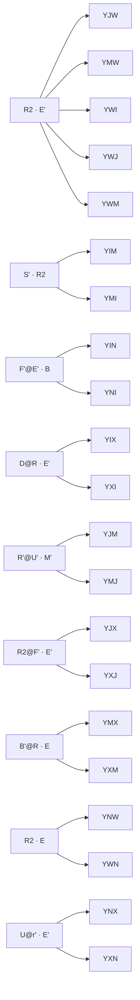

# Edge 3‑Style — Buffer Y — Memory Sheet

*Pure‑memorability picks (shortest/cleanest commutator of 100 computer algs per case).*

## The collapse
| metric | value |
|---|---|
| cases | **24** |
| distinct shapes (cores) | **12** |
| shared‑core families (≥2) | **9** covering 21 |
| inverse pairs (learn 1 ⇒ 2) | **12** |
| pure commutators (no setup) | **10** |
| moves min/avg/max | 6 / 8.2 / 9 |

Read: `setup : [interchange , insert]` → setup → interchange → insert → interchange' → insert' → setup'. Inverse case = swap the two pieces.

## Family map



## Families

### F1. R2 · E' · ×5

Shape `[E' , R2]` — interchange `E'`, insert `R2`.

| case | comm | moves | inverse |
|---|---|---|---|
| **YJW** | `F':[R2,E']` | 6 | YWJ |
| **YMW** | `R' D' R':[E',R2]` | 9 | YWM |
| **YWI** | `R' D R:[E',R2]` | 9 | YIW |
| **YWJ** | `F':[E',R2]` | 6 | YJW |
| **YWM** | `R' D' R:[E',R2]` | 9 | YMW |

### F2. S' · R2 · ×2

Shape `[R2 , S']` — interchange `R2`, insert `S'`.

| case | comm | moves | inverse |
|---|---|---|---|
| **YIM** | `R' D:[S',R2]` | 8 | YMI |
| **YMI** | `R' D:[R2,S']` | 8 | YIM |

### F3. F'@E' · B · ×2

Shape `[B , E' F' E]` — interchange `B`, insert `E' F' E`.

| case | comm | moves | inverse |
|---|---|---|---|
| **YIN** | `[B,E' F' E]` | 8 | YNI |
| **YNI** | `[E' F' E,B]` | 8 | YIN |

### F4. D@R · E' · ×2

Shape `[E' , R D R']` — interchange `E'`, insert `R D R'`.

| case | comm | moves | inverse |
|---|---|---|---|
| **YIX** | `[E',R D R']` | 8 | YXI |
| **YXI** | `[R D R',E']` | 8 | YIX |

### F5. R'@U' · M' · ×2

Shape `[M' , U' R' U]` — interchange `M'`, insert `U' R' U`.

| case | comm | moves | inverse |
|---|---|---|---|
| **YJM** | `M':[U' R' U,M']` | 9 | YMJ |
| **YMJ** | `M':[M',U' R' U]` | 9 | YJM |

### F6. R2@F' · E' · ×2

Shape `[E' , F' R2 F]` — interchange `E'`, insert `F' R2 F`.

| case | comm | moves | inverse |
|---|---|---|---|
| **YJX** | `[E',F' R2 F]` | 8 | YXJ |
| **YXJ** | `[F' R2 F,E']` | 8 | YJX |

### F7. B'@R · E · ×2

Shape `[E , R B' R']` — interchange `E`, insert `R B' R'`.

| case | comm | moves | inverse |
|---|---|---|---|
| **YMX** | `[R B' R',E]` | 8 | YXM |
| **YXM** | `[E,R B' R']` | 8 | YMX |

### F8. R2 · E · ×2

Shape `[E , R2]` — interchange `E`, insert `R2`.

| case | comm | moves | inverse |
|---|---|---|---|
| **YNW** | `E2 B:[E,R2]` | 8 | YWN |
| **YWN** | `E2 B:[R2,E]` | 8 | YNW |

### F9. U@r' · E' · ×2

Shape `[E' , r' U r]` — interchange `E'`, insert `r' U r`.

| case | comm | moves | inverse |
|---|---|---|---|
| **YNX** | `[E',r' U r]` | 8 | YXN |
| **YXN** | `[r' U r,E']` | 8 | YNX |

## Singletons

| case | comm | moves | inverse |
|---|---|---|---|
| **YIW** | `M' u R:[S,R2]` | 9 | YWI |
| **YJN** | `D':[R S R',D2]` | 9 | YNJ |
| **YNJ** | `r':[U',M' U2 M']` | 9 | YJN |

## Inverse‑pair index

| learn | comm | ⇄ | derive | comm |
|---|---|---|---|---|
| **YIM** | `R' D:[S',R2]` | ⇄ | YMI | `R' D:[R2,S']` |
| **YIN** | `[B,E' F' E]` | ⇄ | YNI | `[E' F' E,B]` |
| **YIW** | `M' u R:[S,R2]` | ⇄ | YWI | `R' D R:[E',R2]` |
| **YIX** | `[E',R D R']` | ⇄ | YXI | `[R D R',E']` |
| **YJM** | `M':[U' R' U,M']` | ⇄ | YMJ | `M':[M',U' R' U]` |
| **YJN** | `D':[R S R',D2]` | ⇄ | YNJ | `r':[U',M' U2 M']` |
| **YJW** | `F':[R2,E']` | ⇄ | YWJ | `F':[E',R2]` |
| **YJX** | `[E',F' R2 F]` | ⇄ | YXJ | `[F' R2 F,E']` |
| **YMW** | `R' D' R':[E',R2]` | ⇄ | YWM | `R' D' R:[E',R2]` |
| **YMX** | `[R B' R',E]` | ⇄ | YXM | `[E,R B' R']` |
| **YNW** | `E2 B:[E,R2]` | ⇄ | YWN | `E2 B:[R2,E]` |
| **YNX** | `[E',r' U r]` | ⇄ | YXN | `[r' U r,E']` |

## Case cards (with 3‑cycle diagrams)

#### YIM — S' · R2 — `R' D:[S',R2]` (8)
```
      · · ·
      · u ·
      · · ·
· · ·  · · ·  · · ·  · · ·
· l ·  · f ·  · r ·  1 b ·
· · ·  · · ·  · · ·  · · ·
      · 2 ·
      · d ·
      · 3 ·
  1=Y(BR)  2=I(DF)  3=M(DB)
```

#### YIN — F'@E' · B — `[B,E' F' E]` (8)
```
      · · ·
      · u ·
      · · ·
· · ·  · · ·  · · ·  · · ·
· l ·  · f ·  · r ·  1 b ·
· · ·  · · ·  · · ·  · 3 ·
      · 2 ·
      · d ·
      · · ·
  1=Y(BR)  2=I(DF)  3=N(BD)
```

#### YIW — S · R2 — `M' u R:[S,R2]` (9)
```
      · · ·
      · u ·
      · · ·
· · ·  · · ·  · · ·  · · ·
· l ·  · f ·  · r ·  1 b 3
· · ·  · · ·  · · ·  · · ·
      · 2 ·
      · d ·
      · · ·
  1=Y(BR)  2=I(DF)  3=W(BL)
```

#### YIX — D@R · E' — `[E',R D R']` (8)
```
      · · ·
      · u ·
      · · ·
· · ·  · · ·  · · ·  · · ·
3 l ·  · f ·  · r ·  1 b ·
· · ·  · · ·  · · ·  · · ·
      · 2 ·
      · d ·
      · · ·
  1=Y(BR)  2=I(DF)  3=X(LB)
```

#### YJM — R'@U' · M' — `M':[U' R' U,M']` (9)
```
      · · ·
      · u ·
      · · ·
· · ·  · · ·  · · ·  · · ·
· l ·  · f ·  · r ·  1 b ·
· · ·  · 2 ·  · · ·  · · ·
      · · ·
      · d ·
      · 3 ·
  1=Y(BR)  2=J(FD)  3=M(DB)
```

#### YJN — S@R · D2 — `D':[R S R',D2]` (9)
```
      · · ·
      · u ·
      · · ·
· · ·  · · ·  · · ·  · · ·
· l ·  · f ·  · r ·  1 b ·
· · ·  · 2 ·  · · ·  · 3 ·
      · · ·
      · d ·
      · · ·
  1=Y(BR)  2=J(FD)  3=N(BD)
```

#### YJW — R2 · E' — `F':[R2,E']` (6)
```
      · · ·
      · u ·
      · · ·
· · ·  · · ·  · · ·  · · ·
· l ·  · f ·  · r ·  1 b 3
· · ·  · 2 ·  · · ·  · · ·
      · · ·
      · d ·
      · · ·
  1=Y(BR)  2=J(FD)  3=W(BL)
```

#### YJX — R2@F' · E' — `[E',F' R2 F]` (8)
```
      · · ·
      · u ·
      · · ·
· · ·  · · ·  · · ·  · · ·
3 l ·  · f ·  · r ·  1 b ·
· · ·  · 2 ·  · · ·  · · ·
      · · ·
      · d ·
      · · ·
  1=Y(BR)  2=J(FD)  3=X(LB)
```

#### YMI — S' · R2 — `R' D:[R2,S']` (8)
```
      · · ·
      · u ·
      · · ·
· · ·  · · ·  · · ·  · · ·
· l ·  · f ·  · r ·  1 b ·
· · ·  · · ·  · · ·  · · ·
      · 3 ·
      · d ·
      · 2 ·
  1=Y(BR)  2=M(DB)  3=I(DF)
```

#### YMJ — R'@U' · M' — `M':[M',U' R' U]` (9)
```
      · · ·
      · u ·
      · · ·
· · ·  · · ·  · · ·  · · ·
· l ·  · f ·  · r ·  1 b ·
· · ·  · 3 ·  · · ·  · · ·
      · · ·
      · d ·
      · 2 ·
  1=Y(BR)  2=M(DB)  3=J(FD)
```

#### YMW — R2 · E' — `R' D' R':[E',R2]` (9)
```
      · · ·
      · u ·
      · · ·
· · ·  · · ·  · · ·  · · ·
· l ·  · f ·  · r ·  1 b 3
· · ·  · · ·  · · ·  · · ·
      · · ·
      · d ·
      · 2 ·
  1=Y(BR)  2=M(DB)  3=W(BL)
```

#### YMX — B'@R · E — `[R B' R',E]` (8)
```
      · · ·
      · u ·
      · · ·
· · ·  · · ·  · · ·  · · ·
3 l ·  · f ·  · r ·  1 b ·
· · ·  · · ·  · · ·  · · ·
      · · ·
      · d ·
      · 2 ·
  1=Y(BR)  2=M(DB)  3=X(LB)
```

#### YNI — F'@E' · B — `[E' F' E,B]` (8)
```
      · · ·
      · u ·
      · · ·
· · ·  · · ·  · · ·  · · ·
· l ·  · f ·  · r ·  1 b ·
· · ·  · · ·  · · ·  · 2 ·
      · 3 ·
      · d ·
      · · ·
  1=Y(BR)  2=N(BD)  3=I(DF)
```

#### YNJ — U2@M' · U' — `r':[U',M' U2 M']` (9)
```
      · · ·
      · u ·
      · · ·
· · ·  · · ·  · · ·  · · ·
· l ·  · f ·  · r ·  1 b ·
· · ·  · 3 ·  · · ·  · 2 ·
      · · ·
      · d ·
      · · ·
  1=Y(BR)  2=N(BD)  3=J(FD)
```

#### YNW — R2 · E — `E2 B:[E,R2]` (8)
```
      · · ·
      · u ·
      · · ·
· · ·  · · ·  · · ·  · · ·
· l ·  · f ·  · r ·  1 b 3
· · ·  · · ·  · · ·  · 2 ·
      · · ·
      · d ·
      · · ·
  1=Y(BR)  2=N(BD)  3=W(BL)
```

#### YNX — U@r' · E' — `[E',r' U r]` (8)
```
      · · ·
      · u ·
      · · ·
· · ·  · · ·  · · ·  · · ·
3 l ·  · f ·  · r ·  1 b ·
· · ·  · · ·  · · ·  · 2 ·
      · · ·
      · d ·
      · · ·
  1=Y(BR)  2=N(BD)  3=X(LB)
```

#### YWI — R2 · E' — `R' D R:[E',R2]` (9)
```
      · · ·
      · u ·
      · · ·
· · ·  · · ·  · · ·  · · ·
· l ·  · f ·  · r ·  1 b 2
· · ·  · · ·  · · ·  · · ·
      · 3 ·
      · d ·
      · · ·
  1=Y(BR)  2=W(BL)  3=I(DF)
```

#### YWJ — R2 · E' — `F':[E',R2]` (6)
```
      · · ·
      · u ·
      · · ·
· · ·  · · ·  · · ·  · · ·
· l ·  · f ·  · r ·  1 b 2
· · ·  · 3 ·  · · ·  · · ·
      · · ·
      · d ·
      · · ·
  1=Y(BR)  2=W(BL)  3=J(FD)
```

#### YWM — R2 · E' — `R' D' R:[E',R2]` (9)
```
      · · ·
      · u ·
      · · ·
· · ·  · · ·  · · ·  · · ·
· l ·  · f ·  · r ·  1 b 2
· · ·  · · ·  · · ·  · · ·
      · · ·
      · d ·
      · 3 ·
  1=Y(BR)  2=W(BL)  3=M(DB)
```

#### YWN — R2 · E — `E2 B:[R2,E]` (8)
```
      · · ·
      · u ·
      · · ·
· · ·  · · ·  · · ·  · · ·
· l ·  · f ·  · r ·  1 b 2
· · ·  · · ·  · · ·  · 3 ·
      · · ·
      · d ·
      · · ·
  1=Y(BR)  2=W(BL)  3=N(BD)
```

#### YXI — D@R · E' — `[R D R',E']` (8)
```
      · · ·
      · u ·
      · · ·
· · ·  · · ·  · · ·  · · ·
2 l ·  · f ·  · r ·  1 b ·
· · ·  · · ·  · · ·  · · ·
      · 3 ·
      · d ·
      · · ·
  1=Y(BR)  2=X(LB)  3=I(DF)
```

#### YXJ — R2@F' · E' — `[F' R2 F,E']` (8)
```
      · · ·
      · u ·
      · · ·
· · ·  · · ·  · · ·  · · ·
2 l ·  · f ·  · r ·  1 b ·
· · ·  · 3 ·  · · ·  · · ·
      · · ·
      · d ·
      · · ·
  1=Y(BR)  2=X(LB)  3=J(FD)
```

#### YXM — B'@R · E — `[E,R B' R']` (8)
```
      · · ·
      · u ·
      · · ·
· · ·  · · ·  · · ·  · · ·
2 l ·  · f ·  · r ·  1 b ·
· · ·  · · ·  · · ·  · · ·
      · · ·
      · d ·
      · 3 ·
  1=Y(BR)  2=X(LB)  3=M(DB)
```

#### YXN — U@r' · E' — `[r' U r,E']` (8)
```
      · · ·
      · u ·
      · · ·
· · ·  · · ·  · · ·  · · ·
2 l ·  · f ·  · r ·  1 b ·
· · ·  · · ·  · · ·  · 3 ·
      · · ·
      · d ·
      · · ·
  1=Y(BR)  2=X(LB)  3=N(BD)
```
